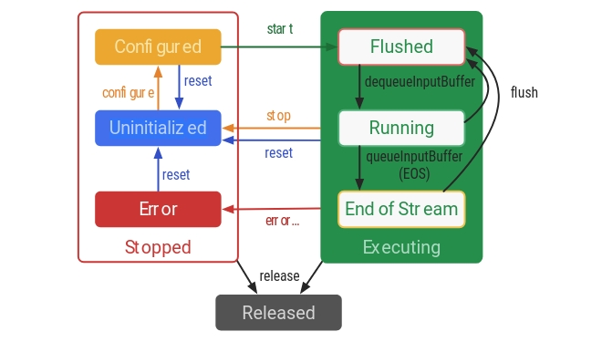

  - [MediaCodec知识点](#mediacodec知识点)
    - [MediaCodec工作原理](#mediacodec工作原理)
    - [MediaCodec同步 vs 异步](#mediacodec同步-vs-异步)
    - [MediaCodec解码导致绿边问题](#mediacodec解码导致绿边问题)
    - [MediaCodec如何提升清晰度](#mediacodec如何提升清晰度)
      - [码率--->bitrate](#码率---bitrate)
      - [码率控制模式--->bitrate-mode](#码率控制模式---bitrate-mode)
      - [编码档位--->profile](#编码档位---profile)
    - [使用MediaExtractor和MediaCodec播放视频](#使用mediaextractor和mediacodec播放视频)
    - [软解码 vs 软解码](#软解码-vs-软解码)

## MediaCodec知识点
### MediaCodec工作原理
MediaCodec是Android系统提供的原生编解码器,是标准的硬解码,在Android系统如果需要对音视频进行编解码操作的情况下,都会使用MediaCodec进行操作,因为硬解码效率比软解码要高很多.

MediaCodec 类可以访问底层多媒体编解码器框架(StageFright或者OpenMAX)，即编解码组件，与MediaSync、MediaMuxer、MediaCrypto、MediaDrm、Image、Surface和AudioTrack一起使用，通过调用底层获得了编解码能力。


MediaCodec可以处理三种数据:
> * 压缩数据
> * 原始视频数据
> * 原始音频数据

因为MediaCodec有编码和解码的功能,其中维护了一个InputBuffer和OutputBuffer缓冲区,如果是解码数据,就会将压缩的视频数据填充到InputBuffer中的,MediaCodec处理这些数据,处理完成之后,放到OutputBuffer中,OutputBuffer中存放的就是解码出来的音视频原始数据,可以分别处理这些音视频原始数据,音频用AudioTrack或者OpenSL ES播放出来,视频画面利用SurfaceView或者TextureView借助系统的渲染引擎渲染出来,也可以使用SDL渲染,或者使用OpenGL ES渲染.




MediaCodec存在三种状态:
> * 停止状态: 停止的状态有三种可能, 未初始化/已配置/错误
> * 执行状态: 执行状态也有三种可能, Flushed/Running/Stream-of-Stream
> * 释放状态

具体的执行流程是:
> * 创建MediaCodec实例,当前的编解码器处于未初始化的状态
> * 执行configure方法进行配置,是的codec进入已配置状态
> * 调用start进入执行状态
> * 调用start方法之后,编解码器立即处于Flushed子状态,其中包含了所有的缓冲区,一旦首个输入缓冲区出队,编码器立即进行Running状态,处于工作情况下大部分都是Running中,在此状态下,编码器不能接收其他的输入缓冲区,可以生成输出缓冲区,直到出现Stream-of-Stream说明流结束了.
> * 调用stop使编解码器重置到未初始化的状态,之后你就可以重新对codec进行配置了.
> * 执行完成之后,调用release释放对应的资源

注意:
> * codec也会遇到错误,录入queue中的无效返回值或者传递数据异常,可以调用reset重置codec状态,让codec再次正常使用.

### MediaCodec同步 vs 异步
MediaCodec的数据处理存在同步和异步两种形式,每个编解码器维护一组输入和输出缓冲区，这些输入和输出缓冲区由API调用中的缓冲区ID引用。成功调用start（）后，客户端“不拥有”输入缓冲区或输出缓冲区。在同步模式下，调用dequeueInput / OutputBuffer（…）从编解码器获取（或拥有）输入或输出缓冲区。在异步模式下，您将通过Callback＃onInputBufferAvailable / Callback＃onOutputBufferAvailable回调自动接收可用缓冲区。

MediaCodec异步模式下使用方式:
```
 MediaCodec codec = MediaCodec.createByCodecName(name);
 MediaFormat mOutputFormat; // member variable
 codec.setCallback(new MediaCodec.Callback() {
  @Override
  void onInputBufferAvailable(MediaCodec mc, int inputBufferId) {
    ByteBuffer inputBuffer = codec.getInputBuffer(inputBufferId);
    // fill inputBuffer with valid data
    …
    codec.queueInputBuffer(inputBufferId, …);
  }
 
  @Override
  void onOutputBufferAvailable(MediaCodec mc, int outputBufferId, …) {
    ByteBuffer outputBuffer = codec.getOutputBuffer(outputBufferId);
    MediaFormat bufferFormat = codec.getOutputFormat(outputBufferId); // option A
    // bufferFormat is equivalent to mOutputFormat
    // outputBuffer is ready to be processed or rendered.
    …
    codec.releaseOutputBuffer(outputBufferId, …);
  }
 
  @Override
  void onOutputFormatChanged(MediaCodec mc, MediaFormat format) {
    // Subsequent data will conform to new format.
    // Can ignore if using getOutputFormat(outputBufferId)
    mOutputFormat = format; // option B
  }
 
  @Override
  void onError(…) {
    …
  }
 });
 codec.configure(format, …);
 mOutputFormat = codec.getOutputFormat(); // option B
 codec.start();
 // wait for processing to complete
 codec.stop();
 codec.release();
```


从Build.VERSION_CODES.LOLLIPOP开始，即使在同步模式下使用编解码器，也应使用getInput / OutputBuffer（int）和/或getInput / OutputImage（int）检索输入和输出缓冲区。这允许框架进行某些优化，例如处理动态内容时。如果调用getInput / OutputBuffers（），则会禁用此优化。
MediaCodec同步模式下使用方式:
```
MediaCodec codec = MediaCodec.createByCodecName(name);
 codec.configure(format, …);
 MediaFormat outputFormat = codec.getOutputFormat(); // option B
 codec.start();
 for (;;) {
  int inputBufferId = codec.dequeueInputBuffer(timeoutUs);
  if (inputBufferId >= 0) {
    ByteBuffer inputBuffer = codec.getInputBuffer(…);
    // fill inputBuffer with valid data
    …
    codec.queueInputBuffer(inputBufferId, …);
  }
  int outputBufferId = codec.dequeueOutputBuffer(…);
  if (outputBufferId >= 0) {
    ByteBuffer outputBuffer = codec.getOutputBuffer(outputBufferId);
    MediaFormat bufferFormat = codec.getOutputFormat(outputBufferId); // option A
    // bufferFormat is identical to outputFormat
    // outputBuffer is ready to be processed or rendered.
    …
    codec.releaseOutputBuffer(outputBufferId, …);
  } else if (outputBufferId == MediaCodec.INFO_OUTPUT_FORMAT_CHANGED) {
    // Subsequent data will conform to new format.
    // Can ignore if using getOutputFormat(outputBufferId)
    outputFormat = codec.getOutputFormat(); // option B
  }
 }
 codec.stop();
 codec.release();

```

### MediaCodec解码导致绿边问题
MediaCodec解码H264数据之后可能会存在数据对齐的问题,数据对齐问题会导致一些异常的表现.
已知MediaCodec使用GPU进行解码,解码后的数据有一个对齐规则,不同的设备表现不一致,有些是15位对齐,或者32位/64位/128位对齐,当然有时候宽高的对齐方式不同.
假设需要解码的图像的宽高是15 * 15,在使用16位对齐的设备进行硬解码后,输出的YUV数据会是16 * 16, 多出来的宽高会被自动填充.
这时候如果按照15 * 15的大小取出YUV数据进行渲染,表现位花屏;如果按照16 * 16的方式进行渲染,会出现绿边.

怎么样去除绿边呢? 
将原始的图像数据抠出来就行了,逐行扣出有效的数据.
```
int width = 15, height = 15;
int alignWidth = 16, alignHeight = 16;
 
//假设 outData 是解码后对齐数据
byte[] outData = new byte[alignWidth * alignHeight * 3 / 2];
 
byte[] yData = new byte[width * height];
byte[] uData = new byte[width * height / 4];
byte[] vData = new byte[width * height / 4];
 
yuvCopy(outData, 0, alignWidth, alignHeight, yData, width, height);
yuvCopy(outData, alignWidth * alignHeight, alignWidth / 2, alignHeight / 2, uData, width / 2, height / 2);
yuvCopy(outData, alignWidth * alignHeight * 5 / 4, alignWidth / 2, alignHeight / 2, vData, width / 2, height / 2);
 
...
 
private static void yuvCopy(byte[] src, int offset, int inWidth, int inHeight, byte[] dest, int outWidth, int outHeight) {
    for (int h = 0; h < inHeight; h++) {
        if (h < outHeight) {
            System.arraycopy(src, offset + h * inWidth, dest, h * outWidth, outWidth);
        }
    }
}
```

### MediaCodec如何提升清晰度
使用MediaCodec进行编码的时候,有些参数会影响编码视频的清晰度的,接下来我们谈谈这些参数怎么影响视频清晰度的.

#### 码率--->bitrate
正常情况下,码率越高的情况下,视频越清晰,但是MediaCodec的码率都是与上限的,这方面要做好预判,可以通过MediaCodecInfo.VideoCapabilities来获取视频的最大码率.
#### 码率控制模式--->bitrate-mode
bitrate-mode有四种模式
> * BITRATE_MODE_CBR
表示恒定码率,编码器会将输出的码率控制设置位恒定的码率值,这种模式码率相对稳定可控,方便进行检测/丢包控制等后续操作,适合网络流媒体传输
> * BITRATE_MODE_CBR_FD
这是CBR的一种,不过会在网络环境较差的情况下进行一定的丢帧.
> * BITRATE_MODE_CQ
表示恒定质量码率,码率会非常大,编码的目的就是尽量保证图像质量,不考虑码率大小,适合网络条件非常好/带宽不受限制的情况,这种模式码率在不同运动环境下码率变化也非常大.
> * BITRATE_MODE_VBR
该模式会根据视频采集内容的复杂度动态调整输出码率,图像复杂时码率会很高,图像简单码率会比较低,总而言之码率波动会非常大,容易出现马赛克等情况.

#### 编码档位--->profile
具体的codec profile可以参考MediaCodecInfo.CodecProfileLevel,里面有针对各种编码的profile level
> * AVCProfileBaseline
> * AVCProfileMain
> * AVCProfileHigh

选择不同的profile对应的清晰度也不同的,profile是对视频压缩特性的描述,profile越高,说明采用了越高级的压缩特性,相应的同样配置下编码得到的视频文件的清晰度就越高,并且码率越小.
比较保险的方式,就是主流机型都支持的方式,可以设置profile位MainProfile

### 使用MediaExtractor和MediaCodec播放视频
MediaExtractor 是 Android系统提供的解析视频信息的类,主要用于解析视频的封装格式,解析出具体的track stream,用MediaExtractor和MediaCodec结合是可以正常的实现播放器的功能的.
具体的可以参考:
[MediaExtractor和MediaCodec结合播放视频](https://www.jianshu.com/p/d406314ab63c)

### 软解码 vs 软解码
硬解码：一般情况下，Android4.4以上版本推荐使用硬解码，低于Android4.4版本使用软解码
软解码：主要使用CPU的大量运算来解码，功耗可能会比较大，但是细节表现比硬解码好，兼容性也比较好。

||优点|缺点|
|:-|:-|:-|
|软解码|1.兼容性强，出错情况少；<br>2.软解码色彩一般比硬解码更加柔和；<br>3.编码的可操作空间大，自由度高|1.CPU消耗大；<br>2.机器容易发热；<br>3.功耗高|
|硬解码|功耗低，执行效率高|1.兼容性差，兼容工作非常繁杂；<br>2.可控性差，依赖底层编解码实现|
