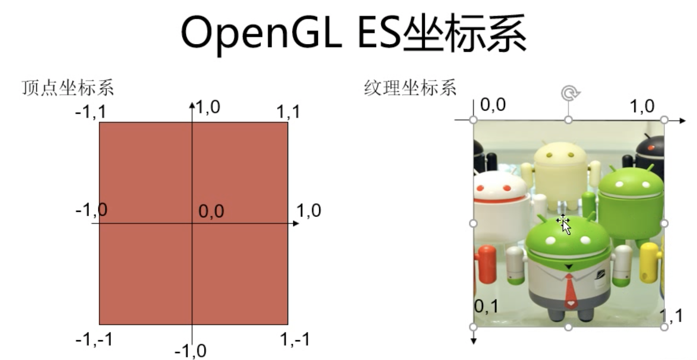
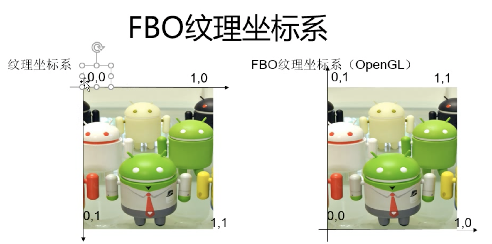
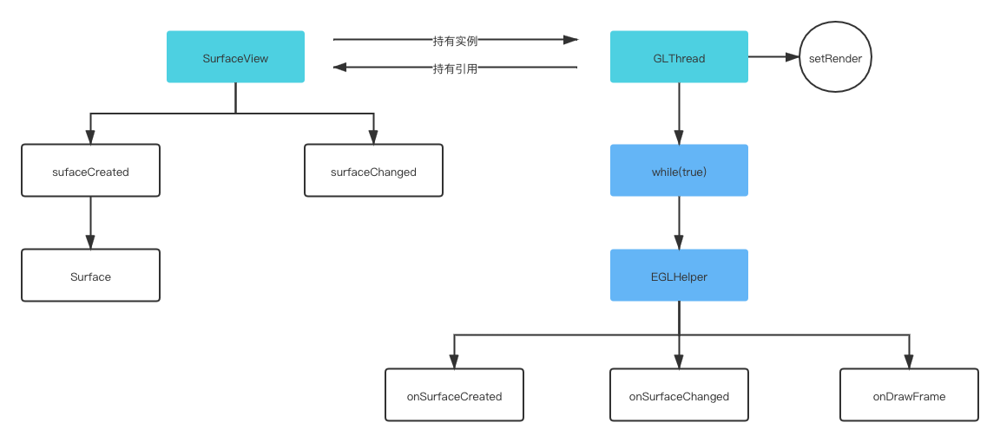

  - [OpenGL知识点](#opengl知识点)
    - [1.OpenGL中重要的概念](#1opengl中重要的概念)
      - [1.1 两种坐标系](#11-两种坐标系)
      - [1.2 绘制的图形](#12-绘制的图形)
      - [1.3 shader--->glsl语言体系](#13-shader---glsl语言体系)
      - [1.4 VBO顶点缓冲对象](#14-vbo顶点缓冲对象)
      - [1.5 FBO帧缓冲对象](#15-fbo帧缓冲对象)
    - [2.EGL环境创建流程](#2egl环境创建流程)
      - [2.1 什么是EGL](#21-什么是egl)
      - [2.2 为什么要创建EGL环境](#22-为什么要创建egl环境)
      - [2.3 EGL环境创建流程](#23-egl环境创建流程)
      - [2.4 opengl es加载shader](#24-opengl-es加载shader)
      - [2.5 opengl es绘制纹理的过程](#25-opengl-es绘制纹理的过程)
      - [2.6 共享上下文实现共享绘制](#26-共享上下文实现共享绘制)
    - [3.自定义GLSurfaceView](#3自定义glsurfaceview)
      - [3.1 自定义GLSurfaceView的流程](#31-自定义glsurfaceview的流程)

## OpenGL知识点
### 1.OpenGL中重要的概念
#### 1.1 两种坐标系
> * 顶点坐标系
> * 纹理坐标系

 

如果要绘制纹理的话，需要将两种坐标系映射起来看。<br>
定点坐标是绘制位置，纹理坐标是填充数据。
#### 1.2 绘制的图形
OpenGL基础可以绘制的是点、线和三角形，其他的形状都可以通过这三种图像拼接得到，例如四边形实际上是两个三角形拼接而成的。

#### 1.3 shader--->glsl语言体系
> * attribute只能在vertex中使用
> * varying用户vertex和fragment之间传递数据
> * uniform用于在application中向vertex和fragment中传递值

顶点glsl:
```
attribute vec4 v_Position;
attribute vec2 f_Position;
varying vec2 ft_Position;
void main() {
    ft_Position = f_Position;
    gl_Position = v_Position;
}
```

片段glsl：
```
precision mediump float;
varying vec2 ft_Position;
uniform sampler2D sTexture;
void main() {
    gl_FragColor=texture2D(sTexture, ft_Position);
}
```
> * gl_FragColor是opengl内置的变量
> * gl_Position是opengl内置的变量

#### 1.4 VBO顶点缓冲对象
VBO是Vertex Buffer Object，为什么要使用VBO呢？<br>
不使用VBO的情况下，我们每次绘制图形时都是从本地内存处获取顶点数据然后传输给opengl绘制，这样就会频繁地操作CPU->GPU增大开销，降低效率。<br>
使用VBO的情况下，我们就能把顶点数据缓存到GPU开辟的一段内存中，然后使用时不必再从本地获取，而是直接从显存中获取，这样就会提升绘制的效率。<br>

创建VBO的完整流程：
> * 创建VBO：
    GLES20.glGenBuffers(1, vbos, 0);
> * 绑定VBO:
    GLES20.glBindBuffer(GLES20.GL_ARRAY_BUFFER, vbos[0]);
> * 分配VBO需要的缓存大小：
    GLES20.glBufferData(GLES20.GL_ARRAY_BUFFER, vertex.length * 4, null, GLES20.GL_STATIC_DRAW);
> * 为VBO设置顶点数据的值
    GLES20.glBufferSubData(GLES20.GL_ARRAY_BUFFER, 0, vertexData,length * 4, vertexBuffer);
> * 解绑VBO
    GLES20.glBindBuffer(GLES20.GL_ARRAY_BUFFER, 0);

使用VBO的完整流程:
> * 绑定VBO
    GLES20.glBindBuffer(GLES20.GL_ARRAY_BUFFER, vbos[0]);
> * 设置顶点数据
    GLES20.glVertexAttribPointer(vPosition, 2, GLES20.GL_FLOAT, false, 8, 0);
> * 解绑VBO
    GLES20.glBindBuffer(GLES20.GL_ARRAY_BUFFER, 0);

#### 1.5 FBO帧缓冲对象
FBO是Frame Buffer Object，为什么要用FBO呢？<br>
当我们需要对纹理进行多次渲染采样时，而这些渲染采样时不需要展示给用户看的，所以我们就可以用一个单独的缓冲对象（离屏渲染）来存储我们的这几次渲染采样的结果，等处理完了才显示到窗口上来。<br>
**优点：提高渲染效率，避免闪屏，可以很方便的实现纹理共享等。**<br>

FBO的渲染方式:
> * 渲染到缓冲区: 深度测试和模板测试,用在3D测试中。
> * 渲染到纹理: 图像渲染。

创建FBO的完整流程:
> * 创建FBO
    GLES20.glGenBuffers(1, fbos, 0);
> * 绑定FBO
    GLES20.glBindFramebuffer(GLES20.GL_FRAMEBUFFER, fbos[0]);
> * 设置FBO分配内存的大小
    GLES20.glTexImage2D(GLES20.GL_TEXTURE_2D, 0, GLES20.GL_RGBA, 720, 1280, 0, GLES20.GL_RGBA, GLES20.GL_UNSIGNED_BYTE, null);
> * 把纹理绑定到FBO
    GLES20.glFramebufferTexture2D(GLES20.GL_FRAMEBUFFER, GLES20.GL_COLOR_ATTACHMENT0, GLES20.GL_TEXTURE_2D, textureid, 0);
> * 检查FBO是否绑定成功
    GLES20.glCheckFramebufferStatus(GLES20.GL_FRAMEBUFFER) != GLES20.GL_FRAMEBUFFER_COMPLETE;
> * 解绑FBO
    GLES20.glBindFramebuffer(GLES20.GL_FRAMEBUFFER, 0);

使用FBO的完整流程:
> * 绑定FBO
    GLES20.glBindFramebuffer(GLES20.GL_FRAMEBUFFER, fbos[0]);
> * 获取需要绘制的图片纹理，然后绘制渲染
> * 解绑FBO
    GLES20.glBindFramebuffer(GLES20.GL_FRAMEBUFFER, fbos[0]);
> * 再把绑定到FBO的纹理绘制渲染出来

非常需要注意的一点是:FBO的坐标系和正常的坐标系是不一样的，我们使用FBO渲染出来的图片，是经过X对称然后翻转的。<br>


****

### 2.EGL环境创建流程
#### 2.1 什么是EGL
EGL是OpenGL ES和本地窗口系统的接口，不同平台上的EGL配置是不一样的，但是调用OpenGL的方式是一样的，就是说OpenGL能够跨平台就是依赖EGL接口
#### 2.2 为什么要创建EGL环境
当我们需要把同一个场景渲染到不同的Surface上时，此时系统的GLSurfaceView就不能满足要求了，所以我们需要自己创建EGL环境来实现渲染的操作。一般较为复杂的OpenGL渲染操作都需要自定义GLSurfaceView来实现渲染功能。<br>
OpenGL整体是一个状态机，通过改变状态就能改变后续的渲染方式，而EGLContext(EGL上下文)就保存所有的状态，因此可以通过共享EGLContext来实现同一场景渲染到不同的Surface上
#### 2.3 EGL环境创建流程
> * 创建EGL实例
> * 得到默认的显示设备，就是显示窗口
> * 初始化默认的显示设备
> * 设置显示设备的属性
> * 从系统中获取对应属性的配置
> * 创建EGLContext实例
> * 创建渲染的Surface
> * 绑定EGLContext和Surface到显示设备中
> * 刷新数据，显示渲染场景

下面是具体的代码流程：
```
/**
 * EGL环境创建的类
 */
public class EglHelper {
    private EGL10 mEgl10;
    private EGLContext mEglContext;
    private EGLDisplay mEglDisplay;
    private EGLSurface mEglSurface;

    public void initEgl(Surface surface, EGLContext context) {
        //1.
        mEgl10 = (EGL10) EGLContext.getEGL();

        //2.
        mEglDisplay = mEgl10.eglGetDisplay(EGL10.EGL_DEFAULT_DISPLAY);
        if (mEglDisplay == EGL10.EGL_NO_DISPLAY) {
            throw new RuntimeException("eglGetDisplay failed");
        }

        //3.
        int[] version = new int[2];
        if (!mEgl10.eglInitialize(mEglDisplay, version)) {
            throw new RuntimeException("eglInitialize failed");
        }

        //4.设置属性
        int[] attributes = new int[]{
                EGL10.EGL_RED_SIZE, 8,
                EGL10.EGL_GREEN_SIZE, 8,
                EGL10.EGL_BLUE_SIZE, 8,
                EGL10.EGL_ALPHA_SIZE, 8,
                EGL10.EGL_DEPTH_SIZE, 8,
                EGL10.EGL_STENCIL_SIZE, 8,
                EGL10.EGL_RENDERABLE_TYPE, 4,
                EGL10.EGL_NONE
        };

        int[] numConfigs = new int[1];
        if (!mEgl10.eglChooseConfig(mEglDisplay, attributes, null, 1, numConfigs)) {
            throw new RuntimeException("eglChooseConfig failed");
        }

        int numConfig = numConfigs[0];
        if (numConfig <= 0) {
            throw new RuntimeException("No match configs");
        }

        //5.
        EGLConfig[] configs = new EGLConfig[numConfig];
        if (!mEgl10.eglChooseConfig(mEglDisplay, attributes, configs, numConfig, numConfigs)) {
            throw new RuntimeException("eglChooseConfig failed final");
        }

        //6.
        //这句代码很重要，因为没有这个支持，并不能加载shader
        int[] attrib_list = {
                EGL14.EGL_CONTEXT_CLIENT_VERSION, 2,
                EGL10.EGL_NONE
        };
        if (context != null) {
            mEglContext = mEgl10.eglCreateContext(mEglDisplay, configs[0], context, attrib_list);
        } else {
            mEglContext = mEgl10.eglCreateContext(mEglDisplay, configs[0], EGL10.EGL_NO_CONTEXT, attrib_list);
        }

        //7.
        mEglSurface = mEgl10.eglCreateWindowSurface(mEglDisplay, configs[0], surface, null);

        //8.
        if (!mEgl10.eglMakeCurrent(mEglDisplay, mEglSurface, mEglSurface, mEglContext)) {
            throw new RuntimeException("eglMakeCurrent failed");
        }
    }

    //刷新数据
    public boolean swapBuffers() {
        if (mEgl10 != null) {
            return mEgl10.eglSwapBuffers(mEglDisplay, mEglSurface);
        } else {
            throw new RuntimeException("EGL is empty");
        }
    }

    public EGLContext getEglContext() {
        return mEglContext;
    }

    public void destoryEgl() {
        if (mEgl10 != null) {
            mEgl10.eglMakeCurrent(mEglDisplay, EGL10.EGL_NO_SURFACE, EGL10.EGL_NO_SURFACE, EGL10.EGL_NO_CONTEXT);
            mEgl10.eglDestroySurface(mEglDisplay, mEglSurface);
            mEglSurface = null;

            mEgl10.eglDestroyContext(mEglDisplay, mEglContext);
            mEglContext = null;

            mEgl10.eglTerminate(mEglDisplay);
            mEglDisplay = null;
            mEgl10 = null;
        }
    }
}
```

#### 2.4 opengl es加载shader
上面创建的shader都是以字符串的形式创建的，还需要加载到程序中，然后获取变量，进行设置。<br>

加载shader的流程:
> * 创建shader着色器，顶点和片元着色器
    int shader = GLES20.glCreateShader(shaderType);
> * 加载shader源码并编译shader
    GLES20.glShaderSource(shader, source);
    GLES20.glCompileShader(shader);
> * 检查是否编译成功：
    GLES20.glGetShaderiv(shader, GLES20.GL_COMPILE_STATUS, compiled, 0);
> * 创建一个渲染程序：
    int program = GLES20.glCreateProgram();
> * 将着色器程序添加到渲染程序中:
    GLES20.glAttachShader(program, vertexShader);
> * 链接源程序：
    GLES20.glLinkProgram(program);
> * 检查链接源程序是否成功:
    GLES20.glGetProgramiv(program, GLES20.GL_LINK_STATUS, linkStatus, 0);
> * 得到着色器中的属性：
    int vPosition = GLES20.glGetAttribLocation(program, "v_Postion");
> * 使用源程序 : 
    GLES20.glUseProgram(program);
> * 使顶点属性数组有效: 
    GLES20.glEnableVertexAttribArray(vPosition);
> * 为顶点属性赋值: 
    GLES20.glVertexAttribPointer(vPosition, 2, GLES20.GL_FLOAT, false, 8, vertexBuffer);
> * 绘制图形:
    GLES20.glDrawArrays(GLES20.GL_TRIANGLE_STRIP, 0, 4);

opengl es加载shader的代码流程: 加载shader和链接program的完整代码流程
```
    private static int loadShader(int shaderType, String source) {
        int shader = GLES20.glCreateShader(shaderType);
        if(shader != 0) {
            GLES20.glShaderSource(shader, source);
            GLES20.glCompileShader(shader);

            int[] compile = new int[1];
            GLES20.glGetShaderiv(shader, GLES20.GL_COMPILE_STATUS, compile, 0);
            if(compile[0] != GLES20.GL_TRUE) {
                Log.d(TAG, "shader compile error");
                GLES20.glDeleteShader(shader);
                shader = 0;
            }
            return shader;
        }
        else {
            return 0;
        }
    }

    public static int createProgram(String vertexSource, String fragmentSoruce) {
        int vertexShader = loadShader(GLES20.GL_VERTEX_SHADER, vertexSource);
        int fragmentShader = loadShader(GLES20.GL_FRAGMENT_SHADER, fragmentSoruce);

        if(vertexShader != 0 && fragmentShader != 0) {
            int program = GLES20.glCreateProgram();

            GLES20.glAttachShader(program, vertexShader);
            GLES20.glAttachShader(program, fragmentShader);

            GLES20.glLinkProgram(program);
            return program;
        }
        return 0;
    }

```

#### 2.5 opengl es绘制纹理的过程
> * 加载shader和生成program的流程不变
> * 创建和绑定纹理:
    GLES20.glGenTextures(1, textureId, 0);
    GLES20.glBindTexture(GLES20.GL_TEXTURE_2D, textureid);
> * 设置环绕和过滤方式
> * 设置图片：
    GLUtils.texImage2D(GLES20.GL_TEXTURE_2D, 0, bitmap, 0);
> * 绑定顶点坐标和纹理坐标
> * 绘制图形

环绕（超出纹理坐标的范围） : <br>
GLES20.glTexParameteri(GLES20.GL_TEXTURE_2D, GLES20.GL_TEXTURE_WRAP_S, GLES20.GL_REPEAT);<br>
GLES20.glTexParameteri(GLES20.GL_TEXTURE_2D, GLES20.GL_TEXTURE_WRAP_T, GLES20.GL_REPEAT);<br>

过滤（纹理像素映射到坐标点） : 可能会缩小、放大，其实是线性的方式<br>
GLES20.glTexParameteri(GLES20.GL_TEXTURE_2D, GLES20.GL_TEXTURE_MIN_FILTER, GLES20.GL_LINEAR);<br>
GLES20.glTexParameteri(GLES20.GL_TEXTURE_2D, GLES20.GL_TEXTURE_MAG_FILTER, GLES20.GL_LINEAR);<br>

#### 2.6 共享上下文实现共享绘制
通过共享EGLContext来实现共享上下文

****

### 3.自定义GLSurfaceView
GLSurfaceView内部拥有三个比较重要的变量：
> * GLThread ： OpenGL ES的运行线程，包含创建EGL环境、调用GLRender的onSurfaceCreated、onSurfaceChanged、onDrawFrame方法以及生命周期的有效管理
> * EglHelper ： 负责创建EGL环境
> * GLSurfaceView ：负责提供Surface和提供状态的改变

#### 3.1 自定义GLSurfaceView的流程
> * 继承SurfaceView，并实现其Callback回调
> * 自定义GLThread线程类，主要用于OpenGL的绘制操作
> * 添加设置Surface和EGLContext的方法
> * 提供和系统GLSurfaceView相同的回调方法

<br>
自定义GLSurfaceView的核心代码: 欢迎参考[https://github.com/JeffMony/OpenGLDemo](https://github.com/JeffMony/OpenGLDemo)