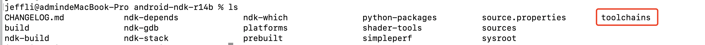

# 第二章 音视频基础知识
## 1.概要
俗话说：万丈高楼平地起，再难的事情都要从打基础开始，学习音视频一个漫长的过程，其中有些点可能很难，那是因为我们没有打好基础，基础牢靠了，学习自然能得心应手。好了，废话少说，我们从最基础的编译介绍，其次介绍Android jni相关知识，然后Android原生的音视频相关的api，然后介绍一些好的开源项目。开源项目的知识比较多，，本章只是介绍，不会过多涉及开源项目的原理，当然后面会着重介绍这些开源项目的。

## 2.交叉编译
交叉编译是什么？对于没有做过嵌入式开发的人来说，也许很陌生，一些Android的开发，如果没有过多涉及jni方面，也不太清楚什么是交叉编译，通俗来讲，交叉编译就是在一个平台上生成另外一个平台可以执行的代码。例如Windows上可执行的文件是.exe，但是.exe文件是不能在Android上面运行的，我如果想编译一个库文件，让这个库文件在Android平台上被加载，那这个编译的过程就是交叉编译。
交叉编译在音视频开发者真的这么重要吗？可以明确的说，非常重要，因为音视频的核心开发逻辑都在native层，java层只是一个接口api和简单的封装，所以jni和native交互不可避免，而且音视频中大量用到一些流行的库，例如ffmpeg、ijkplayer、vlc、fdk-aac、libx264、librtmp等等，这些库想要生成Android平台上可以加载的库，就需要交叉编译。关于这些库怎么交叉编译的，本章的后面会讲到。
### 2.1 交叉编译工具
做过jni项目的都知道jni代码是使用ndk编译的，ndk中就包含交叉编译工具链，在什么地方了，下面看一下ndk的目录结构：<br>
<br>
我们所说的交叉编译工具链就在这个toolchains文件夹中，可以深入进去看一下：<br>
<br>
> * aarch64-linux-android-4.9
> * arm-linux-androideabi-4.9
> * mipsel-linux-android-4.9
> * mips64el-linux-android-4.9
> * x86-4.9
> * x86_64-4.9

这其实是针对不同的CPU架构平台，我们熟知的是arm平台，Android手机基本上都是基于arm平台的，x86主要是PC，mips架构是Microprocessor without interlocked piped stages architecture的缩写，是一种采用精简指令集的处理器架构，主要用在一些个人娱乐装置上，它们三个指令集各有优劣。
<br>
**ARM**<br>
ARM全程是Advanced RISC Machine，它是一个精简的指令集，ARM处理器的特点是：
> * 体积小，低功耗，低成本，高性能，目前ARM也是嵌入式设备中使用最广泛的芯片架构
> * 大量使用到了寄存器，指令执行速度更快，它的大多数数据操作都在寄存器中执行
> * 寻址方式灵活简单，执行效率高
> * 指令长度固定
> * 流水线的处理方式

**X86**<br>
X86是intel主导设计的一个微处理器体系结构的指令架构，PC端主要称霸的是X86架构，与ARM不同，X86采用的是CISC架构，就是复杂指令集计算机，CISC与RISC不同，程序中指令是按照顺序串行执行的，每条指令中的操作也是顺序串行的。

顺序执行优点是控制比较简单，但是利用效率较低，执行速度也不太快。

**MIPS**<br>
MIPS是采用RISC指令集的架构，全称是Microprocessor without interlocked piped stages architecture，由MIPS推出，其基本特点是：
> * 包含大量的寄存器、指令集和字符
> * 可视化的管道延时处理
> * 能耗非常想小。

但是很可惜，最近听说MIPS已经开始拥抱ARM了，市场上的选择变少了，不得不说是一种悲哀。


介绍完了不同架构的区别，现在可以看看有什么具体的交叉编译工具，可以选择arm平台进去看看：<br>
<br>
我们介绍几个常用的吧。
> * arm-linux-androideabi-gcc : 编译c文件的交叉编译器，和gcc类似，不同的是arm-linux-androideabi-gcc的头文件是/urs/include/stdio.h，下面编译能看出来，我们要定义sysroot来链接到头文件。
> * arm-linux-androideabi-g++ : 编译cpp文件的交叉编译器
> * arm-linux-androideabi-addr2line : 反解出堆栈的工具，Android上的Native Crash堆栈都是通过addr2line反解出来的
> * arm-linux-androideabi-ld : 交叉链接器，可以将编译出来的文件链接成在arm平台上运行的文件
> * arm-linux-androideabi-readelf : 查看.elf文件的工具，编译程序运行不了的原因主要看处理器的大小端跟编译的程序的大小端是否对应，可以使用这个工具来查看一下。
> * arm-linux-androideabi-objdump : 将可执行文件反汇编后输入保存到文本中，可以查看底层的汇编代码。
> * arm-linux-androideabi-ar : 可以将多个重定位的目标模块归档为一个函数库文件。

交叉编译有一个完整的过程：<br>
<br>


下面我们运行一个简单的例子来加深对交叉编译工具的理解：
一个很简单的c程序
```
#include <stdio.h>

int main(int argc, char** argv) {
	printf("Hello, jeffmony\n");
	return 0;
}
```
输出的结果如下：
```
jeffli@admindeMacBook-Pro 02-files % gcc hello.c -o hello
jeffli@admindeMacBook-Pro 02-files % ./hello 
Hello, jeffmony
```

gcc编译出来的可执行文件只能在当前架构的平台上执行，如果我想在Android上执行这个程序就需要使用arm-linux-androideabi-gcc来编译hello.c，编译代码如下：
```
$ANDROID_NDK/toolchains/arm-linux-androideabi-4.9/prebuilt/darwin-x86_64/bin/arm-linux-androideabi-gcc \
--sysroot=$ANDROID_NDK/platforms/android-24/arch-arm hello.c -o hello-android
```
这个--sysroot表示链接的头文件的地址，如下图：<br>
<br>
里面放着include和lib文件夹，分别表示Android平台下的头文件的库文件，我们编译的任何文件都可能会引用到这个文件架下面的库。这个链接是不能少的。
编译出来的hello-android是可以在Android手机上运行的。

### 2.2 CMake
大家在Android5.0用过ndk编译的话，当时是使用ndk-build工具进行编译的，还需要配置Android.mk和Application.mk。
当然现在肯定不需要了，CMake会自动帮你生成的，你只需要按照对应的格式，填写CMakeLists.txt文件就行了。按照特定的语法。
我们先来介绍一下什么是CMake？
CMake 是一个开源、跨平台的工具系列，旨在构建、测试和打包软件。CMake用于使用简单的平台和编译器独立配置文件来控制软件编译过程，并生成可在您选择的编译器环境中使用的本机 makefile 和工作区。 CMake 工具套件由 Kitware 创建，以响应对 ITK 和 VTK 等开源项目的强大跨平台构建环境的需求。

Cmake其实是一套项目整理的工具，可以整合完整的编译流程，Android也引入了这套机制，非常好用。
创建一个包含native代码的工程，主要关注这两个结构:<br>
<br>
main目录下创建了cpp和java文件夹，cpp就是写native代码的，java就是上层代码，其中cpp文件夹下面有一个CMakeLists.txt文件，这个文件就是组织cpp文件的一个工具。
下面看一个CMakeLists.txt的例子：
```
# Sets the minimum version of CMake required to build the native
# library.
cmake_minimum_required(VERSION 3.4.1)

# Creates the project's shared lib: libnative-lib.so.
# The lib is loaded by this project's Java code in MainActivity.java:
#     System.loadLibrary("native-lib");
# The lib name in both places must match.
add_library( native-lib
             SHARED
             src/main/cpp/native-lib.cpp )

find_library(log-lib
             log )

# Specifies libraries CMake should link to your target library. You
# can link multiple libraries, such as libraries you define in the
# build script, prebuilt third-party libraries, or system libraries.

target_link_libraries( # Specifies the target library.
                       native-lib

                       # Links the target library to the log library
                       # included in the NDK.
                       ${log-lib} )

```
add_library里面包括我们cpp中所有的native代码，部分头文件可以不用附上，native-lib是我们目标库的名称，编译出来的目标库是libnative-lib.so，target_link_libraries后面参数说明编译出libnative-lib.so需要链接那些系统库。

这儿这是简单介绍一下，后面的实战部分会更加详细的介绍。

build.gradle就是将CMakeLists.txt组织到项目中的核心枢纽。
```
// Sets up parameters for both jni build and cmake.
// For a complete list of parameters, see
// developer.android.com/ndk/guides/cmake.html#variables
externalNativeBuild {
   cmake {
       // cppFlags are configured according to your selection
       // of "Customize C++ Support", in this codelab's
       //    "Create a Sample App with the C++ Template",
       //    step 6
       cppFlags "-std=c++17"
   }
......

// Specifies the location of the top level CMakeLists.txt
// The path is relative to the hosting directory
// of this build.gradle file
externalNativeBuild {
   cmake {
       path "src/main/cpp/CMakeLists.txt"
       version "3.10.2"

   }
}

```
CMakeLists.txt文件可以放在任意位置，只要在build.gradle特殊指定就行了。
同时别忘了在Java层System.loadLibrary这个库。
我们编译完成后，在build目录中会生成对应的so


**独立工具链**<br>
现在已经很少谈到独立工具链了，但是对于一些大型的项目，独立工具链还是有它独特的优势的，因为独立工具链真的很灵活。
NDK提供了make_standalone_toolchain.py 脚本，以便您通过命令行执行自定义工具链安装。脚本位于 $ANDROID_NDK/build/tools/目录中：<br>
<br>
创建独立工具链：
```
$ANDROID_NDK/build/tools/make_standalone_toolchain.py \
    --arch arm --api 21 --install-dir /tmp/my-android-toolchain

```
此命令创建一个名为 /tmp/my-android-toolchain/ 的目录，其中包含 android-21/arch-arm sysroot 的副本，以及适用于 32 位 ARM 目标的工具链二进制文件的副本。

请注意，工具链二进制文件不依赖或包含主机专属路径。换言之，您可以将其安装在任意位置，甚至可以视需要改变其位置。

**为什么特别提到了独立工具链了？**
因为我们熟知的很多大型项目，例如ijkplayer，使用的就是独立工具链，控制非常灵活，建议大家在编译类似项目的时候，也是用独立工具链。

### 2.3 大型项目的交叉编译
接触音视频工程，不得不提到的就是ffmpeg，基本上音视频入门的交叉编译就是编译生成ffmpeg库，下面通过讲解ffmpeg的完整交叉编译过程来帮忙大家理解一下交叉编译的过程。
我们在音视频开发中，编译FFmpeg，需要包括openssl、fdk-aac、libx264，怎么实现了？
推荐一个开源项目：https://github.com/JeffMony/JianYing/tree/main/av_tools<br>
<br>
<br>
> * 配置NDK地址，直接配置到环境变量中，ANDROID_NDK=XXX
> * 下载ffmpeg代码，执行init_ffmpeg.sh代码
> * 下载openssl代码，执行init_openssl.sh
> * 下载fdk-aac代码，执行init_fdkaac.sh
> * 下载libx264代码，执行init_libx264.sh
> * 进入sources，首先执行./compile_openssl.sh，编译openssl代码
> * 编译fdk-aac，执行./compile_fdkaac.sh
> * 编译libx264，执行./compile_libx264.sh
> * 编译ffmpeg，执行./compile_ffmpeg.sh

因为ffmpeg中需要链接openssl、libfdk-aac、libx264，具体的编译脚本如下，大家可以参考下
```
#!/bin/bash


# compile ffmpeg

export NDK_ROOT=${ANDROID_NDK}

CUR_DIR=$(pwd)

BUILD_DIR=${CUR_DIR}/build

PREFIX=${BUILD_DIR}/ffmpeg

FFMPEG_SOURCE_DIR=${CUR_DIR}/ffmpeg

ARCH_PREFIX=

API=24

ARCH=$1

PLATFORM=

HOST=

COMPILE_PLATFORM=

SYSROOT=

CROSS_PREFIX=

OPENSSL_LIB_DIR=

LIBX264_LIB_DIR=

FDKAAC_LIB_DIR=

EXTRA_OPTIONS=

EXTRA_CFLAGS=

EXTRA_LDFLAGS=

cd ${FFMPEG_SOURCE_DIR}


clean() {
	rm -rf ${PREFIX} 
}

build() {
	ARCH=$1
	echo "开始编译 ${ARCH} so"

	PLATFORM=$2

	if [ "${ARCH}" == "arm" ];
	then
		HOST=arm-linux
    	COMPILE_PLATFORM=$PLATFORM
	elif [ "${ARCH}" == "arm64" ];
	then
		HOST=aarch64-linux
    	COMPILE_PLATFORM=$PLATFORM
	elif [ "${ARCH}" == "x86" ];
	then
		HOST=i686-linux
    	COMPILE_PLATFORM=i686-linux-android	
	elif [ "${ARCH}" == "x86_64" ];
	then
		HOST=x86_64-linux
    	COMPILE_PLATFORM=x86_64-linux-android
	fi
	
	ARCH_PREFIX=${PREFIX}/${ARCH}
	rm -rf ${ARCH_PREFIX}
	
	SYSROOT=${NDK_ROOT}/platforms/android-${API}/arch-${ARCH}/
    CROSS_PREFIX=${NDK_ROOT}/toolchains/${PLATFORM}-4.9/prebuilt/darwin-x86_64/bin/${COMPILE_PLATFORM}-

    
    # 判断是否存在openssl
    OPENSSL_LIB_DIR=${BUILD_DIR}/openssl/${ARCH}
    if [ -f "${OPENSSL_LIB_DIR}/lib/libssl.a" ]; then
    	echo "OpenSSL detected"
    	EXTRA_OPTIONS="${EXTRA_OPTIONS} --enable-nonfree"
    	EXTRA_OPTIONS="${EXTRA_OPTIONS} --enable-openssl"
    	EXTRA_CFLAGS="${EXTRA_CFLAGS} -I${OPENSSL_LIB_DIR}/include"
    	EXTRA_LDFLAGS="${EXTRA_LDFLAGS} -L${OPENSSL_LIB_DIR}/lib -lssl -lcrypto"
    fi

    # 判断是否存在libx264
	LIBX264_LIB_DIR=${BUILD_DIR}/libx264/${ARCH}
	if [ -f "${LIBX264_LIB_DIR}/lib/libx264.a" ]; then
		echo "libx264 detected"
		EXTRA_OPTIONS="${EXTRA_OPTIONS} --enable-libx264"
		EXTRA_OPTIONS="${EXTRA_OPTIONS} --enable-encoder=libx264"
		EXTRA_CFLAGS="${EXTRA_CFLAGS} -I${LIBX264_LIB_DIR}/include"
    	EXTRA_LDFLAGS="${EXTRA_LDFLAGS} -L${LIBX264_LIB_DIR}/lib -lx264"
    fi

    # 判断是否存在 fdk-aac
    FDKAAC_LIB_DIR=${BUILD_DIR}/fdk-aac/${ARCH}
	if [ -f "${FDKAAC_LIB_DIR}/lib/libfdk-aac.a" ]; then
		echo "libfdk-aac detected"
		EXTRA_OPTIONS="${EXTRA_OPTIONS} --enable-nonfree"
		EXTRA_OPTIONS="${EXTRA_OPTIONS} --enable-libfdk-aac"
		EXTRA_OPTIONS="${EXTRA_OPTIONS} --enable-encoder=libfdk_aac"
		EXTRA_OPTIONS="${EXTRA_OPTIONS} --enable-muxer=adts"
		EXTRA_CFLAGS="${EXTRA_CFLAGS} -I${FDKAAC_LIB_DIR}/include"
    	EXTRA_LDFLAGS="${EXTRA_LDFLAGS} -L${FDKAAC_LIB_DIR}/lib -lfdk-aac -lm"
    fi

	./configure \
	--prefix=${ARCH_PREFIX} \
	--disable-doc \
	--enable-shared \
	--disable-static \
	--disable-x86asm \
	--disable-asm \
	--disable-symver \
	--disable-devices \
	--disable-avdevice \
	--enable-gpl \
	--disable-ffmpeg \
	--disable-ffplay \
	--disable-ffprobe \
	--enable-small \
	${EXTRA_OPTIONS} \
	--enable-cross-compile \
	--cross-prefix=${CROSS_PREFIX} \
	--target-os=android \
	--arch=${ARCH} \
	--sysroot=${SYSROOT} \
	--extra-cflags="${EXTRA_CFLAGS} -fPIE -pie" \
	--extra-ldflags="${EXTRA_LDFLAGS}"

    make clean
    make -j4
    make install
    echo "完成编译 ${ARCH} so"
}

case "${ARCH}" in
	"")
        build arm arm-linux-androideabi
    ;;
    arm)
        build arm arm-linux-androideabi
    ;;
    arm64)
        build arm64 aarch64-linux-android
    ;;
    x86)
        build x86 x86
    ;;
    x86_64)
        build x86_64 x86_64
    ;;
    all)
        build arm arm-linux-androideabi
        build arm64 aarch64-linux-android
        build x86 x86
        build x86_64 x86_64
    ;;
    clean)
         clean
    ;;
esac


cd -

```
最终会生成需要的动态库：当前目录下的build文件夹有相应的动态库，如下图：<br>
<br>
<br>

## 3.JNI全面剖析
JNI是我们接触音视频开发首先要了解的一部分知识，所以我会由浅入深地给大家分析一下JNI相关的知识，帮忙大家了解JNI的具体知识。
JNI是全程是Java native interface，是Android提供的Java和Native代码（C和C++）交互和联系的方式。
### 3.1 JNI中数据类型
#### 3.1.1 基本类型
|Java中类型|Native中类型|占位|
|:-:|:-:|:-:|
|boolean|jboolean|unsigned 8 bits|
|byte|jbyte|signed 8 bits|
|char|jchar|unsigned 16 bits|
|short|jshort|signed 16 bits|
|int|jint|signed 32 bits|
|long|jlong|signed 64 bits|
|float|jfloat|32 bits|
|double|jdouble|64 bits|
|void|void|N/A|

jni.h中还定义了一些特殊的变量：
```
#define JNI_FALSE   0
#define JNI_TRUE    1

#define JNI_VERSION_1_1 0x00010001
#define JNI_VERSION_1_2 0x00010002
#define JNI_VERSION_1_4 0x00010004
#define JNI_VERSION_1_6 0x00010006

#define JNI_OK          (0)         /* no error */
#define JNI_ERR         (-1)        /* generic error */
#define JNI_EDETACHED   (-2)        /* thread detached from the VM */
#define JNI_EVERSION    (-3)        /* JNI version error */
#define JNI_ENOMEM      (-4)        /* Out of memory */
#define JNI_EEXIST      (-5)        /* VM already created */
#define JNI_EINVAL      (-6)        /* Invalid argument */

#define JNI_COMMIT      1           /* copy content, do not free buffer */
#define JNI_ABORT       2           /* free buffer w/o copying back */
```
#### 3.1.2 引用类型
Java中的引用类型大家都很清楚，JNI作为Java和native交互层，肯定也有类似的引用类型。
|JNI中名称|对应Java名称|
|:-:|:-:|
|jobject|java.lang.Object对象|
|jclass|java.lang.Class对象|
|jstring|java.lang.String对象|
|jthrowable|java.lang.Throwable对象|

上面是通用的引用类型，还有一些数组引用类型
|JNI中名称|对应Java名称|
|:-:|:-:|
|jarray|通用数组引用类型|
|jobjectArray|object 数组|
|jbooleanArray|boolean 数组|
|jbyteArray|byte 数组|
|jcharArray|char 数组|
|jshortArray|short 数组|
|jintArray|int 数组|
|jlongArray|long 数组|
|jfloatArray|float 数组|
|jdoubleArray|double 数组|

```
class _jobject {};
class _jclass : public _jobject {};
class _jstring : public _jobject {};
class _jarray : public _jobject {};
class _jobjectArray : public _jarray {};
class _jbooleanArray : public _jarray {};
class _jbyteArray : public _jarray {};
class _jcharArray : public _jarray {};
class _jshortArray : public _jarray {};
class _jintArray : public _jarray {};
class _jlongArray : public _jarray {};
class _jfloatArray : public _jarray {};
class _jdoubleArray : public _jarray {};
class _jthrowable : public _jobject {};

typedef _jobject*       jobject;
typedef _jclass*        jclass;
typedef _jstring*       jstring;
typedef _jarray*        jarray;
typedef _jobjectArray*  jobjectArray;
typedef _jbooleanArray* jbooleanArray;
typedef _jbyteArray*    jbyteArray;
typedef _jcharArray*    jcharArray;
typedef _jshortArray*   jshortArray;
typedef _jintArray*     jintArray;
typedef _jlongArray*    jlongArray;
typedef _jfloatArray*   jfloatArray;
typedef _jdoubleArray*  jdoubleArray;
typedef _jthrowable*    jthrowable;
typedef _jobject*       jweak;
```


**jclass、jmethodID、jfieldID**
如果在native代码中访问Java对象的引用的字段，需要执行下列操作:
> * 使用 FindClass 获取类的类对象引用
> * 使用 GetFieldID 获取字段的字段ID
> * 使用适当函数获取字段的内容，例如GetIntFieldID

如果需要调用类对象中的方法，有类方法和实例方法，对于实例方法，首先需要获取类对象的引用，然后获取方法ID，方法ID就是只想内部运行时数据结构的指针，一般通过字符串查找的方法来找到对应的方法的，查找到之后，可以很快速地调用方法。
```
auto array_list_class = env->FindClass("java/util/ArrayList");
auto array_list_init_id = env->GetMethodID(array_list_class, "<init>", "()V");
auto array_list_obj = env->NewObject(array_list_class, array_list_init_id);
auto array_list_add_method_id = env->GetMethodID(array_list_class, "add", "(Ljava/lang/Object;)Z");
```

#### 3.1.3 类型签名
类型签名就是JNI和上层交互时的类型标识，不同的字符标识不同的类型。
|类型签名|对应的Java类型|
|:-:|:-:|
|Z|boolean|
|B|byte|
|C|char|
|S|short|
|I|int|
|J|long|
|F|float|
|D|double|

如果针对类类型的，表示结构是: **"L类名;"**，例如: Ljava/lang/String;表示String类型<br>

函数方法的表示是: (参数类型)返回类型，例如针对一个int getResult(int argv, String argv)可以写成: (ILjava/lang/String;)I<br>

这种类型签名的用法下面会有详细的应用介绍。

#### 3.1.4 JavaVM和JNIEnv
JNI定义了两个关键的数据结构，就是JavaVM和JNIEnv，两者本质上都是指向函数表的二级指针，<br>
JavaVM与进程强相关，Android程序下一个进程只能有一个JavaVM对象，JavaVM提供了一系列接口函数。我们这边需要着重记住的就是JavaVM在一个进程中值存在一个，这个很重要，JNI多线程需要这个作为基础。
```
struct _JavaVM {
    const struct JNIInvokeInterface* functions;

#if defined(__cplusplus)
    jint DestroyJavaVM()
    { return functions->DestroyJavaVM(this); }
    jint AttachCurrentThread(JNIEnv** p_env, void* thr_args)
    { return functions->AttachCurrentThread(this, p_env, thr_args); }
    jint DetachCurrentThread()
    { return functions->DetachCurrentThread(this); }
    jint GetEnv(void** env, jint version)
    { return functions->GetEnv(this, env, version); }
    jint AttachCurrentThreadAsDaemon(JNIEnv** p_env, void* thr_args)
    { return functions->AttachCurrentThreadAsDaemon(this, p_env, thr_args); }
#endif /*__cplusplus*/
};
```

JNIEnv 提供了大部分 JNI 函数。您的原生函数都会收到 JNIEnv 作为第一个参数。<br>
JNIEnv 对应的是线程，一个线程对应一个JNIEnv对象，在JNI多线程操作中，一定要注意切换到当前线程的JNIEnv，因为JNIEnv用于线程本地存储，无法在线程之间共享JNIEnv， 那怎么获取当前线程的JNIEnv， 答案是通过JavaVM的GetEnv获取当前线程的JNIEnv， 具体的细节下面会讲解的。这儿大家了解即可。<br>
下面是JNIEnv的源码，比较多，大家记住常用的就行了，其他需要用到的时候查询对应的API即可。
```
struct _JNIEnv {
    /* do not rename this; it does not seem to be entirely opaque */
    const struct JNINativeInterface* functions;

#if defined(__cplusplus)
    jclass GetObjectClass(jobject obj)
    { return functions->GetObjectClass(this, obj); }

    jobject NewGlobalRef(jobject obj)
    { return functions->NewGlobalRef(this, obj); }

    void DeleteGlobalRef(jobject globalRef)
    { functions->DeleteGlobalRef(this, globalRef); }

    void DeleteLocalRef(jobject localRef)
    { functions->DeleteLocalRef(this, localRef); }

    jboolean IsSameObject(jobject ref1, jobject ref2)
    { return functions->IsSameObject(this, ref1, ref2); }


//此处省略N多行
#endif /*__cplusplus*/
};

```

### 3.2 什么是静态和动态注册
我们知道Android中加载的库都是动态库，需要在Java层代码中System.loadLibrary("native-lib");最终会生成libnative-lib.so<br>
初始化加载动态库，native函数一般有两种注册方法，动态注册和静态注册。Android中了解太多动态和静态的区别了，动态注册就是在运行时将JNI类和方法注册进来，静态注册就是通过某种特定的规则，不需要显式注册的前提下，只需要通过一些特定的方法名就可以定位JNI函数了。
#### 3.2.1 动态注册
动态注册就是运行时加载库方法，有两种加载方法：
> * 通过RegisterNatives显示注册原生方法
> * 运行时使用dlsym动态查找

当然RegisterNatives的优势在于，可以预先检查符号是否存在，通过JNI_OnLoad回调方法获取规模更小、速度更快的共享库，<br>
```
JNIEXPORT jint JNI_OnLoad(JavaVM* vm, void* reserved);
JNIEXPORT void JNI_OnUnload(JavaVM* vm, void* reserved);

```
JNI提供了注册so的回调方法，就是JNI_OnLoad，在JNI_OnLoad回调中，可以使用RegisterNatives 注册所有的原生方法，
```
JNIEXPORT jint JNI_OnLoad(JavaVM* vm, void* reserved) {
        JNIEnv* env;
        if (vm->GetEnv(reinterpret_cast<void**>(&env), JNI_VERSION_1_6) != JNI_OK) {
            return JNI_ERR;
        }

        // Find your class. JNI_OnLoad is called from the correct class loader context for this to work.
        jclass c = env->FindClass("com/example/app/package/MyClass");
        if (c == nullptr) return JNI_ERR;

        // Register your class' native methods.
        static const JNINativeMethod methods[] = {
            {"nativeFoo", "()V", reinterpret_cast<void*>(nativeFoo)},
            {"nativeBar", "(Ljava/lang/String;I)Z", reinterpret_cast<void*>(nativeBar)},
        };
        int rc = env->RegisterNatives(c, methods, sizeof(methods)/sizeof(JNINativeMethod));
        if (rc != JNI_OK) return rc;

        return JNI_VERSION_1_6;
    }

```
音视频开发中还是建议使用动态注册的方法，因为静态注册的很多签名问题，可能需要调用的时候才能发现，不利于查找问题。本质上还是动态注册比较好用，代码简洁，而且注册效率高。

#### 3.2.2 静态注册
静态注册的话原生函数需要按照特定的命名规则来命名，下面我们用个例子来详细了解一下这个命名规则：
```
package com.jeffmony.media; 


class Test { 


  private native int func1(double d);

  private static native int func2(double d); 

} 
```

在JNI中生成的对应方法名是:
```
JNIEXPORT jint JNICALL Java_com_jeffmony_media_Test_func1(JNIEnv* env, jobject object, jdouble d);

JNIEXPORT jint JNICALL Java_com_jeffmony_media_Test_func2(JNIEnv* env, jclass object, jdouble d);

```
看出来具体的区别了，因为我们在方法名中已经将当前native方法的路径记录在里面，所以搜索的时候可以直接根据方法发找到对应的native方法。<br>
但是如果出现方法名相同怎么办？<br>
方法名相同不可能里面的参数类型或者参数个数也相同的，那就在签名的方法名中标记区别一下就行了。一般而言都会在方法名中将参数的类型加上。上面的类中如果再增加一个函数：
```

class Test { 


  private native int func1(double d);

  private static native int func2(double d); 

  private static native int func2(int n);

} 
```
那两个func2的写法就会变成：
```
JNIEXPORT jint JNICALL Java_com_jeffmony_media_Test_func2D(JNIEnv* env, jclass object, jdouble d);

JNIEXPORT jint JNICALL Java_com_jeffmony_media_Test_func2I(JNIEnv* env, jclass object, jint n);

```
大家能看出区别来吗？

### 3.3 JNI中的全局引用和局部引用
#### 3.3.1 局部引用
传递给原生方法的每个参数，以及 JNI 函数返回的几乎每个对象都属于“局部引用”。这意味着，局部引用在当前线程中的当前原生方法运行期间有效。在原生方法返回后，即使对象本身继续存在，该引用也无效。<br>

这适用于 jobject 的所有子类，包括 jclass、jstring 和 jarray。就和我们所说的局部变量有点像。

#### 3.3.2 全局引用
如果你希望长时间保留某个引用，必须使用全局引用。获取全局引用的方法是通过NewGlobalRef和NewWeakGlobalRef函数，<br>
我们在JNI的开发中，将局部引用作为参数得到调用NewGlobalRef得到全局引用。使用完了之后，记得调用DeleteGlobalRef删除全局引用。
```
jclass localClass = env->FindClass("MyClass");
jclass globalClass = reinterpret_cast<jclass>(env->NewGlobalRef(localClass));

/**

中间可以使用这个全局应用
**/
env->DeleteGlobalRef(localClass);

```

大家全完别误解了全局引用，多次调用NewGlobalRef得到的全局引用的值可能不同，可以使用IsSameObject来判断是否引用同一个对象。千万别使用==判断。<br>
JNI开发不同于Java开发，大家使用了变量一定要记得释放，千万别出现内存泄露的问题。<br>

全局引用有它的应用场景，如果不是需要全局共享的对象，最好不要使用全局引用，因为忘记释放了可能会造成很严重的问题。

### 3.4 JNI中如何实现多线程
我们经常遇到的一个场景是，在JNI中可能会开启一个线程，如何回调到Java层来？<br>
还记得我们上面说到了JavaVM，在Android中一个进程保持一个JavaVM实例，说明JavaVM是进程间共享的，那我们在JNI_OnLoad的时候需要将当前进程的JavaVM保存起来。<br>
JNIEnv是和线程绑定的，每个线程的JNIEnv都不同，但是都可以通过JavaVM获取当前线程的JNIEnv实例，具体怎么做？<br>

**(1)首先通过调用javaVM->AttachCurrentThread来获取当前线程的JNIEnv**<br>
```
    if((javaVM->AttachCurrentThread(&env,NULL))!=JNI_OK)
    {
        LOGI("%s AttachCurrentThread error failed ",__FUNCTION__);
        return NULL;
    }

```
调用成功了JNIEnv就是和当前线程相关的对象。然后我们就可以通过JNIEnv对象调用JNI方法。
**(2)调用结束后记得javaVM->DetachCurrentThread来解绑JNIEnv**<br>
```
    if((javaVM->DetachCurrentThread())!=JNI_OK)
    {
        LOGI("%s DetachCurrentThread error failed ",__FUNCTION__);
    }

```

具体大家在实践中多尝试几次就可以理解这个意思了。

### 3.5 完整的JNI多线程问题的调查分析流程
音视频开发中，会遇到很多Native Crash问题，下面介绍一种非常常见的JNI异常问题，具体堆栈如下：
```
#00 pc 0000000000089908 /apex/com.android.runtime/lib64/bionic/libc.so (abort+168)
#01 pc 0000000000552abc /apex/com.android.art/lib64/libart.so (_ZN3art7Runtime5AbortEPKc+2260)
#02 pc 0000000000013990 /system/lib64/libbase.so (_ZZN7android4base10SetAborterEONSt3__18functionIFvPKcEEEEN3$_38__invokeES4_+76)
#03 pc 0000000000012fb4 /system/lib64/libbase.so (_ZN7android4base10LogMessageD1Ev+320)
#04 pc 00000000002f8044 /apex/com.android.art/lib64/libart.so (_ZN3art22IndirectReferenceTable17AbortIfNoCheckJNIERKNSt3__112basic_stringIcNS1_11char_traitsIcEENS1_9allocatorIcEEEE+224)
#05 pc 0000000000389d70 /apex/com.android.art/lib64/libart.so (_ZNK3art22IndirectReferenceTable10GetCheckedEPv+444)
#06 pc 0000000000385324 /apex/com.android.art/lib64/libart.so (_ZN3art9JavaVMExt12DecodeGlobalEPv+24)
#07 pc 00000000005a6f68 /apex/com.android.art/lib64/libart.so (_ZNK3art6Thread13DecodeJObjectEP8_jobject+144)
#08 pc 000000000039ac7c /apex/com.android.art/lib64/libart.so (_ZN3art3JNIILb0EE14GetObjectClassEP7_JNIEnvP8_jobject+612)
#09 pc 00000000000d7a74 /data/app/~~yvshfyvSUZ46EK1lhAhiTQ==/com.jeffmony.media-aLxfQNnnePl3Xieaq6E1uQ==/lib/arm64/libav_media.so
#10 pc 00000000000ed098 /data/app/~~yvshfyvSUZ46EK1lhAhiTQ==/com.jeffmony.media-aLxfQNnnePl3Xieaq6E1uQ==/lib/arm64/libav_media.so
#11 pc 00000000000f0c04 /data/app/~~yvshfyvSUZ46EK1lhAhiTQ==/com.jeffmony.media-aLxfQNnnePl3Xieaq6E1uQ==/lib/arm64/libav_media.so
#12 pc 00000000000d7118 /data/app/~~yvshfyvSUZ46EK1lhAhiTQ==/com.jeffmony.media-aLxfQNnnePl3Xieaq6E1uQ==/lib/arm64/libav_media.so
#13 pc 00000000000d56e4 /data/app/~~yvshfyvSUZ46EK1lhAhiTQ==/com.jeffmony.media-aLxfQNnnePl3Xieaq6E1uQ==/lib/arm64/libav_media.so
#14 pc 00000000000d3360 /data/app/~~yvshfyvSUZ46EK1lhAhiTQ==/com.jeffmony.media-aLxfQNnnePl3Xieaq6E1uQ==/lib/arm64/libav_media.so
#15 pc 00000000000d32b4 /data/app/~~yvshfyvSUZ46EK1lhAhiTQ==/com.jeffmony.media-aLxfQNnnePl3Xieaq6E1uQ==/lib/arm64/libav_media.so
#16 pc 00000000000d3008 /data/app/~~yvshfyvSUZ46EK1lhAhiTQ==/com.jeffmony.media-aLxfQNnnePl3Xieaq6E1uQ==/lib/arm64/libav_media.so
#17 pc 00000000000eb504 /apex/com.android.runtime/lib64/bionic/libc.so (_ZL15__pthread_startPv+64)
#18 pc 000000000008bb0c /apex/com.android.runtime/lib64/bionic/libc.so (__start_thread+64)

```

Abort message是：
```
JNI ERROR (app bug): attempt to use stale Global 0x3a6a (should be 0x3a62)
```
这是一种非常典型的问题，下面的堆栈报在我们自己的libav_media.so中，上面挂在系统里面了，这时候不能轻易断言说挂在系统了，还需要仔细分析一下，很大可能使我们自己的误用导致挂在系统中了。

第一步当然是解栈了，使用上面的介绍的addr2line开始解栈，解出来的堆栈如下：
```
_ZN7_JNIEnv14GetObjectClassEP8_jobject
/Users/jeffli/Library/Android/sdk/ndk/21.1.6352462/toolchains/llvm/prebuilt/darwin-x86_64/sysroot/usr/include/jni.h:585

_ZN6effect6OpenGL12ProcessImageEjPKfS2_Pf
/Users/jeffli/poizon/OpenGL/OpenGL/gl/opengl.cc:197

_ZN6effect11FrameBuffer12ProcessImageEjiiPKfS2_Pfl
/Users/jeffli/poizon/OpenGL/OpenGL/gl/frame_buffer.cc:96

_ZN5media11VideoRecord11OnTakePhotoEjii
/Users/jeffli/poizon/androidvideoeditor/library/src/main/cpp/record/video_record.cc:362

_ZN5media11VideoRecord11OnDrawFrameEv
/Users/jeffli/poizon/androidvideoeditor/library/src/main/cpp/record/video_record.cc:454

_ZN5media7Message7ExecuteEv
/Users/jeffli/poizon/androidvideoeditor/library/src/main/cpp/message/message_queue.cc:31

_ZN5media7Handler14ProcessMessageEv
/Users/jeffli/poizon/androidvideoeditor/library/src/main/cpp/message/handler.cc:83

_ZN5media7Handler18MessageQueueThreadEPv
/Users/jeffli/poizon/androidvideoeditor/library/src/main/cpp/message/handler.cc:94

```

我们先查看一下jni.h-->585行是什么？<br>
<br>

```
    jclass GetObjectClass(jobject obj)
    { return functions->GetObjectClass(this, obj); }

```
这个functions->GetObjectClass会直接调用到libart.so中，我们可以通过这个调用判断出具体在我们自己的代码中什么地方调用的。沿着这个思路分析，发现我们最后调用到jni.h的地方在下面的740行代码中<br>
<br>
这是音视频SDK中拍照回调的地方，这个take_photo_listener_是一个java层传入的接口对象jobject，正常情况下我们会想到两个点。
> * take_photo_listener_是不是空指针
> * take_photo_listener_存不存在多线程调用

空指针一般不太可能，因为空指针的话和Abort message不太符合，空指针肯定直接就指定了是Null Pointer了，art功能这个强大，这点提醒还是没有问题的。
那就剩下后一种可能性，就是多线程调用。现在验证我们的猜想，take_photo_listener_是什么时候被设置进去的。<br>
<br>
设置的地方和调用的地方不在一个线程，理论上肯定存在多线程问题的。

但是光这样猜想不行，还是要有理论支撑的。
我们先分析一下这个Crash的源头就不难得到这个结论了。
推荐一个android源码查询的站点cs.android.com，下面分析一下GetObjectClass调用链路。
jni相关的加载代码都在android源码中的art/runtime/jni目录中：<br>
<br>
> * art/runtime/jni/jni_internal.cc---> GetObjectClass
> * art/runtime/scoped_thread_state_changeinl.h---> ScopedObjectAccessAlreadyRunnable::Decode
> * art/runtime/thread.cc---> Thread::DecodeJObject
> * art/runtime/jni/java_vm_ext.cc---> JavaVMExt::DecodeGlobal
> * art/runtime/indirect_reference_table.h---> SynchronizedGet
> * art/runtime/indirect_reference_table.h---> IndirectReferenceTable::Get
> * art/runtime/indirect_reference_table.h---> IndirectReferenceTable::CheckEntry

<br>
https://cs.android.com/android/platform/superproject/+/master:art/runtime/indirect_reference_table-inl.h;l=70;drc=master;bpv=1;bpt=1
最终因为什么报错了？是因为在indirectRef表中没有找到当前jobject对应的索引，导致报错了，为什么找不到这个索引，这个jobject还没有被定义为GlobalObject，这就和上面的分析对应起来了，在赋值的时候，因为多线程，还没有执行env->NewGlobalRef(take_photo_listener)代码，导致在索引表中找不到对应的数据。
通过上面的分析来看，只要在global ref做好线程安全的保护即可。

**cpp中怎么保证线程安全：**
> * 使用pthread_mux_lock实现互斥锁，保证同样的代码块或者变量互斥访问，不会出现多线程问题。例如上面的解决方案可以采用这样的处理方式

### 3.6 如何自动解栈
上面分析了JNI异常的完整分析流程，对于初学音视频开发的同学，解栈是必备的技能，但是包括官方文档在内的技术文章都有一定的门槛，我这边直接放上解栈的工具，帮忙大家一秒钟进入状态。<br>
#### 3.6.1 解栈需要那些工具
解栈需要那些工具了？<br>
首先需要是addr2line工具，这个工具在NDK中，大家翻到上面讲解交叉编译的章节可以看到addr2line是如何工作的。<br>
需要unstripped 的so，就是我们编译出来的动态库，有两个，一个是stripped的so，相当于压缩之后去掉符号表的库文件；还有一个是没有去掉符号表的，就是我们需要的unstripped so<br>
最重要的肯定是崩溃栈啦，崩溃栈的结构如下：
```
#16 pc 00000000000d3008 /data/app/~~yvshfyvSUZ46EK1lhAhiTQ==/com.jeffmony.media-aLxfQNnnePl3Xieaq6E1uQ==/lib/arm64/libav_media.so
```
有一个pc地址，还有具体崩溃的so地址，这是崩溃栈的核心信息。<br>
至于崩溃栈是怎么手机的，建议大家了解一下google-breakpad的开源库，这儿贴一下，大家有兴趣了解一下：<br>
https://github.com/google/breakpad <br>
其核心思想就是linux的终端就是通过signal发生给系统的，系统接收到崩溃的中断信号，就知道当前发生了不可扭转的问题，开始收集堆栈信息。<br>

提供了pc地址和包含符号表的unstripped so，我们要使用ndk中的addr2line开始解栈，我直接贴一下自动化的脚本吧，大家使用的时候直接用就行了。<br>

一个shell脚本addr2line_tools.sh
```
# !/bin/sh

python parse_crash.py crash

```

parse_crash.py如下：
```
# -*- coding:UTF-8 -*-
# Author : jeffmony@163.com
# Date : 28/07/21

import sys
import os
import re

NDK_HOME = '/Users/jeffli/tools/android-ndk-r16b'

ADDRLINE = '/toolchains/aarch64-linux-android-4.9/prebuilt/darwin-x86_64/bin/aarch64-linux-android-addr2line'

ADDRLINE_PATH = NDK_HOME + ADDRLINE

SO_PATH = 'XXXX'

file_name = sys.argv[1]
file_object = open(file_name, 'rU')
file_info = ''

try:
    for line in file_object:
        stack = ''
        so_name = ''
        tempStr = line.strip('\n')
        start = tempStr.find('pc')
        tempStr = tempStr[start + 3:]
        tempStr = re.sub(' +',' ', tempStr)
        end = tempStr.find(' ')
        ## 找到具体的pc地址
        stack = tempStr[:end]
        tempStr = tempStr[end + 1:]
        end = tempStr.find(' ')
        if end != -1:
            tempStr = tempStr[:end]
        ## 找到so的名称,要求必须在特定的目录下
        so_name = tempStr[tempStr.rfind('/') + 1:]
        so_path = SO_PATH + '/' + so_name
        result = os.popen(ADDRLINE_PATH + ' -f -e ' + so_path + ' ' + stack).read()
        print result
finally:
    file_object.close()
```
还需要在当前目录下新建一个crash文件，将对应的crash堆栈写入crash文件中，直接执行**sh addr2line_tools.sh**就可以解栈了。


## 4.Android音视频
我们在Android平台上开发音视频，最基础的就是要搞清楚Android原生自带的音视频工具，理解并且熟练地应用有助于我们搭建一个音视频SDK，Android平台典型的音视频相关的工具有MediaCodec、MediaExtractor、MediaMuxer、AudioTrack，如果要使用相机的话，Camera和Camera2也是需要了解的。我们会介绍这些API的工作原理以及基础的源码知识，帮助我们加深对这些API的理解。下面开始进入正文吧。
### 4.1 MediaCodec
MediaCodec是一套编解码的工具集，主要是硬件编解码，当然对于特定的格式也有一些软件方面的编解码，主要是前者。<br>
MediaCodec既支持音频编解码也支持视频编解码。核心是利用GPU来实现硬解码，当然也有部分软解码借助CPU实现的，本文主要讨论的是MediaCodec的软解码相关的特性。<br>
MediaCodec 类可以访问底层多媒体编解码器框架(StageFright或者OpenMAX)，即编解码组件，与MediaSync、MediaMuxer、MediaCrypto、MediaDrm、Image、Surface和AudioTrack一起使用，通过调用底层获得了编解码能力。<br>
<br>
不管是编码还是解码，MediaCodec在内部维持了两个队列，input buffer queue和output buffer queue，分别存放输入数据和输出数据。例如针对编码工作而言，输入的数据就是音视频原始数据，输出的数据就是编码好的数据。反之，解码的工作输入队列中存放的解码之前的数据，输出队列就是解码之后的原始数据。<br>

MediaCodec存在三种状态:
> * 停止状态: 停止的状态有三种可能, 未初始化/已配置/错误
> * 执行状态: 执行状态也有三种可能, Flushed/Running/Stream-of-Stream
> * 释放状态

具体的执行流程是:
> * 创建MediaCodec实例,当前的编解码器处于未初始化的状态
> * 执行configure方法进行配置,是的codec进入已配置状态
> * 调用start进入执行状态
> * 调用start方法之后,编解码器立即处于Flushed子状态,其中包含了所有的缓冲区,一旦首个输入缓冲区出队,编码器立即进行Running状态,处于工作情况下大部分都是Running中,在此状态下,编码器不能接收其他的输入缓冲区,可以生成输出缓冲区,直到出现Stream-of-Stream说明流结束了.
> * 调用stop使编解码器重置到未初始化的状态,之后你就可以重新对codec进行配置了.
> * 执行完成之后,调用release释放对应的资源

注意:
> * codec也会遇到错误,录入queue中的无效返回值或者传递数据异常,可以调用reset重置codec状态,让codec再次正常使用.

#### 4.1.1 MediaCodec异步和同步方式
MediaCodec的数据处理存在同步和异步两种形式,每个编解码器维护一组输入和输出缓冲区，这些输入和输出缓冲区由API调用中的缓冲区ID引用。成功调用start（）后，客户端“不拥有”输入缓冲区或输出缓冲区。在同步模式下，调用dequeueInput / OutputBuffer（…）从编解码器获取（或拥有）输入或输出缓冲区。在异步模式下，您将通过Callback＃onInputBufferAvailable / Callback＃onOutputBufferAvailable回调自动接收可用缓冲区。

MediaCodec异步模式下使用方式:
```
 MediaCodec codec = MediaCodec.createByCodecName(name);
 MediaFormat mOutputFormat; // member variable
 codec.setCallback(new MediaCodec.Callback() {
  @Override
  void onInputBufferAvailable(MediaCodec mc, int inputBufferId) {
    ByteBuffer inputBuffer = codec.getInputBuffer(inputBufferId);
    // fill inputBuffer with valid data
    …
    codec.queueInputBuffer(inputBufferId, …);
  }
 
  @Override
  void onOutputBufferAvailable(MediaCodec mc, int outputBufferId, …) {
    ByteBuffer outputBuffer = codec.getOutputBuffer(outputBufferId);
    MediaFormat bufferFormat = codec.getOutputFormat(outputBufferId); // option A
    // bufferFormat is equivalent to mOutputFormat
    // outputBuffer is ready to be processed or rendered.
    …
    codec.releaseOutputBuffer(outputBufferId, …);
  }
 
  @Override
  void onOutputFormatChanged(MediaCodec mc, MediaFormat format) {
    // Subsequent data will conform to new format.
    // Can ignore if using getOutputFormat(outputBufferId)
    mOutputFormat = format; // option B
  }
 
  @Override
  void onError(…) {
    …
  }
 });
 codec.configure(format, …);
 mOutputFormat = codec.getOutputFormat(); // option B
 codec.start();
 // wait for processing to complete
 codec.stop();
 codec.release();
```


从Build.VERSION_CODES.LOLLIPOP开始，即使在同步模式下使用编解码器，也应使用getInput / OutputBuffer（int）和/或getInput / OutputImage（int）检索输入和输出缓冲区。这允许框架进行某些优化，例如处理动态内容时。如果调用getInput / OutputBuffers（），则会禁用此优化。
MediaCodec同步模式下使用方式:
```
MediaCodec codec = MediaCodec.createByCodecName(name);
 codec.configure(format, …);
 MediaFormat outputFormat = codec.getOutputFormat(); // option B
 codec.start();
 for (;;) {
  int inputBufferId = codec.dequeueInputBuffer(timeoutUs);
  if (inputBufferId >= 0) {
    ByteBuffer inputBuffer = codec.getInputBuffer(…);
    // fill inputBuffer with valid data
    …
    codec.queueInputBuffer(inputBufferId, …);
  }
  int outputBufferId = codec.dequeueOutputBuffer(…);
  if (outputBufferId >= 0) {
    ByteBuffer outputBuffer = codec.getOutputBuffer(outputBufferId);
    MediaFormat bufferFormat = codec.getOutputFormat(outputBufferId); // option A
    // bufferFormat is identical to outputFormat
    // outputBuffer is ready to be processed or rendered.
    …
    codec.releaseOutputBuffer(outputBufferId, …);
  } else if (outputBufferId == MediaCodec.INFO_OUTPUT_FORMAT_CHANGED) {
    // Subsequent data will conform to new format.
    // Can ignore if using getOutputFormat(outputBufferId)
    outputFormat = codec.getOutputFormat(); // option B
  }
 }
 codec.stop();
 codec.release();

```
#### 4.1.2 MediaCodec解码导致绿边问题
MediaCodec解码H264数据之后可能会存在数据对齐的问题,数据对齐问题会导致一些异常的表现.
已知MediaCodec使用GPU进行解码,解码后的数据有一个对齐规则,不同的设备表现不一致,有些是15位对齐,或者32位/64位/128位对齐,当然有时候宽高的对齐方式不同.
假设需要解码的图像的宽高是15 * 15,在使用16位对齐的设备进行硬解码后,输出的YUV数据会是16 * 16, 多出来的宽高会被自动填充.
这时候如果按照15 * 15的大小取出YUV数据进行渲染,表现位花屏;如果按照16 * 16的方式进行渲染,会出现绿边.

怎么样去除绿边呢? 
将原始的图像数据抠出来就行了,逐行扣出有效的数据.
```
int width = 15, height = 15;
int alignWidth = 16, alignHeight = 16;
 
//假设 outData 是解码后对齐数据
byte[] outData = new byte[alignWidth * alignHeight * 3 / 2];
 
byte[] yData = new byte[width * height];
byte[] uData = new byte[width * height / 4];
byte[] vData = new byte[width * height / 4];
 
yuvCopy(outData, 0, alignWidth, alignHeight, yData, width, height);
yuvCopy(outData, alignWidth * alignHeight, alignWidth / 2, alignHeight / 2, uData, width / 2, height / 2);
yuvCopy(outData, alignWidth * alignHeight * 5 / 4, alignWidth / 2, alignHeight / 2, vData, width / 2, height / 2);
 
...
 
private static void yuvCopy(byte[] src, int offset, int inWidth, int inHeight, byte[] dest, int outWidth, int outHeight) {
    for (int h = 0; h < inHeight; h++) {
        if (h < outHeight) {
            System.arraycopy(src, offset + h * inWidth, dest, h * outWidth, outWidth);
        }
    }
}
```
#### 4.1.3 MediaCodec编码提升视频清晰度
使用MediaCodec进行编码的时候,有些参数会影响编码视频的清晰度的,接下来我们谈谈这些参数怎么影响视频清晰度的。<br>
##### 4.1.3.1 码率--->bitrate
正常情况下,码率越高的情况下,视频越清晰,但是MediaCodec的码率都是与上限的,这方面要做好预判,可以通过MediaCodecInfo.VideoCapabilities来获取视频的最大码率.
##### 4.1.3.2 码率控制模式--->bitrate-mode
bitrate-mode有四种模式
> * BITRATE_MODE_CBR
表示恒定码率,编码器会将输出的码率控制设置位恒定的码率值,这种模式码率相对稳定可控,方便进行检测/丢包控制等后续操作,适合网络流媒体传输
> * BITRATE_MODE_CBR_FD
这是CBR的一种,不过会在网络环境较差的情况下进行一定的丢帧.
> * BITRATE_MODE_CQ
表示恒定质量码率,码率会非常大,编码的目的就是尽量保证图像质量,不考虑码率大小,适合网络条件非常好/带宽不受限制的情况,这种模式码率在不同运动环境下码率变化也非常大.
> * BITRATE_MODE_VBR
该模式会根据视频采集内容的复杂度动态调整输出码率,图像复杂时码率会很高,图像简单码率会比较低,总而言之码率波动会非常大,容易出现马赛克等情况.
##### 4.1.3.3 编码档位--->profile
具体的codec profile可以参考MediaCodecInfo.CodecProfileLevel,里面有针对各种编码的profile level
> * AVCProfileBaseline
> * AVCProfileMain
> * AVCProfileHigh

选择不同的profile对应的清晰度也不同的,profile是对视频压缩特性的描述,profile越高,说明采用了越高级的压缩特性,相应的同样配置下编码得到的视频文件的清晰度就越高,并且码率越小.
比较保险的方式,就是主流机型都支持的方式,可以设置profile位MainProfile
##### 4.1.3.4 软编码方式
同等条件下，软编码编出来的视频的清晰程度会比硬编码编出来的视频清晰度要好一些的。但是软编码性能比较一般，下面有针对软编码和软编码的比较。<br>
硬编码：一般情况下，Android4.4以上版本推荐使用硬编码，低于Android4.4版本使用软编码
软编码：主要使用CPU的大量运算来编码，功耗可能会比较大，但是细节表现比硬编码好，兼容性也比较好。

||优点|缺点|
|:-|:-|:-|
|软编码|1.兼容性强，出错情况少；<br>2.软解码色彩一般比硬解码更加柔和；<br>3.编码的可操作空间大，自由度高|1.CPU消耗大；<br>2.机器容易发热；<br>3.功耗高|
|硬编码|功耗低，执行效率高|1.兼容性差，兼容工作非常繁杂；<br>2.可控性差，依赖底层编解码实现|
### 4.2 MediaExtractor
MediaExtractor 是Android系统提供的一个解封装的操作，例如我们MP4就是一种封装格式，MediaExtractor可以解封装视频，识别其中有哪些音频流和视频流或者字幕流。<br>
目前MediaExtractor支持的格式并不多，只能支持一些基础的格式，但是使用非常方便，大家可以使用MediaExtractor窥探音视频文件的内部信息，熟悉播放器流程的同学应该很清楚，首先要解封装，接下来需要解码，然后音视频同步，最后渲染。<br>
解封装是第一步，然后才是解码，那能不能通过MediaExtractor和MediaCodec结合起来播放一段视频。显然是可以的，下面是具体的做法？<br>

#### 4.2.1 利用MediaCodec和MediaExtractor播放视频
<br>
上图是播放器播放视频的主要流程，其中深色的部分是视频流处理的流程：
> * 从视频中分离出音频流和视频流；
> * 要处理视频流，就要对视频流数据进行解码，Android平台上自然要用到MediaCodec 解码工具；
> * 解码出来的数据要写入到Surface中，借助SurfaceFlinger来合成一个个surface数据；

**(1)分离音频视频流**<br>
```
    mExtractor = new MediaExtractor();
    try {
        mExtractor.setDataSource(mVideoPath);
    } catch (Exception e) {
        e.printStackTrace();
    }

    for(int index = 0; index < mExtractor.getTrackCount(); index++) {
        MediaFormat format = mExtractor.getTrackFormat(index);
        Log.i(TAG, "index="+index+", format="+format);

        String mime = format.getString(MediaFormat.KEY_MIME);

        if(mime.startsWith("video/")) {
            //Do something.
        }
    }

```
分离音频视频流当然要借助MediaExtractor 执行，我们只需要播放视频就行，音频不需要管；取出视频的MediaFormat，打印出视频的MediaFormat信息：<br>
```
2020-02-03 15:04:30.696 16773-16810/? I/ACodec: [OMX.qcom.video.decoder.avc]configureCodec AMessage(what = 'conf', target = 1) = {
      int32_t track-id = 1
      int32_t level = 512
      string mime = "video/avc"
      int32_t profile = 1
      string language = "```"
      int32_t color-standard = 1
      int32_t display-width = 1280
      Buffer csd-1 = {
        00000000:  00 00 00 01 68 ce 06 e2                           ....h...
      }
      int32_t color-transfer = 3
      int64_t durationUs = 21393466
      int32_t display-height = 720
      int32_t width = 1280
      int32_t color-range = 2
      int32_t rotation-degrees = 90
      int32_t max-input-size = 156947
      int32_t frame-rate = 30
      int32_t height = 720
      Buffer csd-0 = {
        00000000:  00 00 00 01 67 42 80 1f  da 01 40 16 e9 58 30 30  ....gB....@..X00
        00000010:  30 36 85 09 a8                                    06...
      }
      RefBase *native-window = 0x7f2325b000
    }

```
哇，很赞，连 csd-0 和 csd-1都打印出来了；<br>
csd-0 表示 H264 的SPS；SPS是必须的，如果缺失，视频播不出来；<br>
csd-1 表示 H264 的PPS；PPS可以缺失；<br>

**(2)创建MediaCodec实例**<br>
上一步把视频的mime解析出来，是 string mime = "video/avc"，<br>
```
    mExtractor.selectTrack(index);

    try {
        mCodec = MediaCodec.createDecoderByType(mime);
    } catch (Exception e) {
        e.printStackTrace();
    }
    mCodec.configure(format, mSurface, null, 0);
    if (mCodec == null) {
        return;
    }
    mCodec.start();

```

**(3)输入/输出缓冲区处理**<br>
```
    ByteBuffer[] inputBuffers = mCodec.getInputBuffers();
    ByteBuffer[] outputBuffers = mCodec.getOutputBuffers();

```
我们通常认为MediaCodec 的工作方式是提供一个input数据就会对应一个output数据，实际上不是这样；<br>
MediaCodec读入input数据之后，会根据代码逻辑来处理编码数据，或者解码数据，然后将处理的结果输出，MediaCodec的input和output之间没有对应关系。<br>

我们知道MediaCodec有同步解码和异步解码两种；对于网络资源，还是尽量使用异步解码，这样性能可以保证；<br>
```
        ByteBuffer[] inputBuffers = mCodec.getInputBuffers();
        ByteBuffer[] outputBuffers = mCodec.getOutputBuffers();

        MediaCodec.BufferInfo bufferInfo = new MediaCodec.BufferInfo();
        boolean isEOS = false;
        long start = System.currentTimeMillis();

        while(!Thread.interrupted()) {
            if(!isEOS) {
                int inIndex = mCodec.dequeueInputBuffer(10 * 1000); //10ms
                if (inIndex >= 0) {
                    ByteBuffer buffer = inputBuffers[inIndex];
                    int sampleSize = mExtractor.readSampleData(buffer, 0);

                    if (sampleSize < 0) {
                        mCodec.queueInputBuffer(inIndex, 0, 0, 0, MediaCodec.BUFFER_FLAG_END_OF_STREAM);
                        isEOS = true;
                    } else {
                        mCodec.queueInputBuffer(inIndex, 0, sampleSize, mExtractor.getSampleTime(), 0);
                        mExtractor.advance();
                    }
                }
            }

            int outIndex = mCodec.dequeueOutputBuffer(bufferInfo, 10 * 1000);
            switch (outIndex) {
                case MediaCodec.INFO_OUTPUT_BUFFERS_CHANGED:
                    outputBuffers = mCodec.getOutputBuffers();
                    break;
                case MediaCodec.INFO_OUTPUT_FORMAT_CHANGED:
                    break;
                case MediaCodec.INFO_TRY_AGAIN_LATER:
                    break;
                default:
                    ByteBuffer buffer = outputBuffers[outIndex];

                    while(bufferInfo.presentationTimeUs / 1000 > System.currentTimeMillis() - start) {
                        try {
                            sleep(10);
                        } catch (Exception e) {
                            e.printStackTrace();
                            break;
                        }
                    }
                    mCodec.releaseOutputBuffer(outIndex, true);
                    break;
            }

            if ((bufferInfo.flags & MediaCodec.BUFFER_FLAG_END_OF_STREAM) != 0) {
                break;
            }
        }

        mCodec.stop();
        mCodec.release();
        mExtractor.release();

```
> * MediaCodec 处理输入数据产生数据数据，当异步处理数据时，使用一组 inputBuffers 和 ouputBuffers；
> * 客户端请求数据填入预先设定的空输入缓冲区，就是定义好的MediaCodec.BufferInfo 对象，inputBuffers 填满数据后将其传递到 MediaCodec 并进行编解码处理；
> * MediaCodec 编解码后的数据被填充到 ouputBuffers 中；
> * 客户端请求 ouputBuffers ，消耗 ouputBuffers 中的内容，用完后释放，给MediaCodec 重新填充 ouputBuffers；

一定一定要注意的是：<br>
必须要保证输入 和 输出队列同时非空，至少有一个输入buffer和输出buffer才能正常工作；<br>
具体的github地址：https://github.com/JeffMony/MediaCodecDemo

#### 4.2.2 获取关键帧数据
我们在分析视频信息的时候，视频的关键帧对我们非常重要，通常而言，一组关键帧可以组成一个完整的视频，其他的非关键帧可以通过前后的关键帧计算得到；<br>
I帧、P帧、B帧，这个I帧就是关键帧，我们现在就是用利用MediaExtractor抽取I帧。
```
    public static boolean getKeyFrames(String inputPath) throws IOException {
        MediaMetadataRetriever mRetriever = new MediaMetadataRetriever();
        mRetriever.setDataSource(inputPath);

        MediaExtractor mediaExtractor = new MediaExtractor();
        mediaExtractor.setDataSource(inputPath);

        int sourceVideoTrack = -1;
        for (int index=0; index < mediaExtractor.getTrackCount(); index++) {
            MediaFormat format = mediaExtractor.getTrackFormat(index);
            String mime = format.getString(MediaFormat.KEY_MIME);
            if (mime.startsWith("video/")) {
                sourceVideoTrack = index;
                break;
            }
        }

        if (sourceVideoTrack == -1)
            return false;

        mediaExtractor.selectTrack(sourceVideoTrack);
        ByteBuffer buffer = ByteBuffer.allocate(500 * 1024);
        List<Long> frameTimeList = new ArrayList<>();
        int sampleSize = 0;
        while((sampleSize = mediaExtractor.readSampleData(buffer, 0)) > 0) {
            int flags = mediaExtractor.getSampleFlags();
            if (flags > 0 && (flags & MediaExtractor.SAMPLE_FLAG_SYNC) != 0) {
                frameTimeList.add(mediaExtractor.getSampleTime());
            }
            mediaExtractor.advance();
        }
        LogUtils.d("getKeyFrames keyFrameCount = " + frameTimeList.size());

        String parentPath = (new File(inputPath)).getParent() + File.separator;
        LogUtils.d("getKeyFrames parent Path="+parentPath);
        for(int index = 0; index < frameTimeList.size(); index++) {
            Bitmap bitmap = mRetriever.getFrameAtTime(frameTimeList.get(index), MediaMetadataRetriever.OPTION_CLOSEST_SYNC);
            savePicFile(bitmap, parentPath + "test_pic_" + index + ".jpg");

        }
        return true;
    }

    private static void savePicFile(Bitmap bitmap, String savePath) throws IOException {
        if (bitmap == null) {
            LogUtils.d("savePicFile failed, bitmap is null.");
            return;
        }
        LogUtils.d("savePicFile step 1, bitmap is not null.");
        File file = new File(savePath);
        if (!file.exists()) {
            file.createNewFile();
        }
        FileOutputStream outputStream = new FileOutputStream(file);
        bitmap.compress(Bitmap.CompressFormat.JPEG, 100, outputStream);
        outputStream.flush();
        outputStream.close();
    }

```
抽取关键帧非常重要，我们需要关键帧来获取当前视频的大概信息；这个关键帧就是I帧，下面我们会分析一下；
> * 定义MediaExtractor 实例，来获取视频中的视频track信息；
> * 将视频中的关键帧的sampleTime信息记录下来，什么是关键帧？就是当前视频帧的flags中如果标记为MediaExtractor.SAMPLE_FLAG_SYNC 是关键帧，如果没有标记，不是关键帧；
> * 定义MediaMetadataRetriever 实例，通过调用 MediaMetadataRetriever-->getFrameAtTime(time, flags)；time就是表示当前关键帧的时间点；后一个参数flags为 MediaMetadataRetriever.OPTION_CLOSEST_SYNC 表示在这个时间戳 中最近的一个关键帧；这个关键帧可以在这个时间点前面，也可以是后面，也可以就是这个时间点；
> * 保存Bitmap 文件；

具体的代码可以参考开源项目：https://github.com/JeffMony/VideoApplication

### 4.3 MediaMuxer
MediaMuxer是Android提供的用来封装编码的视频流和音频流到MP4容器中的工具，可以看成MediaExtractro的相反的过程。官方文档中MediaMuxer只支持一个音频track和视频track，如果存在多个音频track，那就要将多个音频先混音成一个音频track然后再利用MediaMuxer合成。<br>
音频混音也是一个难点，不过我们后面也会谈到这一点的，音视频SDK中混音算是一个比较基础的功能，大家平时在抖音中也会经常用到混音，这里不作过多的讨论，留在后面讨论吧。<br>

下面先简单介绍一下MediaMuxer的使用规则，然后进入一系列实战环节。<br>
> * 创建MediaMuxer实例：MediaMuxer muxer = new MediaMuxer(String outputPath, MediaMuxer.OutputFormat.MUXER_OUTPUT_MPEG_4)
> * 创建MediaFormat format实例，设置输出文件的基本参数。
> * 添加track信息，int trackIndex = muxer.addTrack(format)，获取到要写入的trackIndex信息。
> * 启动muxer， muxer.start()
> * 开始写入数据，muxer.writeSmapleData(trackIndex, buffer, info)

有了上面的理论支持，下面我们进入实战的环境，利用MediaMuxer和之前介绍的Android相关的API来实现一些常用的功能。<br>
#### 4.3.1 分离音频、视频文件
我们知道MediaExtractor是解封装的，可以将MP4的外套脱下来，直接面对裸流音频和视频。我们玩抖音的时候经常遇到一些需求:**提取视频文件中的音频**<br>
下面利用代码演示一下如何实现这个功能：
```
    public static boolean splitAudioFile(String inputPath, String audioPath) throws IOException {
        MediaMuxer mediaMuxer = null;

        MediaExtractor mediaExtractor = new MediaExtractor();
        mediaExtractor.setDataSource(inputPath);

        int audioTrackIndex = -1;
        for (int index = 0; index < mediaExtractor.getTrackCount(); index++) {
            MediaFormat format = mediaExtractor.getTrackFormat(index);
            LogUtils.w("format = " + format);
            String mime = format.getString(MediaFormat.KEY_MIME);
            if (!mime.startsWith("audio/")) {
                continue;
            }
            mediaExtractor.selectTrack(index);

            mediaMuxer = new MediaMuxer(audioPath, MediaMuxer.OutputFormat.MUXER_OUTPUT_MPEG_4);
            audioTrackIndex = mediaMuxer.addTrack(format);
            mediaMuxer.start();
        }

        if (mediaMuxer == null) {
            return false;
        }
        MediaCodec.BufferInfo info = new MediaCodec.BufferInfo();
        info.presentationTimeUs = 0;
        ByteBuffer buffer = ByteBuffer.allocate(500 * 1024);
        int sampleSize = 0;
        while ((sampleSize = mediaExtractor.readSampleData(buffer, 0)) > 0) {
            info.offset = 0;
            info.size = sampleSize;
            info.flags = mediaExtractor.getSampleFlags();
            info.presentationTimeUs = mediaExtractor.getSampleTime();
            mediaMuxer.writeSampleData(audioTrackIndex, buffer, info);
            mediaExtractor.advance();   // 开始下一帧数据
        }

        mediaExtractor.release();
        mediaMuxer.stop();
        mediaMuxer.release();

        return true;
    }

```
这个操作要放在线程中执行，分离视频的操作是类似的，判断的时候记得mime 是 video/* <br>

MediaMuxer 用来合并 多种基本流；<br>
MediaMuxer支持的合并格式如下：
```
public static final int MUXER_OUTPUT_MPEG_4 = MUXER_OUTPUT_FIRST;
/** WEBM media file format/
public static final int MUXER_OUTPUT_WEBM = MUXER_OUTPUT_FIRST + 1;
/* 3GPP media file format/
public static final int MUXER_OUTPUT_3GPP = MUXER_OUTPUT_FIRST + 2;
/* HEIF media file format/
public static final int MUXER_OUTPUT_HEIF = MUXER_OUTPUT_FIRST + 3;
/* Ogg media file format*/
public static final int MUXER_OUTPUT_OGG = MUXER_OUTPUT_FIRST + 4;

```
> * 首先MediaExtractor --> selectTrack(index)；选定轨道index；因为接下来要去这个轨道中读数据；
> * 创建MediaMuxer对象，第一个参数是 输出的路径，第二个参数是输出格式，见上面。
> * MediaMuxer-->addTrack(format) ； 这个操作表示输出的media文件是什么MediaFormat的，我们是分离视频和音频文件，那就直接取要分离的MediaFormat；
> * MediaMuxer-->start()；创建文件，这个必须要在 MediaMuxer-->addTrack(format)之后做；
> * MediaExtractor-->readSampleData(buffer, 0)； 读取 track index 对应的轨道信息数据，放到buffer中；
> * MediaMuxer-->writeSampleData(index, buffer, info)； 写入读取的帧数据；
> * MediaExtractor-->advance()； 开始移到下一帧，读新的数据；

#### 4.3.2 裁剪视频
短视频产品中有一个基本的功能是裁剪视频长度，一个20s的视频，我想截取第3s到15s之间的视频？可以做到吗？<br>
当然是可以做到的。下面先贴上我们实现的代码，然后讲解一下实现的原理：
```
    public static boolean cutAudio(String inputPath, String outputPath, long start, long duration) throws IOException {
        MediaMuxer mediaMuxer = null;

        MediaExtractor mediaExtractor = new MediaExtractor();
        mediaExtractor.setDataSource(inputPath);

        mediaMuxer = new MediaMuxer(outputPath, MediaMuxer.OutputFormat.MUXER_OUTPUT_MPEG_4);

        int sourceVideoTrack = -1;
        int sourceAudioTrack = -1;
        int videoTrackIndex = -1;
        int audioTrackIndex = -1;

        for (int index = 0; index < mediaExtractor.getTrackCount(); index++) {
            MediaFormat format = mediaExtractor.getTrackFormat(index);
            LogUtils.w("format = " + format);
            String mime = format.getString(MediaFormat.KEY_MIME);
            if (mime.startsWith("audio/")) {
                sourceAudioTrack = index;
                audioTrackIndex = mediaMuxer.addTrack(format);
            } else if (mime.startsWith("video/")) {
                sourceVideoTrack = index;
                videoTrackIndex = mediaMuxer.addTrack(format);
            }
        }

        if (mediaMuxer == null) {
            return false;
        }

        mediaMuxer.start();


        //1.cut video track info.
        mediaExtractor.selectTrack(sourceVideoTrack);
        MediaCodec.BufferInfo info = new MediaCodec.BufferInfo();
        info.presentationTimeUs = 0;
        ByteBuffer buffer = ByteBuffer.allocate(500 * 1024);
        int sampleSize = 0;
        while ((sampleSize = mediaExtractor.readSampleData(buffer, 0)) > 0) {
            info.offset = 0;
            info.size = sampleSize;
            info.flags = mediaExtractor.getSampleFlags();
            info.presentationTimeUs = mediaExtractor.getSampleTime();
            if (info.presentationTimeUs <= start) {
                mediaExtractor.advance();
                continue;
            }
            mediaMuxer.writeSampleData(videoTrackIndex, buffer, info);
            if (info.presentationTimeUs > start + duration) {
                break;
            }
            mediaExtractor.advance();
        }

        //2.cut audio track info.
        mediaExtractor.unselectTrack(sourceVideoTrack);
        mediaExtractor.selectTrack(sourceAudioTrack);
        info = new MediaCodec.BufferInfo();
        info.presentationTimeUs = 0;
        buffer = ByteBuffer.allocate(500 * 1024);
        sampleSize = 0;
        while ((sampleSize = mediaExtractor.readSampleData(buffer, 0)) > 0) {
            info.offset = 0;
            info.size = sampleSize;
            info.flags = mediaExtractor.getSampleFlags();
            info.presentationTimeUs = mediaExtractor.getSampleTime();
            if (info.presentationTimeUs <= start) {
                mediaExtractor.advance();
                continue;
            }
            mediaMuxer.writeSampleData(audioTrackIndex, buffer, info);
            if (info.presentationTimeUs > start + duration) {
                break;
            }
            mediaExtractor.advance();
        }

        mediaExtractor.release();
        mediaMuxer.stop();
        mediaMuxer.release();

        return true;

    }

```
当然这个函数调用也是需要放在子线程中执行的；<br>
裁剪视频具体要经过一下几个操作步骤：
> * 首先使用MediaExtractor 取出 视频中的音频流track 和 视频流track；分别取出它们的track index还有对应的MediaFormat信息；
> * MediaMuxer.addTrack(MediaFormat) 得到合成之后新视频的 音频track 和 视频track；这儿要注意合成之后的视频的 音频track 或者视频track 与 原始视频不一定是一样的；这一点要明确一下，很重要，怕应用的时候混淆；我们定义的变量中也可以看出来 sourceVideoTrack 和 videoTrackIndex分别区分一下；
> * MediaMuxer.start() ；开始合成视频操作；
> * 提取视频流中的 固定位置的 data；
> * 提取音频流中的 固定位置的 data；

假如：start 是10* 1000 * 1000；duration 是 20 * 1000 * 1000；那就是需要截取视频中起始位置是 10s，之后的20s视频信息；<br>
我这边跳过前 10s的方式是 遇到视频 或者 音频中前10s的data 信息就直接忽略，不会写到 MediaMuxer 中；<br>
有没有其他的办法呢？<br>
mediaExtractor.seekTo(start, MediaExtractor.SEEK_TO_PREVIOUS_SYNC);<br>
上面这个方法是直接跳到 start位置；这是系统提供的API，可以使用下，但是正常情况下，还是建议使用我上面的方法，这样控制比较精准一些；

#### 4.3.3 音视频合成
我们拍摄一个视频，想加上一些好听的音乐，这是短视频最火的玩法，MediaMuxer也是可以实现这个功能的。基本原理就是抽取音频的中的track信息和视频中的视频track信息，然后利用MediaMuxer实现合成功能。<br>
具体代码实现如下：
```
    public static boolean mergeMedia(String audioPath, String videoPath, String outputPath) throws IOException {
        MediaMuxer mediaMuxer = null;
        mediaMuxer = new MediaMuxer(outputPath, MediaMuxer.OutputFormat.MUXER_OUTPUT_MPEG_4);

        MediaExtractor videoExtractor = new MediaExtractor();
        videoExtractor.setDataSource(videoPath);

        MediaExtractor audioExtractor = new MediaExtractor();
        audioExtractor.setDataSource(audioPath);

        int sourceVideoTrack = -1;
        int videoTrackIndex = -1;
        for (int index = 0; index < videoExtractor.getTrackCount(); index++) {
            MediaFormat format = videoExtractor.getTrackFormat(index);
            LogUtils.w("format = " + format);
            String mime = format.getString(MediaFormat.KEY_MIME);
            if (mime.startsWith("video/")) {
                sourceVideoTrack = index;
                videoTrackIndex = mediaMuxer.addTrack(format);
                break;
            }
        }

        int sourceAudioTrack = -1;
        int audioTrackIndex = -1;
        for (int index = 0; index < audioExtractor.getTrackCount(); index++) {
            MediaFormat format = audioExtractor.getTrackFormat(index);
            LogUtils.w("format = " + format);
            String mime = format.getString(MediaFormat.KEY_MIME);
            if (mime.startsWith("audio/")) {
                sourceAudioTrack = index;
                audioTrackIndex = mediaMuxer.addTrack(format);
                break;
            }
        }

        if (mediaMuxer == null)
            return false;

        mediaMuxer.start();

        //1.write video track info into muxer.
        videoExtractor.selectTrack(sourceVideoTrack);
        MediaCodec.BufferInfo info = new MediaCodec.BufferInfo();
        info.presentationTimeUs = 0;
        ByteBuffer buffer = ByteBuffer.allocate(500 * 1024);
        int sampleSize = 0;
        while ((sampleSize = videoExtractor.readSampleData(buffer, 0)) > 0) {
            info.offset = 0;
            info.size = sampleSize;
            info.flags = videoExtractor.getSampleFlags();
            info.presentationTimeUs = videoExtractor.getSampleTime();
            mediaMuxer.writeSampleData(videoTrackIndex, buffer, info);
            videoExtractor.advance();
        }

        //2.write audio track info into muxer;
        audioExtractor.selectTrack(sourceAudioTrack);
        info = new MediaCodec.BufferInfo();
        info.presentationTimeUs = 0;
        buffer = ByteBuffer.allocate(500 * 1024);
        sampleSize = 0;
        while ((sampleSize = audioExtractor.readSampleData(buffer, 0)) > 0) {
            info.offset = 0;
            info.size = sampleSize;
            info.flags = audioExtractor.getSampleFlags();
            info.presentationTimeUs = audioExtractor.getSampleTime();
            mediaMuxer.writeSampleData(audioTrackIndex, buffer, info);
            audioExtractor.advance();
        }

        videoExtractor.release();
        audioExtractor.release();
        mediaMuxer.stop();
        mediaMuxer.release();

        return true;
    }

```
函数的参数有3个：音频文件的路径，视频文件的路径，输出文件的路径；
> * 实例化两个 MediaExtractor ，一个抽取音频的信息，一个抽取 视频的信息；audioExtractor videoExtractor
> * audioExtractor 只取 音频的 track信息（正常情况下应该只有一个track信息）；videoExtractor 只取 视频的track信息，判断到video信息之后就行；
> * MediaMuxer 分别将 抽取出的 音频 track 和 视频 track 合并起来，成为一个新的文件；
> * 最后记得一定要释放创建的extractor和mediaMuxer；

#### 4.3.4 拼接视频
有视频裁剪功能，相对应的，肯定有视频拼接的功能，将多个视频拼接或者说合并为一个视频。<br>
这个功能的注意点主要是:
> * 分别抽取出 两个视频中的视频和音频，分别对应拼接。
> * 拼接视频的时候，一定要对好视频的时间戳，这个非常重要。

```
    public static boolean appendVideo(String inputPath1, String inputPath2, String outputPath) throws IOException {
        MediaMuxer mediaMuxer = null;
        mediaMuxer = new MediaMuxer(outputPath, MediaMuxer.OutputFormat.MUXER_OUTPUT_MPEG_4);

        MediaExtractor videoExtractor1 = new MediaExtractor();
        videoExtractor1.setDataSource(inputPath1);

        MediaExtractor videoExtractor2 = new MediaExtractor();
        videoExtractor2.setDataSource(inputPath2);

        int videoTrackIndex = -1;
        int audioTrackIndex = -1;
        long file1_duration = 0L;

        int sourceVideoTrack1 = -1;
        int sourceAudioTrack1 = -1;
        for (int index = 0; index < videoExtractor1.getTrackCount(); index++) {
            MediaFormat format = videoExtractor1.getTrackFormat(index);
            String mime = format.getString(MediaFormat.KEY_MIME);
            file1_duration = format.getLong(MediaFormat.KEY_DURATION);
            if (mime.startsWith("video/")) {
                sourceVideoTrack1 = index;
                videoTrackIndex = mediaMuxer.addTrack(format);
            } else if (mime.startsWith("audio/")) {
                sourceAudioTrack1 = index;
                audioTrackIndex = mediaMuxer.addTrack(format);
            }
        }

        int sourceVideoTrack2 = -1;
        int sourceAudioTrack2 = -1;
        for (int index = 0; index < videoExtractor2.getTrackCount(); index++) {
            MediaFormat format = videoExtractor2.getTrackFormat(index);
            String mime = format.getString(MediaFormat.KEY_MIME);
            if (mime.startsWith("video/")) {
                sourceVideoTrack2 = index;
            } else if (mime.startsWith("audio/")) {
                sourceAudioTrack2 = index;
            }
        }

        if (mediaMuxer == null)
            return false;

        mediaMuxer.start();
        //1.write first video track into muxer.
        videoExtractor1.selectTrack(sourceVideoTrack1);
        MediaCodec.BufferInfo info = new MediaCodec.BufferInfo();
        info.presentationTimeUs = 0;
        ByteBuffer buffer = ByteBuffer.allocate(500 * 1024);
        int sampleSize = 0;
        while ((sampleSize = videoExtractor1.readSampleData(buffer, 0)) > 0) {
            info.offset = 0;
            info.size = sampleSize;
            info.flags = videoExtractor1.getSampleFlags();
            info.presentationTimeUs = videoExtractor1.getSampleTime();
            mediaMuxer.writeSampleData(videoTrackIndex, buffer, info);
            videoExtractor1.advance();
        }

        //2.write first audio track into muxer.
        videoExtractor1.unselectTrack(sourceVideoTrack1);
        videoExtractor1.selectTrack(sourceAudioTrack1);
        info = new MediaCodec.BufferInfo();
        info.presentationTimeUs = 0;
        buffer = ByteBuffer.allocate(500 * 1024);
        sampleSize = 0;
        while ((sampleSize = videoExtractor1.readSampleData(buffer, 0)) > 0) {
            info.offset = 0;
            info.size = sampleSize;
            info.flags = videoExtractor1.getSampleFlags();
            info.presentationTimeUs = videoExtractor1.getSampleTime();
            mediaMuxer.writeSampleData(audioTrackIndex, buffer, info);
            videoExtractor1.advance();
        }

        //3.write second video track into muxer.
        videoExtractor2.selectTrack(sourceVideoTrack2);
        info = new MediaCodec.BufferInfo();
        info.presentationTimeUs = 0;
        buffer = ByteBuffer.allocate(500 * 1024);
        sampleSize = 0;
        while ((sampleSize = videoExtractor2.readSampleData(buffer, 0)) > 0) {
            info.offset = 0;
            info.size = sampleSize;
            info.flags = videoExtractor2.getSampleFlags();
            info.presentationTimeUs = videoExtractor2.getSampleTime() + file1_duration;
            mediaMuxer.writeSampleData(videoTrackIndex, buffer, info);
            videoExtractor2.advance();
        }

        //4.write second audio track into muxer.
        videoExtractor2.unselectTrack(sourceVideoTrack2);
        videoExtractor2.selectTrack(sourceAudioTrack2);
        info = new MediaCodec.BufferInfo();
        info.presentationTimeUs = 0;
        buffer = ByteBuffer.allocate(500 * 1024);
        sampleSize = 0;
        while ((sampleSize = videoExtractor2.readSampleData(buffer, 0)) > 0) {
            info.offset = 0;
            info.size = sampleSize;
            info.flags = videoExtractor2.getSampleFlags();
            info.presentationTimeUs = videoExtractor2.getSampleTime() + file1_duration;
            mediaMuxer.writeSampleData(audioTrackIndex, buffer, info);
            videoExtractor2.advance();
        }

        videoExtractor1.release();
        videoExtractor2.release();
        mediaMuxer.stop();
        mediaMuxer.release();

        return true;
    }

```
代码有点长，关键步骤如下：
> * 实例化两个MediaExtractor ，分别是 videoExtractor1 和 videoExtractor2；
> * 分别取出videoExtractor1 和 videoExtractor2中的 audio track 和 video track；
> * MediaMuxer 中定义一个 audio track 和一个 video track；
> * 先写入videoExtractor1 中的 video track 和audio track；
> * 再写入 videoExtractor2 中的 video track 和 audio track，这儿一定要注意 info.presentationTimeUs 的定义；看看代码中的写法：
info.presentationTimeUs = videoExtractor2.getSampleTime() + file1_duration; 这儿表示附在 video1 之后；时间戳对应在video1之后；

上面例子的具体代码可以参考开源项目：https://github.com/JeffMony/VideoApplication

### 4.4 Camera和Camera2
Android提供了两种相机的API， Camera和Camera2， Android 5.0已上，Camera2诞生，目前基本上不维护Camera了，主流使用的是Camera2。<br>
#### 4.4.1 Camera和Camera2区别
> * Camera严格区分了预览和拍照两个流程，但是Camera2则认为预览和拍照都是Capture的过程，只不过拍照是一个点状态，预览是一个常态，这就是Camera2的capture request由来。
> * 不要以为Camera2是对Camera的完全升级，实测发现Camera2性能消耗并不低，建议在使用的时候还要另起一个HandlerThread处理。
> * Camera2确实提供了更加丰富的功能，能完全包含Camera，就是Camera能做的事情Camera2都能做，但是Camera2能做的事情Camera不一定能做。
> * Camera2中你需要注册各种回调，说实话这样的做法确实很清晰，但是代码会有点乱，而且Camera2将流程拆分的比较细，控制相机的粒度更细致，但是对开发者的要求相对也高一点，我们在应用的时候也要结合实际来看，不能完全依赖回调，部分流程改阻塞就阻塞使用。
> * 当Supported Hardware level低于FULL时，说明硬件不能支持Camera2的所有功能，这时候Camera2和Camera没有区别。可以选择Camera

Supported Hardware Level是和硬件结合起来的，不同的厂商对Camera2的支持程度也不一样，Supported Hardware Level就是对Camera2支持程度的定义，共有4个等级：
> * LEGACY：此级别的设备只支持Camera的功能，不具备Camera2的高级特性。
> * LIMITED：除了支持Camera的功能，还支持Camera2的部分功能。
> * FULL：支持Camera2的所有特性。
> * LEVEL_3：新增很多Camera2的高级特性，例如YUV原始数据的后处理。

#### 4.4.2 Camera2实现
需要实现相机功能，前提条件要申请相关的权限：
```
    <uses-permission android:name="android.permission.CAMERA"/>
    <uses-permission android:name="android.permission.READ_EXTERNAL_STORAGE"/>
    <uses-permission android:name="android.permission.WRITE_EXTERNAL_STORAGE"/>

    <uses-feature android:name="android.hardware.camera"/>
    <uses-feature android:name="android.hardware.camera.autofocus"/>

```
除了相机相关的权限，还有存储权限，大家不可能开发一个相机只有预览功能吧，肯定要拍照或者录制视频的吧。<br>

**CameraManager:** CameraManager是一个系统服务，用来和操作管理CameraDevice，是Camera2的重要控制类。<br>
**CameraDevice:** CameraDevice和底层的camera节点关联，代表camera2设备。<br>
**CameraCharacteristics:** CameraCharacteristics中包含相机的属性，预览分辨率链表，拍照分辨率链表等等。<br> 
**CaptureRequest:** Camera2用CaptureRequest来表示捕获请求，预览是常态的捕捉过程，拍照是某个点的捕捉过程，录制视频是一段时间的捕捉过程。<br>

#### 4.4.3 Camera实现


具体代码见开源项目：https://github.com/JeffMony/CameraApp

### 4.5 如何学习Android音视频源码
https://cs.android.com/android/platform/superproject/+/master:frameworks/av/media/


