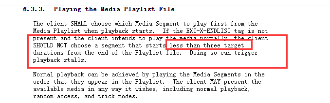

# 第三章 音视频格式剖析
## 1.概要
作为一名音视频工程师，常见的音视频知识是必须要知道的，封装格式、编码格式、视频的YUV排列、H264帧中的SPS与PPS，还有一些传输协议，这些都是流媒体开发中比较常见的技术方案，作为一个合格的音视频工程师，不需要你样样精通，但是你一定要心中有数，知道原理。<br>
不掌握核心原理去优化，是没法达到好的效果的，所以我们学习东西还是要深入到内部，了解原理细节。本文主要阐释音视频开发中经常会用到的一些格式和格式中的重要概念。
## 2.常见音视频封装格式
封装格式就是视频最外层的一套衣服，视频的内部数据都在这个封装格式内部，视频有音频轨道信息、视频轨道信息，甚至还有字幕轨道信息，这个信息或者数据流都被集成在封装格式中，所以解剖这些小麻雀是我们音视频进阶的第一步，开始脱衣服了，兄弟们。
### 2.1 MP4
MP4应用有广泛，现在最火的短视频都是采用MP4的封装格式，还是首先抛出一个问题，MP4的全程是什么？<br>
我去，全程是什么有那么重要吗？我之前在学校的时候被导师说过一次，他当时问我FFmpeg的全程是什么？我一脸懵逼，当时他就说我研究一个东西难道不应该先搞清楚这个东西来龙去脉吗？当时觉得委屈，现在想想看看，还是有一定的道理，稍微花点时间，可以搞清楚的事情有时候却不愿意去搞明白，还是学习地不彻底。好了，言归正传。<br>
MP4就是MPEG-4，MPEG的全程是Moving Picture Experts Group，即动态影像专家组，MPEG第一代在1998年就提出来了，目前最新的版本是MPEG-4，MPEG-4相对其前辈而言有高度的压缩比和高清的画质以及较高的灵活性。大家感兴趣可以看看MPEG的发展历史：https://zh.wikipedia.org/wiki/MPEG-4 <br>

下面我们通过分析MP4的结构来解剖这只小麻雀。<br>
MP4本质是一个BOX的嵌套结构，就是像套娃一样，主要包含四个一级文件索引:<br>
<br>
**ftyp :**<br> 
File Type Box，该Box有且只有一个，通常放在文件开始的位置，指示该MP4文件的相关信息，依次包括32位的major brand(4个字符)，1个32位的minor version和1个32位的compatible brands，见下图。<br>
<br>
```
public class FileTypeBox extends AbstractBox {
    public static final String TYPE = "ftyp";

    private String majorBrand;
    private long minorVersion;
    private List<String> compatibleBrands = Collections.emptyList();

    public FileTypeBox() {
        super(TYPE);
    }

    public FileTypeBox(String majorBrand, long minorVersion, List<String> compatibleBrands) {
        super(TYPE);
        this.majorBrand = majorBrand;
        this.minorVersion = minorVersion;
        this.compatibleBrands = compatibleBrands;
    }
    //......

}

```
major_brand就是mp42，minor_version是0，compatible_brands是isom,mp42
**free :**<br>
free box里面的数据无关紧要，基本上是可有可无的，它被删除了不会对播放产生任何影响，主要是最初的版本就有free box，后面为了向前兼容，所以没有删除。
```
public class FreeSpaceBox extends AbstractBox {
    public static final String TYPE = "skip";

    byte[] data;

    public FreeSpaceBox() {
        super(TYPE);
    }

    protected long getContentSize() {
        return data.length;
    }

    public byte[] getData() {
        return data;
    }

    public void setData(byte[] data) {
        this.data = data;
    }
    //......
}

```
它的type通常是FREE或者是SKIP的。大家了解即可。

**mdat :**<br>
mdat存储是具体的音视频数据，当然是解码之前的数据，由于MP4知识封装格式，所以这部分原始数据我们不需要过多深究其细节，只要知道多大就行了，指引解析mdat的地方才是比较重要的地方，就是下面我们要讲的moov box结构。

**moov :**<br>
moov是MP4文件中非常重要的一个BOX，其中存放媒体的metadata信息，MP4文件的所有属性信息都会在moov中显示，下面是moov的结构示意图：<br>
<br>
<br>
如上图所示，moov的完整结构非常复杂。其一级目录中主要包括mvhd、meta、trak、udta<br>

mvhd又称为 movie header atom info，存放视频的基本信息，例如时长、码率、音量等等。<br>
<br>
> * version : box版本号
> * creation_time : 创建时间，相对UTC-1904-01-01的时间
> * modification_time : 最后的修改时间
> * time_scale : 1s时间的刻度值
> * duration : 时间长度， 和time_scale一起可以计算总时长，  duraion / time_scale，例如上面的视频就是12s多一点。
> * rate : 推荐的播放速率
> * volume : 推荐的音量大小
> * matrix : 指定的视频变换矩阵
> * next_track_id : 指定下一个轨道的索引，这儿是3，说明已经有2个轨道了。

```
public class MovieBox extends AbstractContainerBox {
    public static final String TYPE = "moov";

    public MovieBox() {
        super(TYPE);
    }

    public int getTrackCount() {
        return getBoxes(TrackBox.class).size();
    }


    /**
     * Returns the track numbers associated with this <code>MovieBox</code>.
     *
     * @return the tracknumbers (IDs) of the tracks in their order of appearance in the file
     */
    public long[] getTrackNumbers() {

        List<TrackBox> trackBoxes = this.getBoxes(TrackBox.class);
        long[] trackNumbers = new long[trackBoxes.size()];
        for (int trackCounter = 0; trackCounter < trackBoxes.size(); trackCounter++) {
            trackNumbers[trackCounter] = trackBoxes.get(trackCounter).getTrackHeaderBox().getTrackId();
        }
        return trackNumbers;
    }

    public MovieHeaderBox getMovieHeaderBox() {
        return Path.getPath(this, "mvhd");
    }

}

```

这已经是可视化的分析数据了，其实分析文件结构就是读位运算，还挺枯燥的。<br><br>

trak一听就是存储轨道信息，像上面的示意图，有两个轨道信息，我们拿出其中一个来分析一下。一个视频中多个track信息是互相独立的，分别有自己的时间和空间信息，trak信息包含一个tkhd和mdia box结构，下面是trak的代码逻辑：
```
public class TrackBox extends AbstractContainerBox {
    public static final String TYPE = "trak";
    private SampleTableBox sampleTableBox;

    public TrackBox() {
        super(TYPE);
    }

    public TrackHeaderBox getTrackHeaderBox() {
        return Path.getPath(this, "tkhd[0]");
    }

    /**
     * Gets the SampleTableBox at mdia/minf/stbl if existing.
     *
     * @return the SampleTableBox or <code>null</code>
     */
    public SampleTableBox getSampleTableBox() {
        if (sampleTableBox != null) {
            return sampleTableBox;
        }
        MediaBox mdia = getMediaBox();
        if (mdia != null) {
            MediaInformationBox minf = mdia.getMediaInformationBox();
            if (minf != null) {
                sampleTableBox = minf.getSampleTableBox();
                return sampleTableBox;
            }
        }
        return null;

    }


    public MediaBox getMediaBox() {
        return Path.getPath(this, "mdia[0]");
    }

    @Override
    public void setBoxes(List<? extends Box> boxes) {
        super.setBoxes(boxes);
        sampleTableBox = null;
    }

}

```
其中tkhd是trak的属性信息的集合，相当月trak的头文件：<br>
<br>
> * version : 版本号，通常为0或者1 
> * track_id : 轨道索引号
> * layer : 指定的视频层次，默认为0，越小越在上面
> * width : 视频的宽
> * height : 视频的高，音频一般没有这个信息的。

<br><br>

mdia 则是整个track的媒体相关的信息，其中mdhd是其头部信息，mdhd和tkhd内容大致一样。如下图，不做过多的介绍了。<br>
<br>

stbl 存储音视频的chunk数据，像一个链表一样，存储着一个个sample块结构，<br>
stts中有块个数，stsz有sample size， 可以通过sample size到mdat中读取对应的数据。<br>

简单分析了MP4的结构，我们会有一个疑问，moov是MP4的是头文件，那为什么moov在文件末尾了？会不会有问题，我要播放MP4文件，肯定要先读moov数据，才能通过moov信息到mdat找对应的原始数据。<br>
其实标准的MP4文件中moov应该在mdat之前的，上面的视频一般是手机录制的视频，我们在短视频应用中需要在后台将moov处理放到mdat之前，因为边下边播的必要条件就是要moov一定要在mdat之前，不然双IO请求处理非常复杂。<br>
这也间接说明了MP4文件并不是流式文件，它的诞生有很强的时代背景，在如今流式文件满天飞的时代，MP4是不能作为直播的封装格式存在的。<br>

下面是指令可以将MP4文件的moov放到mdat之前。
```
ffmpeg -i input.mp4 -movflags faststart output.mp4

```
但是凡事无绝对，moov在mdat后面确实会对MP4的首帧速度造成一些影响，但是不是绝对不能播放，只要把握这种规律，在起始请求的时候发起双端IO请求会解决不能播放的问题，但是性能肯定会收到影响了，这在后面分析播放器方面源码的时候会详细分析一下。
<br>
虽然MPEG-4文件的标准后缀名是.mp4，但是还有一些其他的后缀名，例如仅有音频的文件会使用.m4a作为后缀名，苹果中的音频加密文件会使用.m4p作为后缀名，早期的移动电话会使用.3qp作为后缀名。<br>

上面分析MP4 box结构的工具是在线的工具，现在附上具体的链接：https://gpac.github.io/mp4box.js/test/filereader.html
### 2.2 FLV
上面提到了MP4不能作为直播的流式文件，因为MP4的BOX结构的限制，那可以作为直播的格式是什么？FLV开始登上历史的舞台。<br>
上面之所以用是否是流式结果来区分FLV和MP4，并不是说FLV比MP4好，只是它们应用的场景不一样，所以我们关注它们特性的重点也不同，两种格式在不同的领域应用都非常广泛，所以大家要根据实际的应用情况来选择具体的格式。<br>
FLV全称是Flash Video，是Adobe公司推出的一种媒体封装格式，我们先分析一下FLV格式的具体内容。
#### 2.2.1 FLV分析工具
计算机上面的数据，最终写入就是bytes数据，二进制信息，还是需要可视化的工具来查看。FLV查看的工具是FlvAnalyzer，回复FLV得到多媒体查看分析的一整套工具。下面使用FlvAnalyzer来分析FLV文件。
<br>
FlvAnalyzer解析出来的FLV文件是一种树状的排列，分为两大部分：
> * FLV Header：包含版本信息和音频、视频的排位信息；
> * FLV Body：这里能看到交替的Video Tag和Audio Tag信息；

里面可以直接看到二进制信息，当然这些二进制数据都有具体的含义，下面会重点阐述。<br>

除了FlvAnalyzer，还有一个工具推荐一下，是雷神开发的一个工具，是SpecialFFlv工具，真的相当赞的工具，大大优化了可视化的功能，界面交互更加优化。它还提供了分离视频流和音频流的功能。<br>
<br>
<br>
test.flv分离出来的视频test_0.flv 和音频 test_0.mp3
```
ffprobe test.flv

Input #0, flv, from 'test.flv':
  Metadata:
    major_brand     : isom
    minor_version   : 512
    compatible_brands: isomiso2avc1mp41
    encoder         : Lavf57.83.100
  Duration: 00:01:19.69, start: 0.084000, bitrate: 950 kb/s
    Stream #0:0: Video: h264 (High), yuv420p(progressive), 960x540, 23.98 fps, 23.98 tbr, 1k tbn, 47.95 tbc
    Stream #0:1: Audio: mp3, 44100 Hz, stereo, s16p, 128 kb/s

```
test_0.flv解析如下
```
ffprobe test_0.flv

Input #0, flv, from 'test_0.flv':
  Duration: 00:01:19.54, start: 0.084000, bitrate: 819 kb/s
    Stream #0:0: Video: h264 (High), yuv420p(progressive), 960x540, 24.42 fps, 23.98 tbr, 1k tbn, 47.95 tbc

```
#### 2.2.2 FLV格式分析
上面使用工具解析出FLV文件的具体结构，下面我们要分析一下FLV格式的各个字段代表什么意思。<br>
FLV包括文件头（File Header）和文件体（File Body）两部分，其中文件体由一系列的Tag组成。FLV文件的结构如下图：<br>
<br>
##### 2.2.2.1 FLV Header
Header 部分记录了FLV的类型、版本等信息，是FLV的开头。一般差不多占9个字节。具体格式如下：<br>
<br>
可以看出来，其中包含，签名信息，版本信息，保留位，音频和视频信息，还有header size；<br>
文件标识：占3位，总是FLV，0x46 0x4c 0x56<br>
<br>
版本号：占1位，目前默认为0x01<br>
<br>
流信息：占1位，文件的标志说明，前5位保留，必须为0；第6位为音频Tag：1 表示有音频；第七位保留，为0；第8位为视频Tag：1 表示有视频。<br>
<br>
Header长度：占4位，整个Header的长度，一般为9（版本为0x01时）；大于9表示下面还有扩展信息。即0x00000009。
##### 2.2.2.2 FLV Body
文件体由一系列的Tag组成。其中，每个Tag前面还包含了Previous Tag Size字段，表示前面一个Tag的大小。Tag的类型可以是视频、音频和Script，每个Tag只能包含以上三种类型的数据中的一种。<br>
每个Tag由也是由两部分组成的：Tag Header和Tag Data。Tag Header里存放的是当前Tag的类型、数据区（Tag Data）长度等信息，具体如下：<br>
Tag类型：占1位，0x08：音频; 0x09：视频; 0x12：脚本; 其他：保留。<br>
数据区长度：占3位，表示数据区的长度。<br>
时间戳：占3位，整数，单位是毫秒。对于脚本型的tag总是0 （CTS）<br>
时间戳扩展：占1位，加上之前的时间戳3位，将时间戳扩展为4bytes，代表高8位。很少用到。<br>
StreamsID：占1位，总是0<br>
数据区（由数据区长度决定）：数据实体<br>
下面是三个Tag类型说明：<br>
> * Audio Tag Data结构（音频类型） ：音频Tag Data区域开始的第一个字节包含了音频数据的参数信息，从第二个字节开始为音频流数据。
> * Video Tag Data结构(视频类型)：视频Tag Data开始的第一个字节包含视频数据的参数信息，从第二个字节开始为视频流数据。
> * Script Tag Data结构（脚本类型、帧类型）：该类型Tag又被称为MetaData Tag，存放一些关于FLV视频和音频的元信息，比如：duration、width、height等。通常该类型Tag会作为FLV文件的第一个tag，并且只有一个，跟在File Header后。<br>
<br>
上面是Script Tag 的结构信息。

其实从FLV的结构信息来看，比较清晰的看出来FLV就是流式格式，因为音频和视频分别对应出现，不会出现视频和音频完全分离，播放的时候再次同步拉取很麻烦。
#### 2.2.3 FLV相关实践
将一个MP4文件转化为FLV文件，这在ffmpeg指令操作中非常简单：
```
ffmpeg -i test.mp4 -c:v libx264 -crf 24 test.flv

```
如何将FLV格式中设置关键帧索引？FLV标准格式中并没有关键帧索引这一说法，但是我们在实际应用中，特别是现在直播的应用中，我们往往需要向FLV格式中写入关键帧索引，并将这些索引文件写在Metadata 中，这些我们再次播放的时候，可以很快通过这些关键帧索引站到对应的位置，然后准确快速渲染播放。
```
ffmpeg -i test.mp4 -c copy -f flv -flvflags add_keyframe_index key.flv

```
查看具体的key.flv：
```
ffprobe -v trace -i key.flv

```
<br>
关键帧位置对播放的seek操作非常重要，通过计算关键帧的位置，可以很快seek到具体的位置，不会耗时，具有非常好的用户体验效果，当然这是播放器的具体知识了。后面讲解播放器seek操作的时候可以展开分析一下。
### 2.3 HLS
HLS全称为Http Live Streaming，是Apple主推的一种流媒体协议，外部的开发熟知的还是M3U8格式。<br>
M3U8格式，早期称为M3U格式，一种使用UTF-8编码的文本格式，当然文本中记录的链接是具体的视频链接。M3U8文件是M3U文件的一种，只不过它的编码格式是UTF-8。M3U使用Latin-1字符集编码。M3U的全称是Moving Picture Experts Group Audio Layer 3 Uniform Resource Locator，即mp3 URL。M3U是纯文本文件；所以UTF-8编码的M3U文件也简称为 M3U8。<br>
HLS 的工作原理是把整个流分成一个个小的基于 HTTP 的文件来下载，每次只下载一些。当媒体流正在播放时，客户端可以选择从许多不同的备用源中以不同的速率下载同样的资源，允许流媒体会话适应不同的数据速率。在开始一个流媒体会话时，客户端会下载一个包含元数据的 extended M3U (m3u8) playlist文件，用于寻找可用的媒体流。<br>
HLS 只请求基本的 HTTP 报文，与实时传输协议（RTP）不同，HLS 可以穿过任何允许 HTTP 数据通过的防火墙或者代理服务器。它也很容易使用内容分发网络来传输媒体流。这是HLS应用在直播上的一大优势。<br>
如果在直播中使用HLS技术，那么执行流程如下：图片来源于苹果官网；<br>
<br>
我们播放一个HLS，首先要对HLS流对应的M3U8文件进行解析，解析M3U8文件，首先要搞清楚M3U8的封装格式；
#### 2.3.1 HLS格式解析
HLS流可以用于直播，也可以用于点播；<br>
M3U8 文件实质是一个播放列表（playlist），其可能是一个媒体播放列表（Media Playlist），或者是一个主列表（Master Playlist）。
##### 2.3.1.1 HLS文件类型
当 M3U8 文件作为媒体播放列表（Media Playlist）时，其内部信息记录的是一系列媒体片段资源，顺序播放该片段资源，即可完整展示多媒体资源。其格式如下所示：
```
#EXTM3U
#EXT-X-TARGETDURATION:10

#EXTINF:9.009,
http://media.example.com/first.ts
#EXTINF:9.009,
http://media.example.com/second.ts
#EXTINF:3.003,
http://media.example.com/third.ts
#EXT-X-ENDLIST

```
当 M3U8 作为主播放列表（Master Playlist）时，其内部提供的是同一份媒体资源的多份流列表资源。其格式如下所示：
```
#EXTM3U
#EXT-X-STREAM-INF:BANDWIDTH=150000,RESOLUTION=416x234,CODECS="avc1.42e00a,mp4a.40.2"
http://example.com/low/index.m3u8
#EXT-X-STREAM-INF:BANDWIDTH=240000,RESOLUTION=416x234,CODECS="avc1.42e00a,mp4a.40.2"
http://example.com/lo_mid/index.m3u8
#EXT-X-STREAM-INF:BANDWIDTH=440000,RESOLUTION=416x234,CODECS="avc1.42e00a,mp4a.40.2"
http://example.com/hi_mid/index.m3u8
#EXT-X-STREAM-INF:BANDWIDTH=640000,RESOLUTION=640x360,CODECS="avc1.42e00a,mp4a.40.2"
http://example.com/high/index.m3u8
#EXT-X-STREAM-INF:BANDWIDTH=64000,CODECS="mp4a.40.5"
http://example.com/audio/index.m3u8
#EXT-X-ENDLIST

```
##### 2.3.1.2 HLS基本字段
```

#EXTM3U                    M3U8文件头，必须放在第一行;
#EXT-X-MEDIA-SEQUENCE      第一个TS分片的序列号，一般情况下是0，但是在直播场景下，这个序列号标识直播段的起始位置; #EXT-X-MEDIA-SEQUENCE:0
#EXT-X-TARGETDURATION      每个分片TS的最大的时长;   #EXT-X-TARGETDURATION:10     每个分片的最大时长是 10s
#EXT-X-ALLOW-CACHE         是否允许cache;          #EXT-X-ALLOW-CACHE:YES      #EXT-X-ALLOW-CACHE:NO    默认情况下是YES
#EXT-X-ENDLIST             M3U8文件结束符；
#EXTINF                    extra info，分片TS的信息，如时长，带宽等；一般情况下是    #EXTINF:<duration>,[<title>] 后面可以跟着其他的信息，逗号之前是当前分片的ts时长，分片时长 移动要小于 #EXT-X-TARGETDURATION 定义的值；
#EXT-X-VERSION             M3U8版本号
#EXT-X-DISCONTINUITY       该标签表明其前一个切片与下一个切片之间存在中断。下面会详解
#EXT-X-PLAYLIST-TYPE       表明流媒体类型；
#EXT-X-KEY                 是否加密解析，    #EXT-X-KEY:METHOD=AES-128,URI="https://priv.example.com/key.php?r=52"    加密方式是AES-128,秘钥需要请求   https://priv.example.com/key.php?r=52  ，请求回来存储在本地；

```
##### 2.3.1.3 HLS高级字段
要想深入了解HLS, 光了解基本字段是不够,本文带你了解一下HLS的高级字段,让你对HLS有更深的理解。<br>
**EXT-X-BYTERANGE**<br>
我们知道M3U8需要切片,但是有时候我们不想切片(为什么? 我比较懒), 我只想用一个ts来构建一个类似M3U8的分片索引, 这时候EXT-X-BYTERANGE就派上用场了.
表达的格式如下:
```
#EXT-X-BYTERANGE:<length>[@<offset>]

```
其中length表示range的长度, offset表示这个range从分片的什么位置开始读.<br>
据一个例子吧:
```
#EXTM3U
#EXT-X-TARGETDURATION:11
#EXT-X-MEDIA-SEQUENCE:0
#EXT-X-VERSION:4
#EXTINF:9.009,
#EXT-X-BYTERANGE:12345@0
media.ts
#EXTINF:9.009,
#EXT-X-BYTERANGE:82112@12345
media.ts
#EXTINF:3.003,
#EXT-X-BYTERANGE:69864
media.ts
#EXT-X-ENDLIST

```
这个M3U8索引文件中,只有media.ts一个分片文件,这个文件可能很大, 第一个指定的分片是从media.ts的0位置开始读12345长度的数据; 第二个指定的分片是从media.ts的12345位置开始读82112长度的数据;第三个没有指定offset, 那么默认从上一个指定分为的结束处开始读.
当然只有VERSION版本不低于4才可以应用这个属性。<br><br>

**EXT-X-KEY**<br>
M3U8索引文件中有了#EXT-X-KEY 字段,说明当前的M3U8视频片段可能被加密了.这一行是告诉你应该怎么解密这些视频分片.<br>
表达的格式如下:
```
#EXT-X-KEY:<attribute-list>          

```
这个属性列表中有如下几个字段:
> * METHOD : 这个是一个枚举值,可以为NONE, AES-128, SAMPLE-AES, NONE表述分片并没有被加密,其他的属性集就没有必要出现了,后面介绍如何解密
> * URI : 密钥的地址存放的地方,也是一个url
> * IV : 该值是一个十六进制序列, 它指定要与密钥一起使用的128位无符号整数初始化向量
> * KEYFORMAT : 这个密钥的格式, 可选字段, 默认情况下是"identity", 主要是加强数字证书校验安全性设定的.

M3U8加密和解密非常重要, 是M3U8的优势之一, 毕竟现代社会越来越注重安全,版权意识也非常重要。<br><br>

**EXT-X-MAP**<br>
这个字段是视频的初始化片段, 简而言之,有了这个字段,说明后续的每一个分片文件必须和通过这个初始化片段才能完整解读,缺少这个初始化片段, M3U8视频根本播放不了.
表达的格式如下:
```
#EXT-X-MAP:<attribute-list>

```
> * URI : 初始化片段的地址, 这个信息是必须的.
> * BYTERANGE : 这个可以参考 #EXT-X-BYTERANGE 字段

给大家据一个例子: <br>
https://europe.olemovienews.com/hlstimeofffmp4/20210226/fICqcpqr/mp4/fICqcpqr.mp4/master.m3u8 <br>
其中有一行: <br>
```
#EXT-X-MAP:URI="init-v1-a1.mp4"

```
说明后续的每一个分片都需要这个init-v1-a1.mp4才能真正解码播放出来，取出第一个分片地址如下：
https://europe.olemovienews.com/hlstimeofffmp4/20210226/fICqcpqr/mp4/fICqcpqr.mp4/seg-1-v1-a1.m4s<br>
```
ffprobe version 4.2.4-1ubuntu0.1 Copyright (c) 2007-2020 the FFmpeg developers
  built with gcc 9 (Ubuntu 9.3.0-10ubuntu2)
  configuration: --prefix=/usr --extra-version=1ubuntu0.1 --toolchain=hardened --libdir=/usr/lib/x86_64-linux-gnu --incdir=/usr/include/x86_64-linux-gnu --arch=amd64 --enable-gpl --disable-stripping --enable-avresample --disable-filter=resample --enable-avisynth --enable-gnutls --enable-ladspa --enable-libaom --enable-libass --enable-libbluray --enable-libbs2b --enable-libcaca --enable-libcdio --enable-libcodec2 --enable-libflite --enable-libfontconfig --enable-libfreetype --enable-libfribidi --enable-libgme --enable-libgsm --enable-libjack --enable-libmp3lame --enable-libmysofa --enable-libopenjpeg --enable-libopenmpt --enable-libopus --enable-libpulse --enable-librsvg --enable-librubberband --enable-libshine --enable-libsnappy --enable-libsoxr --enable-libspeex --enable-libssh --enable-libtheora --enable-libtwolame --enable-libvidstab --enable-libvorbis --enable-libvpx --enable-libwavpack --enable-libwebp --enable-libx265 --enable-libxml2 --enable-libxvid --enable-libzmq --enable-libzvbi --enable-lv2 --enable-omx --enable-openal --enable-opencl --enable-opengl --enable-sdl2 --enable-libdc1394 --enable-libdrm --enable-libiec61883 --enable-nvenc --enable-chromaprint --enable-frei0r --enable-libx264 --enable-shared
  libavutil      56. 31.100 / 56. 31.100
  libavcodec     58. 54.100 / 58. 54.100
  libavformat    58. 29.100 / 58. 29.100
  libavdevice    58.  8.100 / 58.  8.100
  libavfilter     7. 57.100 /  7. 57.100
  libavresample   4.  0.  0 /  4.  0.  0
  libswscale      5.  5.100 /  5.  5.100
  libswresample   3.  5.100 /  3.  5.100
  libpostproc    55.  5.100 / 55.  5.100
[mov,mp4,m4a,3gp,3g2,mj2 @ 0x55fd8bd5ff00] could not find corresponding trex (id 1)
[mov,mp4,m4a,3gp,3g2,mj2 @ 0x55fd8bd5ff00] could not find corresponding track id 0
[mov,mp4,m4a,3gp,3g2,mj2 @ 0x55fd8bd5ff00] trun track id unknown, no tfhd was found
[mov,mp4,m4a,3gp,3g2,mj2 @ 0x55fd8bd5ff00] error reading header
https://europe.olemovienews.com/hlstimeofffmp4/20210226/fICqcpqr/mp4/fICqcpqr.mp4/seg-1-v1-a1.m4s: Invalid data found when processing input

```
<br>
这是因为光解析第一个分片是不行的,因为真正的视频头部信息在init-v1-a1.mp4中，就是moov信息在init-v1-a1.mp4文件中，所以想要解析完整的MP4视频，还需要moov才可以真正的解析成功。<br><br>

**EXT-X-I-FRAMES-ONLY**<br>
这个字段表示每个片段只有一个I帧, I帧是什么大家应该很清楚, 音音视频的兄弟们, 为什么会出现这个字段？<br>
如果做过视频特效处理的同学应该很清楚, 处理视频的时候,如果都是I帧,那么特效/反转/快进/快退非常方便.<br>

当然实际上M3U8上用到 #EXT-X-I-FRAMES-ONLY并不多, 大家了解即可.<br><br>

**EXT-X-MEDIA**<br>
这个字段表示针对同一个内容的不同角度的演绎, 例如统一段视频有视频/音频/字幕, 甚至还不止一个音频轨道, 很有很多种语言的字幕, 一段视频有这么多信息, #EXT-X-MEDIA 就是干这个的.<br>
表达的格式如下:
```
#EXT-X-MEDIA:<attribute-list>

```
属性集有下面的字段:
> * TYPE : 这是一个枚举值, 可以是AUDIO, VIDEO, SUBTITLES, CLOSED-CAPTIONS, 这个字段是必须的.
> * URI : 数据源的url, 如果TYPE是CLOSED-CAPTIONS, URI就没有了
> * GROUP-ID : 表示源属于的组ID, 这只是一个标识
> * DEFAULT : YES 或者 NO
> * AUTOSELECT : YES 或者 NO

举个EXT-X-MEDIA应用的例子：
```
#EXTM3U
#EXT-X-MEDIA:TYPE=AUDIO,GROUP-ID="test_audio",LANGUAGE="eng",NAME="Test Audio",AUTOSELECT=NO,DEFAULT=NO,URI="test_audio_aac/index.m3u8"

#EXT-X-MEDIA:TYPE=SUBTITLES,GROUP-ID="subs",NAME="English",DEFAULT=YES,AUTOSELECT=YES,FORCED=NO,LANGUAGE="en",CHARACTERISTICS="public.accessibility.transcribes-spoken-dialog, public.accessibility.describes-music-and-sound",URI="subtitles/eng/index.m3u8"

#EXT-X-STREAM-INF:BANDWIDTH=263851,CODECS="mp4a.40.2, avc1.4d400d",RESOLUTION=416x234,AUDIO="test_audio",SUBTITLES="subs"
high_test/index.m3u8
#EXT-X-STREAM-INF:BANDWIDTH=41457,CODECS="mp4a.40.2",AUDIO="test_audio",SUBTITLES="subs"
middle_test/index.m3u8

```
##### 2.3.1.3 HLS的具体例子
（1）HLS基础例子：<br>
```
#EXTM3U
#EXT-X-TARGETDURATION:10
#EXT-X-VERSION:3
#EXTINF:9.009,
http://media.example.com/first.ts
#EXTINF:9.009,
http://media.example.com/second.ts
#EXTINF:3.003,
http://media.example.com/third.ts
#EXT-X-ENDLIST

```

<br>
（2）HLS直播例子：<br>

```
#EXTM3U
#EXT-X-VERSION:3
#EXT-X-TARGETDURATION:8
#EXT-X-MEDIA-SEQUENCE:2680
#EXTINF:7.975,
https://priv.example.com/fileSequence2680.ts
#EXTINF:7.941,
https://priv.example.com/fileSequence2681.ts
#EXTINF:7.975,
https://priv.example.com/fileSequence2682.ts

```

<br>
（3）master HLS例子：<br>

```
#EXTM3U
#EXT-X-STREAM-INF:BANDWIDTH=1280000,AVERAGE-BANDWIDTH=1000000
http://example.com/low.m3u8
#EXT-X-STREAM-INF:BANDWIDTH=2560000,AVERAGE-BANDWIDTH=2000000
http://example.com/mid.m3u8
#EXT-X-STREAM-INF:BANDWIDTH=7680000,AVERAGE-BANDWIDTH=6000000
http://example.com/hi.m3u8
#EXT-X-STREAM-INF:BANDWIDTH=65000,CODECS="mp4a.40.5"
http://example.com/audio-only.m3u8

```

<br>
（4）EXT-X-MEDIA例子：<br>

```
#EXTM3U
#EXT-X-MEDIA:TYPE=AUDIO,GROUP-ID="aac",NAME="English", \
      DEFAULT=YES,AUTOSELECT=YES,LANGUAGE="en", \
      URI="main/english-audio.m3u8"
#EXT-X-MEDIA:TYPE=AUDIO,GROUP-ID="aac",NAME="Deutsch", \
      DEFAULT=NO,AUTOSELECT=YES,LANGUAGE="de", \
      URI="main/german-audio.m3u8"
#EXT-X-MEDIA:TYPE=AUDIO,GROUP-ID="aac",NAME="Commentary", \
      DEFAULT=NO,AUTOSELECT=NO,LANGUAGE="en", \
      URI="commentary/audio-only.m3u8"
#EXT-X-STREAM-INF:BANDWIDTH=1280000,CODECS="...",AUDIO="aac"
low/video-only.m3u8
#EXT-X-STREAM-INF:BANDWIDTH=2560000,CODECS="...",AUDIO="aac"
mid/video-only.m3u8
#EXT-X-STREAM-INF:BANDWIDTH=7680000,CODECS="...",AUDIO="aac"
hi/video-only.m3u8
#EXT-X-STREAM-INF:BANDWIDTH=65000,CODECS="mp4a.40.5",AUDIO="aac"
main/english-audio.m3u8
```

#### 2.3.2 如何判断HLS是否是直播
（1）判断是否存在 #EXT-X-ENDLIST<br>
对于一个M3U8文件，如果结尾不存在 #EXT-X-ENDLIST，那么一定是 直播，不是点播；<br><br>

（2）判断 #EXT-X-PLAYLIST-TYPE 类型<br>

'#EXT-X-PLAYLIST-TYPE' 有两种类型，<br>

VOD 即 Video on Demand，表示该视频流为点播源，因此服务器不能更改该 M3U8 文件；<br>

EVENT 表示该视频流为直播源，因此服务器不能更改或删除该文件任意部分内容（但是可以在文件末尾添加新内容）（注：VOD 文件通常带有 EXT-X-ENDLIST 标签，因为其为点播源，不会改变；而 EVEVT 文件初始化时一般不会有 EXT-X-ENDLIST 标签，暗示有新的文件会添加到播放列表末尾，因此也需要客户端定时获取该 M3U8 文件，以获取新的媒体片段资源，直到访问到 EXT-X-ENDLIST 标签才停止）。

#### 2.3.3 HLS如何提供多码率
上面提出了有一种Master Playlist 的HLS类型，就是会提供 多份码率的列表资源，如下：
```

#EXTM3U
#EXT-X-STREAM-INF:BANDWIDTH=150000,RESOLUTION=416x234,CODECS="avc1.42e00a,mp4a.40.2"
http://example.com/low/index.m3u8
#EXT-X-STREAM-INF:BANDWIDTH=240000,RESOLUTION=416x234,CODECS="avc1.42e00a,mp4a.40.2"
http://example.com/lo_mid/index.m3u8
#EXT-X-STREAM-INF:BANDWIDTH=440000,RESOLUTION=416x234,CODECS="avc1.42e00a,mp4a.40.2"
http://example.com/hi_mid/index.m3u8
#EXT-X-STREAM-INF:BANDWIDTH=640000,RESOLUTION=640x360,CODECS="avc1.42e00a,mp4a.40.2"
http://example.com/high/index.m3u8
#EXT-X-STREAM-INF:BANDWIDTH=64000,CODECS="mp4a.40.5"
http://example.com/audio/index.m3u8
#EXT-X-ENDLIST

```
'#EXT-X-STREAM-INF' 字段后面有：<br>
BANDWIDTH 指定码率<br>
RESOLUTION 分辨率<br>
PROGRAM-ID 唯一ID<br>
CODECS 指定流的编码类型<br><br>

码率、码流是同一个概念，是数据传输时单位时间传送的数据量，一般用单位kbps表示。<br>

视频码率就是指视频文件在单位时间内使用的数据量。简单理解就是要播放一秒的视频需要多少数据，从这个角度就不难理解通常码率越高视频质量也越好，相应的文件体积也会越大。码率、视频质量、文件体积是正相关的。但当码率超过一定数值后，对图像的质量影响就不大了。几乎所有的编码算法都在追求用最低的码率达到最少的失真(最好的清晰度)；
#### 2.3.4 如何在HLS中插入广告
M3U8文件中插入广告，要想灵活的控制广告，则广告可以插入任何视频中，那么无法保证广告的编码格式和码率等信息和原视频的编码格式等信息保持一致，就必须告知播放器，在插入广告的地方，ts片段发生的信息变更，需要播放器适配处理。<br><br>

'#EXT-X-DISCONTINUITY' 该标签表明其前一个切片与下一个切片之间存在中断。说明有不连续的视频出现，这个视频绝大多数情况下就是广告；<br>
'#EXT-X-DISCONTINUITY' 这个字段就是来做这个事情的；<br>
当出现以下情况时，必须使用该标签：
> * file format
> * encoding parameters

下面展示一个插入广告的例子：
```
#EXTM3U
#EXT-X-TARGETDURATION:10
#EXT-X-VERSION:4
#EXT-X-MEDIA-SEQUENCE:0
#EXTINF:10.0,
movieA.ts
#EXTINF:10.0,
movieB.ts
 ...
#EXT-X-ENDLIST

```
想在开头插入广告：
```
#EXTM3U
#EXT-X-TARGETDURATION:10
#EXT-X-VERSION:4
#EXT-X-MEDIA-SEQUENCE:0
#EXTINF:10.0,
ad0.ts
#EXTINF:8.0,
ad1.ts
#EXT-X-DISCONTINUITY
#EXTINF:10.0,
movieA.ts
#EXTINF:10.0,
movieB.ts
...
#EXT-X-ENDLIST

```
当然你可以在任意位置插入广告。<br>

HLS协议草案：HLS协议中还有很多字段，但是有些字段其实就是协议，在实际应用中并不大；大家可以参考看看；https://tools.ietf.org/html/rfc8216

#### 2.3.5 EXT-X-MAP工作原理
从上面的格式剖析来看，'#EXT-X-MAP'是视频的初始化片段， 简而言之，有了这个字段，说明后续的每一个分片文件必须和通过这个初始化片段才能完整解读，缺少这个初始化片段，M3U8视频根本播放不了。<br>
表达的格式如下:
```
#EXT-X-MAP:<attribute-list>

```
这个属性集有下面这些字段:
> * URI : 初始化片段的地址, 这个信息是必须的.
> * BYTERANGE : 这个可以参考 #EXT-X-BYTERANGE 字段

上面已经举了一个例子：https://europe.olemovienews.com/hlstimeofffmp4/20210226/fICqcpqr/mp4/fICqcpqr.mp4/master.m3u8 中的其中一行是:
```
#EXT-X-MAP:URI="init-v1-a1.mp4"

```
这是初始化片段，后续的每一个分片都需要这个初始化片段才能真正解析出来。<br>
'#EXT-X-MAP'的字段主要目的有3个:
> * 为了安全
> * 为了节省存储空间
> * 为了减少切片, 减少切片服务器的工作量

##### 2.3.5.1 安全作用
'#EXT-X-MAP' 将一个完整视频的头单独存放, 将其他部分存在另一个视频文件中, 这样就是你们抓到了其中一个视频, 也播放不了, 这是防止盗链的一种手段, "将鸡蛋放在不同的篮子里"
对于https://europe.olemovienews.com/hlstimeofffmp4/20210226/fICqcpqr/mp4/fICqcpqr.mp4/master.m3u8 下载完成的文件如下：<br>
<br>
其中#EXT-X-MAP中视频片段是:
```
#EXT-X-MAP:URI="https://europe.olemovienews.com/hlstimeofffmp4/20210226/fICqcpqr/mp4/fICqcpqr.mp4/init-v1-a1.mp4"

```
可以看出来, #EXT-X-MAP中的视频片段中没有实质内容, 只有视频的头部, 了解MP4视频构造的都知道moov是MP4的头部, mdat才是MP4的实质内容,<br>
<br>
对比看一下第一个片段:
https://europe.olemovienews.com/hlstimeofffmp4/20210226/fICqcpqr/mp4/fICqcpqr.mp4/seg-1-v1-a1.m4s
这是一个fMP4片段, 里面没有moov头部, 单单播放这个视频片段是无法播放成功的, 还需要和#EXT-X-MAP结合起来播放才可以真正播放成功的.<br>
<br>
MP4和fMP4的区别如下：<br>
<br>
现在大家知道了'#EXT-X-MAP'的安全就表现在这里=====> 我可以将'#EXT-X-MAP'中的片段和其他的片段放在不同的服务器上, 只要两个片段不被同时拿到, 还是安全的.
当然安全并不是'#EXT-X-MAP'的主要目的, 毕竟如果为了安全, 还是使用'#EXT-X-KEY'更方便一点.

##### 2.3.5.2 减少存储空间
虽然MP4的moov头部占比不太大, 但是对于一个动不动有成百上千个的M3U8文件, 加起来的大小还是比较可观的, 一个moov头部一般有100K, 如果有1000个fMP4片段, 那么就可以节省10M大小, 海量的视频算算要节省多少数据.

##### 2.3.5.3 减少切片工作
我们上面都是谈 #EXT-X-MAP中的URI属性, 但是别忘了#EXT-X-MAP还有一个BYTERANGE属性, 这个属性是例子一般是
```
#EXT-X-MAP:URI="init-v1-a1.mp4",BYTERANGE="1000@2000"

```
这就表示init-v1-a1.mp4中的1000和2000之间的数据被采用, 其他的不被采用.<br>
这样做的好处是将一个完整的视频切片是需要工作量的, 如果服务端不想做这个工作, 直接在M3U8索引文件中标识一下采用哪一段的数据, 就不用切片这么复杂的工作了.

#### 2.3.6 HLS中URL生成规则
M3U8中的URL的表示无处不在, 不管是基础的HLS片段还是Master的HLS类型, 都需要了解URL的计算规则: <br>
下面介绍四种URL的表示:
> * 直接给出URL
> * 单文件名相对位置
> * 带文件路径的相对位置
> * 双斜杠相对位置

##### 2.3.6.1 直接给出URL
```
#EXTM3U
#EXT-X-TARGETDURATION:10
#EXT-X-VERSION:3
#EXTINF:9.009,
http://media.example.com/first.ts
#EXTINF:9.009,
http://media.example.com/second.ts
#EXTINF:3.003,
http://media.example.com/third.ts
#EXT-X-ENDLIST

```
上面的每一个片段都直接指出了片段的具体url是什么,就是完整的url请求,我们在解析的时候就不需要对片段的具体为值进行拼接了,直接请求url即可

##### 2.3.6.2 单文件名相对位置
```
#EXTM3U
#EXT-X-TARGETDURATION:10
#EXT-X-VERSION:3
#EXTINF:9.009,
first.ts
#EXTINF:9.009,
second.ts
#EXTINF:3.003,
third.ts
#EXT-X-ENDLIST

```
这儿没有任何url, 只有片段的名字, 例如我们请求的视频url是 http://media.example.com/index.m3u8 
这样我们请求http://media.example.com/index.m3u8 的时候,解析到first.ts的时候,我们会默认接上http://media.example.com/ 变成http://media.example.com/first.ts

##### 2.3.6.3 带文件路径的相对位置
例如 https://douban.donghongzuida.com/20210109/15467_73a719b2/index.m3u8
解析出来如下:
```
#EXTM3U
#EXT-X-STREAM-INF:PROGRAM-ID=1,BANDWIDTH=800000,RESOLUTION=1080x608
1000k/hls/index.m3u8

```
这个1000k/hls/index.m3u8 就不是文件名这个简单了,是一个相对路径, 完整的路径是:
https://douban.donghongzuida.com/20210109/15467_73a719b2/1000k/hls/index.m3u8

有时候也可以写成如下:
```
#EXTM3U
#EXT-X-STREAM-INF:PROGRAM-ID=1,BANDWIDTH=800000,RESOLUTION=1080x608
/1000k/hls/index.m3u8

```
甚至可以写成如下:
```
#EXTM3U
#EXT-X-STREAM-INF:PROGRAM-ID=1,BANDWIDTH=800000,RESOLUTION=1080x608
/15467_73a719b2/1000k/hls/index.m3u8

```
这时候你会生成https://douban.donghongzuida.com/20210109/15467_73a719b2/15467_73a719b2/1000k/hls/index.m3u8吧,
显然是不对的.<br>

这时候应该找 https://douban.donghongzuida.com/20210109/15467_73a719b2/和/15467_73a719b2/1000k/hls/index.m3u8 共同的那部分,然后将共同的部分抹掉, 这样就能得到新的url了。
##### 2.3.6.4 双斜杠相对位置
双斜杠后面一般直接就是域名了, 例如下面
```
#EXTM3U
#EXT-X-STREAM-INF:PROGRAM-ID=1,BANDWIDTH=800000,RESOLUTION=1080x608
//douban.donghongzuida.com/20210109/15467_73a719b2/1000k/hls/index.m3u8

```
这时候直接增加一个协议就可以的。

#### 2.3.7 低延时HLS--->LL-HLS
HLS====> HTTP LIVE STREAMING 是苹果公司2009推出的一种流媒体协议, 从推出到现在, 得到了非常广泛的应用, 不管在点播还是直播中, 使用的公司非常多, 点播的情况下不必多说. 我们都知道直播场景下, RTMP使用的显然比HLS更加广泛, 肯定是HLS存在某些缺陷才会导致在直播场景下应用不太广泛。<br>
下面是几种协议的优劣比较<br>
|协议比较|RTMP|HTT-FLV|HLS|
|:-|:-|:-|:-|
|全称|Real Time Message Protocol|RTMP over HTTP|HTTP Live Streaming|
|所在层|传输层|网络层|网络层|
|是否长链接|是|是|否|
|延时|1 ~ 3s|1 ~ 3s|10s|
|兼容性|部分平台不一定支持|全平台支持|全平台支持|
|扩展性|差，Adobe已经不维护|差，Adobe已经不维护了|Apple全力支持，扩展性好|

显而易见, RTMP在传输时延方面确实有很大的优势, 这是目前直播用RTMP的主要原因, 但是苹果公司也不是吃素的, 他们也在积极努力, 改进HLS的时延, 降低直播的耗时, 改善直播观看体验。<br>
经过多年的努力, 2019年苹果公司推出LL-HLS====> Low Latency HLS来着重解决这类问题。
##### 2.3.7.1 为什么HLS这么慢
首先看看HLS 标准协议文档中是怎么介绍的? ====> https://tools.ietf.org/html/rfc8216#section-6.3.3 <br>
<br>
<br>
<br>
简而言之, 必须至少加载3个分片视频, 当前的分片才能被启动播放, HLS标准的分片时长是10s, 加载3个分片, 也就说标准的时延要达到30s, 这在正常直播场景中是无法忍受的。
##### 2.3.7.2 LL-HLS做了什么改进
**（1）生成分片的一部分**<br>
LL-HLS将大的分片且分为一个个较小的分片, 这种切分方式不是简单的将源分片等分, 而是结合fMP4封装和#EXT-X-MAP规则, 将整视频的头部和内容分开, 而且内容源被划分的很细, 例如原来一个分片6s左右, 可能被切分为30个200ms的fMP4分片, 这些分片使用#EXT-X-PART来标注:
```
#EXTINF:6.003,
LLHLS_Video1_67750710.mp4
#EXT-X-PROGRAM-DATE-TIME:2021-03-18T09:20:29.482Z
#EXT-X-PART:DURATION=1.000,URI="LLHLS_Video1_67750711.0.mp4",INDEPENDENT=YES
#EXT-X-PART:DURATION=1.000,URI="LLHLS_Video1_67750711.1.mp4",INDEPENDENT=YES
#EXT-X-PART:DURATION=1.000,URI="LLHLS_Video1_67750711.2.mp4",INDEPENDENT=YES
#EXT-X-PART:DURATION=1.000,URI="LLHLS_Video1_67750711.3.mp4",INDEPENDENT=YES
#EXT-X-PART:DURATION=1.000,URI="LLHLS_Video1_67750711.4.mp4",INDEPENDENT=YES
#EXT-X-PART:DURATION=1.000,URI="LLHLS_Video1_67750711.5.mp4",INDEPENDENT=YES

```
一个整分片LLHLS_Video1_67750710.mp4被切分为6个小分片, 每一个小分片用 '#EXT-X-PART' 标准
这样的好处是原来要把一整个分片请求下来才能播放, 现在不需要了, 我只要请求一两个小分片就可以播放可, 时间上肯定是大大减少了. <br>

**（2）播放列表增量更新**<br>
直播过程中, M3U8索引文件是不断更新的, M3U8索引中会有每一分片的时间戳和真实的时间戳, 这样我们明确知道当前播放到什么问题, 这段分片视频是什么时候下发的, 直播过程中如果出现网络不好, 累积的时延会越来越大, 但是有了时间戳的校验, 网络差的情况下我们也会实时追上最新的播放点.
====> #EXT-X-SERVER-CONTROL 会告诉你那些分片会被丢弃调.
```
#EXT-X-SERVER-CONTROL:CAN-BLOCK-RELOAD=YES,PART-HOLD-BACK=3.150,CAN-SKIP-UNTIL=36.000

```
CAN-SKIP-UNTIL=36.000 说明之前36的视频都是可以舍弃的.<br>
例如紧接着的文件描述为:
```
#EXT-X-SERVER-CONTROL:CAN-BLOCK-RELOAD=YES,PART-HOLD-BACK=3.150,CAN-SKIP-UNTIL=36.000
#EXT-X-MEDIA-SEQUENCE:67750702
#EXT-X-PROGRAM-DATE-TIME:2021-03-18T09:19:35.479Z
#EXTINF:6.000,
LLHLS_Video1_67750702.mp4
#EXT-X-PROGRAM-DATE-TIME:2021-03-18T09:19:41.479Z
#EXTINF:6.000,
LLHLS_Video1_67750703.mp4
#EXT-X-PROGRAM-DATE-TIME:2021-03-18T09:19:47.479Z
#EXTINF:6.000,
LLHLS_Video1_67750704.mp4
#EXT-X-PROGRAM-DATE-TIME:2021-03-18T09:19:53.479Z
#EXTINF:6.000,
LLHLS_Video1_67750705.mp4
#EXT-X-PROGRAM-DATE-TIME:2021-03-18T09:19:59.479Z
#EXTINF:6.000,
LLHLS_Video1_67750706.mp4
#EXT-X-PROGRAM-DATE-TIME:2021-03-18T09:20:05.479Z
#EXTINF:6.000,
LLHLS_Video1_67750707.mp4
#EXT-X-PROGRAM-DATE-TIME:2021-03-18T09:20:11.479Z
#EXTINF:6.000,
LLHLS_Video1_67750708.mp4
#EXT-X-PROGRAM-DATE-TIME:2021-03-18T09:20:17.479Z
#EXT-X-PART:DURATION=1.000,URI="LLHLS_Video1_67750709.0.mp4",INDEPENDENT=YES
#EXT-X-PART:DURATION=1.000,URI="LLHLS_Video1_67750709.1.mp4",INDEPENDENT=YES
#EXT-X-PART:DURATION=1.000,URI="LLHLS_Video1_67750709.2.mp4",INDEPENDENT=YES
#EXT-X-PART:DURATION=1.000,URI="LLHLS_Video1_67750709.3.mp4",INDEPENDENT=YES
#EXT-X-PART:DURATION=1.000,URI="LLHLS_Video1_67750709.4.mp4",INDEPENDENT=YES
#EXT-X-PART:DURATION=1.000,URI="LLHLS_Video1_67750709.5.mp4",INDEPENDENT=YES

```
服务器明确告知我们, 36s之前的内容都是可以SKIP的, 36s之后开始再切片, 之前之所以不切片因为之前的内容可能比较老了, 没有比较再切片.<br>
36s之后如果发现'#EXT-X-SKIP' 说明也是可以丢弃的, 这些都是为了解决直播的实时性问题. <br>

**（3）阻止播放列表重新加载**<br>
阻止播放列表重新加载, 直播中M3U8索引文件不断更新, 每隔一段时间重新请求以获取最新的M3U8索引列表, 但是重新请求可能浪费的时间更多,现在采用的方式是在LL-HLS中加入一些设置指定未来要请求的特定片段.<br>
我们在M3U8中会加入一个MSN===> Media Sequence Number来表示即将请求的MSN是哪一个, 这样可以不用重新加载M3U8索引文件, 就提前知道要请求哪一个分片, 哪一个索引文件.<br>

**（4）预加载支持**<br>
预加载的支持是通过#EXT-X-PRELOAD-HINT来表示:
```
#EXT-X-PRELOAD-HINT:TYPE=PART,URI="LLHLS_Video1_67750712.5.mp4"

```
通常在加载完一个分片之后, 即将要加载某一个分片之前, 标注一下未来要请求哪一个分片, 这种在索引文件中提前预告的行为确实能为我们省下很多时间.<br>

**（5）多渲染报告支持**<br>
LL-HLS播放过程中有时候会遇到#EXT-X-RENDITION-REPORT, 这说明接下来需要加载不一样的类型的视频了, 可能是分辨率/码率/格式发生了变化,LAST-MSN表示是在哪一个MSN结束之后开始加载这个新的索引文件.
```
#EXT-X-RENDITION-REPORT:URI="LLHLS_Video2.m3u8",LAST-MSN=67750884,LAST-PART=3

```
举一个LL-HLS的例子:
https://d18lkalz24uryj.cloudfront.net/LLHLS_Video1.m3u8 <br>

<br>

**小结:**<br>
> * LL-HLS在直播中的延时大大降低, 可以降低值3s内, 但是即使这样, 还是不如RTMP, 不过Apple还会努力的, 我觉得LL-HLS还是可以优化的, 例如多服务器控制源
> * LL-HLS的控制粒度更细了, 对预加载/H2 push的利用效率更好, 核心原理还是要减少RTT和HLS的原有耗时点.
> * 国内使用LL-HLS并不多, 主要是目前RTMP并没有什么大的瓶颈, 而且RTC也在发展, 选择比较多, 不过LL-HLS很简单, 接入简单, 成本小, 需要维护的成本也小, 也不失为一种选择.
> * Android 平台上ExoPlayer 2.13.0版本已经支持了LL-HLS, 可以体验实测下。

#### 2.3.8 M3U8合并为MP4视频
我们知道M3U8文件如果下载到本地的话，是一个个分散的TS文件和一个索引文件，类似如下的情况：<br>
https://europe.olemovienews.com/hlstimeofffmp4/20210226/fICqcpqr/mp4/fICqcpqr.mp4/master.m3u8 解析出来的索引文件如下：
```
#EXTM3U
#EXT-X-VERSION:3
#EXT-X-MEDIA-SEQUENCE:0
#EXT-X-TARGETDURATION:6.0
#EXT-X-KEY:METHOD=AES-128,URI="https://www.qzamfz.com/20190710/BjhH5Ffw/key.key"
#EXTINF:5.110089,
https://www.qzamfz.com/20190710/BjhH5Ffw/BjhH5Ffw000.ts
#EXTINF:5.005333,
https://www.qzamfz.com/20190710/BjhH5Ffw/BjhH5Ffw001.ts
#EXTINF:5.005333,
https://www.qzamfz.com/20190710/BjhH5Ffw/BjhH5Ffw002.ts
#EXTINF:5.005333,
https://www.qzamfz.com/20190710/BjhH5Ffw/BjhH5Ffw003.ts
#EXTINF:5.005333,
https://www.qzamfz.com/20190710/BjhH5Ffw/BjhH5Ffw004.ts
#EXTINF:5.005333,
https://www.qzamfz.com/20190710/BjhH5Ffw/BjhH5Ffw005.ts
#EXTINF:5.005333,
https://www.qzamfz.com/20190710/BjhH5Ffw/BjhH5Ffw006.ts
#EXTINF:5.005333,
https://www.qzamfz.com/20190710/BjhH5Ffw/BjhH5Ffw007.ts
#EXTINF:5.005333,
https://www.qzamfz.com/20190710/BjhH5Ffw/BjhH5Ffw008.ts
#EXTINF:5.005333,
https://www.qzamfz.com/20190710/BjhH5Ffw/BjhH5Ffw009.ts
#EXTINF:5.005333,
https://www.qzamfz.com/20190710/BjhH5Ffw/BjhH5Ffw010.ts
#EXTINF:5.005333,
https://www.qzamfz.com/20190710/BjhH5Ffw/BjhH5Ffw011.ts
#EXTINF:5.005333,
https://www.qzamfz.com/20190710/BjhH5Ffw/BjhH5Ffw012.ts
#EXTINF:5.005333,
https://www.qzamfz.com/20190710/BjhH5Ffw/BjhH5Ffw013.ts
#EXTINF:5.005333,
https://www.qzamfz.com/20190710/BjhH5Ffw/BjhH5Ffw014.ts
#EXTINF:5.005333,
https://www.qzamfz.com/20190710/BjhH5Ffw/BjhH5Ffw015.ts
#EXTINF:5.005333,
https://www.qzamfz.com/20190710/BjhH5Ffw/BjhH5Ffw016.ts
#EXTINF:5.005333,
https://www.qzamfz.com/20190710/BjhH5Ffw/BjhH5Ffw017.ts
#EXTINF:5.005333,
https://www.qzamfz.com/20190710/BjhH5Ffw/BjhH5Ffw018.ts
#EXTINF:5.005333,
https://www.qzamfz.com/20190710/BjhH5Ffw/BjhH5Ffw019.ts
#EXTINF:5.005333,
https://www.qzamfz.com/20190710/BjhH5Ffw/BjhH5Ffw020.ts
#EXTINF:5.005333,
https://www.qzamfz.com/20190710/BjhH5Ffw/BjhH5Ffw021.ts
#EXTINF:5.005333,
https://www.qzamfz.com/20190710/BjhH5Ffw/BjhH5Ffw022.ts
#EXTINF:5.005333,
https://www.qzamfz.com/20190710/BjhH5Ffw/BjhH5Ffw023.ts
#EXTINF:5.005333,
https://www.qzamfz.com/20190710/BjhH5Ffw/BjhH5Ffw024.ts
#EXTINF:5.005333,
https://www.qzamfz.com/20190710/BjhH5Ffw/BjhH5Ffw025.ts
#EXTINF:5.005333,
https://www.qzamfz.com/20190710/BjhH5Ffw/BjhH5Ffw026.ts
#EXTINF:5.005333,
https://www.qzamfz.com/20190710/BjhH5Ffw/BjhH5Ffw027.ts
#EXTINF:5.005333,
https://www.qzamfz.com/20190710/BjhH5Ffw/BjhH5Ffw028.ts
#EXTINF:5.005333,
https://www.qzamfz.com/20190710/BjhH5Ffw/BjhH5Ffw029.ts
#EXTINF:5.005333,
https://www.qzamfz.com/20190710/BjhH5Ffw/BjhH5Ffw030.ts
#EXTINF:5.005333,
https://www.qzamfz.com/20190710/BjhH5Ffw/BjhH5Ffw031.ts
#EXTINF:5.005333,
https://www.qzamfz.com/20190710/BjhH5Ffw/BjhH5Ffw032.ts
#EXTINF:5.005333,
https://www.qzamfz.com/20190710/BjhH5Ffw/BjhH5Ffw033.ts
#EXTINF:5.005333,
https://www.qzamfz.com/20190710/BjhH5Ffw/BjhH5Ffw034.ts
#EXTINF:5.005333,
https://www.qzamfz.com/20190710/BjhH5Ffw/BjhH5Ffw035.ts
#EXTINF:5.005333,
https://www.qzamfz.com/20190710/BjhH5Ffw/BjhH5Ffw036.ts
#EXTINF:5.005333,
https://www.qzamfz.com/20190710/BjhH5Ffw/BjhH5Ffw037.ts
#EXTINF:5.005333,
https://www.qzamfz.com/20190710/BjhH5Ffw/BjhH5Ffw038.ts
#EXTINF:5.005333,
https://www.qzamfz.com/20190710/BjhH5Ffw/BjhH5Ffw039.ts
#EXTINF:5.005333,
https://www.qzamfz.com/20190710/BjhH5Ffw/BjhH5Ffw040.ts
#EXTINF:4.755067,
https://www.qzamfz.com/20190710/BjhH5Ffw/BjhH5Ffw041.ts
#EXT-X-ENDLIST

```
如果下载到本地之后，本地的文件夹下就会出现很多个ts文件：
```
130|PD1824:/sdcard/Android/data/com.jeffmony.videodemo/files/Video/Download/e546f6e1e7a649e93be7cf705a9af9ec # ls
e546f6e1e7a649e93be7cf705a9af9ec_local.m3u8 video_1.ts  video_13.ts video_17.ts video_20.ts video_24.ts video_28.ts video_31.ts video_35.ts video_39.ts video_5.ts video_9.ts 
local.key                                   video_10.ts video_14.ts video_18.ts video_21.ts video_25.ts video_29.ts video_32.ts video_36.ts video_4.ts  video_6.ts 
remote.m3u8                                 video_11.ts video_15.ts video_19.ts video_22.ts video_26.ts video_3.ts  video_33.ts video_37.ts video_40.ts video_7.ts 
video_0.ts                                  video_12.ts video_16.ts video_2.ts  video_23.ts video_27.ts video_30.ts video_34.ts video_38.ts video_41.ts video_8.ts

```
有一个.m3u8的索引文件和很多个ts文件，其中本地的.m3u8索引文件如下：直接存储的是每一个ts文件的地址，这样解析这个.m3u8文件就可以找到本地的ts文件。
```
#EXTM3U
#EXT-X-VERSION:3
#EXT-X-MEDIA-SEQUENCE:0
#EXT-X-TARGETDURATION:6.0
#EXT-X-KEY:METHOD=AES-128,URI="/storage/emulated/0/Android/data/com.jeffmony.videodemo/files/Video/Download/e546f6e1e7a649e93be7cf705a9af9ec/local.key"
#EXTINF:5.110089,
/storage/emulated/0/Android/data/com.jeffmony.videodemo/files/Video/Download/e546f6e1e7a649e93be7cf705a9af9ec/video_0.ts
#EXTINF:5.005333,
/storage/emulated/0/Android/data/com.jeffmony.videodemo/files/Video/Download/e546f6e1e7a649e93be7cf705a9af9ec/video_1.ts
#EXTINF:5.005333,
/storage/emulated/0/Android/data/com.jeffmony.videodemo/files/Video/Download/e546f6e1e7a649e93be7cf705a9af9ec/video_2.ts
#EXTINF:5.005333,
/storage/emulated/0/Android/data/com.jeffmony.videodemo/files/Video/Download/e546f6e1e7a649e93be7cf705a9af9ec/video_3.ts
#EXTINF:5.005333,
/storage/emulated/0/Android/data/com.jeffmony.videodemo/files/Video/Download/e546f6e1e7a649e93be7cf705a9af9ec/video_4.ts
#EXTINF:5.005333,
/storage/emulated/0/Android/data/com.jeffmony.videodemo/files/Video/Download/e546f6e1e7a649e93be7cf705a9af9ec/video_5.ts
#EXTINF:5.005333,
/storage/emulated/0/Android/data/com.jeffmony.videodemo/files/Video/Download/e546f6e1e7a649e93be7cf705a9af9ec/video_6.ts
#EXTINF:5.005333,
/storage/emulated/0/Android/data/com.jeffmony.videodemo/files/Video/Download/e546f6e1e7a649e93be7cf705a9af9ec/video_7.ts
#EXTINF:5.005333,
/storage/emulated/0/Android/data/com.jeffmony.videodemo/files/Video/Download/e546f6e1e7a649e93be7cf705a9af9ec/video_8.ts
#EXTINF:5.005333,
/storage/emulated/0/Android/data/com.jeffmony.videodemo/files/Video/Download/e546f6e1e7a649e93be7cf705a9af9ec/video_9.ts
#EXTINF:5.005333,
/storage/emulated/0/Android/data/com.jeffmony.videodemo/files/Video/Download/e546f6e1e7a649e93be7cf705a9af9ec/video_10.ts
#EXTINF:5.005333,
/storage/emulated/0/Android/data/com.jeffmony.videodemo/files/Video/Download/e546f6e1e7a649e93be7cf705a9af9ec/video_11.ts
#EXTINF:5.005333,
/storage/emulated/0/Android/data/com.jeffmony.videodemo/files/Video/Download/e546f6e1e7a649e93be7cf705a9af9ec/video_12.ts
#EXTINF:5.005333,
/storage/emulated/0/Android/data/com.jeffmony.videodemo/files/Video/Download/e546f6e1e7a649e93be7cf705a9af9ec/video_13.ts
#EXTINF:5.005333,
/storage/emulated/0/Android/data/com.jeffmony.videodemo/files/Video/Download/e546f6e1e7a649e93be7cf705a9af9ec/video_14.ts
#EXTINF:5.005333,
/storage/emulated/0/Android/data/com.jeffmony.videodemo/files/Video/Download/e546f6e1e7a649e93be7cf705a9af9ec/video_15.ts
#EXTINF:5.005333,
/storage/emulated/0/Android/data/com.jeffmony.videodemo/files/Video/Download/e546f6e1e7a649e93be7cf705a9af9ec/video_16.ts
#EXTINF:5.005333,
/storage/emulated/0/Android/data/com.jeffmony.videodemo/files/Video/Download/e546f6e1e7a649e93be7cf705a9af9ec/video_17.ts
#EXTINF:5.005333,
/storage/emulated/0/Android/data/com.jeffmony.videodemo/files/Video/Download/e546f6e1e7a649e93be7cf705a9af9ec/video_18.ts
#EXTINF:5.005333,
/storage/emulated/0/Android/data/com.jeffmony.videodemo/files/Video/Download/e546f6e1e7a649e93be7cf705a9af9ec/video_19.ts
#EXTINF:5.005333,
/storage/emulated/0/Android/data/com.jeffmony.videodemo/files/Video/Download/e546f6e1e7a649e93be7cf705a9af9ec/video_20.ts
#EXTINF:5.005333,
/storage/emulated/0/Android/data/com.jeffmony.videodemo/files/Video/Download/e546f6e1e7a649e93be7cf705a9af9ec/video_21.ts
#EXTINF:5.005333,
/storage/emulated/0/Android/data/com.jeffmony.videodemo/files/Video/Download/e546f6e1e7a649e93be7cf705a9af9ec/video_22.ts
#EXTINF:5.005333,
/storage/emulated/0/Android/data/com.jeffmony.videodemo/files/Video/Download/e546f6e1e7a649e93be7cf705a9af9ec/video_23.ts
#EXTINF:5.005333,
/storage/emulated/0/Android/data/com.jeffmony.videodemo/files/Video/Download/e546f6e1e7a649e93be7cf705a9af9ec/video_24.ts
#EXTINF:5.005333,
/storage/emulated/0/Android/data/com.jeffmony.videodemo/files/Video/Download/e546f6e1e7a649e93be7cf705a9af9ec/video_25.ts
#EXTINF:5.005333,
/storage/emulated/0/Android/data/com.jeffmony.videodemo/files/Video/Download/e546f6e1e7a649e93be7cf705a9af9ec/video_26.ts
#EXTINF:5.005333,
/storage/emulated/0/Android/data/com.jeffmony.videodemo/files/Video/Download/e546f6e1e7a649e93be7cf705a9af9ec/video_27.ts
#EXTINF:5.005333,
/storage/emulated/0/Android/data/com.jeffmony.videodemo/files/Video/Download/e546f6e1e7a649e93be7cf705a9af9ec/video_28.ts
#EXTINF:5.005333,
/storage/emulated/0/Android/data/com.jeffmony.videodemo/files/Video/Download/e546f6e1e7a649e93be7cf705a9af9ec/video_29.ts
#EXTINF:5.005333,
/storage/emulated/0/Android/data/com.jeffmony.videodemo/files/Video/Download/e546f6e1e7a649e93be7cf705a9af9ec/video_30.ts
#EXTINF:5.005333,
/storage/emulated/0/Android/data/com.jeffmony.videodemo/files/Video/Download/e546f6e1e7a649e93be7cf705a9af9ec/video_31.ts
#EXTINF:5.005333,
/storage/emulated/0/Android/data/com.jeffmony.videodemo/files/Video/Download/e546f6e1e7a649e93be7cf705a9af9ec/video_32.ts
#EXTINF:5.005333,
/storage/emulated/0/Android/data/com.jeffmony.videodemo/files/Video/Download/e546f6e1e7a649e93be7cf705a9af9ec/video_33.ts
#EXTINF:5.005333,
/storage/emulated/0/Android/data/com.jeffmony.videodemo/files/Video/Download/e546f6e1e7a649e93be7cf705a9af9ec/video_34.ts
#EXTINF:5.005333,
/storage/emulated/0/Android/data/com.jeffmony.videodemo/files/Video/Download/e546f6e1e7a649e93be7cf705a9af9ec/video_35.ts
#EXTINF:5.005333,
/storage/emulated/0/Android/data/com.jeffmony.videodemo/files/Video/Download/e546f6e1e7a649e93be7cf705a9af9ec/video_36.ts
#EXTINF:5.005333,
/storage/emulated/0/Android/data/com.jeffmony.videodemo/files/Video/Download/e546f6e1e7a649e93be7cf705a9af9ec/video_37.ts
#EXTINF:5.005333,
/storage/emulated/0/Android/data/com.jeffmony.videodemo/files/Video/Download/e546f6e1e7a649e93be7cf705a9af9ec/video_38.ts
#EXTINF:5.005333,
/storage/emulated/0/Android/data/com.jeffmony.videodemo/files/Video/Download/e546f6e1e7a649e93be7cf705a9af9ec/video_39.ts
#EXTINF:5.005333,
/storage/emulated/0/Android/data/com.jeffmony.videodemo/files/Video/Download/e546f6e1e7a649e93be7cf705a9af9ec/video_40.ts
#EXTINF:4.755067,
/storage/emulated/0/Android/data/com.jeffmony.videodemo/files/Video/Download/e546f6e1e7a649e93be7cf705a9af9ec/video_41.ts
#EXT-X-ENDLIST

```
从上面的描述可以看出来，为什么要做M3U8文件的合并？
> * 如果想将文件移动一下，需要完整拷贝.m3u8索引文件和ts文件。
> * 如果想将文件分享给别人，抱歉，M3U8文件不支持分享。

这就是痛点，无法分享文件，因为M3U8文件始终无法看成一个个体，那怎么合并成一个MP4呢？<br>
合并使用的是ffmpeg，嵌入到android中的ffmpeg逻辑，具体可以参考开源项目：https://github.com/JeffMony/VideoDownloader <br>
这个VideoDownloader支持的主要功能如下：
> * 1.支持下载HLS视频/非HLS视频
> * 2.支持并发任务下载
> * 3.支持线程池动态调整策略
> * 4.支持HLS众多特性: #EXT-X-KEY / #EXT-X-MAP等
> * 5.支持下载百分比/下载速度/下载大小等提示
> * 6.支持数据库同步
> * 7.支持一系列下载成功率的优化措施
> * 8.支持HLS下载成功之后合并为MP4视频
> * 9.支持下载完成之后播放视频

M3U8合并为MP4中，一个比较大的问题就是可能会存在时间戳不连续导致的合成失败的问题：
```
Application provided invalid, non monotonically increasing dts to muxer in stream 1: 11264 >= 0

```
要想解决这个问题，首先还是要回到源码, ffmpeg源码中的mux.c文件======>compute_muxer_pkt_fields函数，我截取了最核心的判断逻辑。
```
    if (st->cur_dts && st->cur_dts != AV_NOPTS_VALUE &&
        ((!(s->oformat->flags & AVFMT_TS_NONSTRICT) &&
          st->codecpar->codec_type != AVMEDIA_TYPE_SUBTITLE &&
          st->codecpar->codec_type != AVMEDIA_TYPE_DATA &&
          st->cur_dts >= pkt->dts) || st->cur_dts > pkt->dts)) {
        av_log(s, AV_LOG_ERROR,
               "Application provided invalid, non monotonically increasing dts to muxer in stream %d: %s >= %s\n",
               st->index, av_ts2str(st->cur_dts), av_ts2str(pkt->dts));
        return AVERROR(EINVAL);
    }

```
现在我们一个一个拆解一下判断逻辑: <br>
**条件一：**<br>
st->cur_dts 说明当前的dts要存在,而且要大于0<br>

**条件二：**<br>
st->cur_dts != AV_NOPTS_VALUE 说明当前dts一定不能未知, 不能等于AV_NOPTS_VALUE<br>
#define AV_NOPTS_VALUE ((int64_t)UINT64_C(0x8000000000000000))<br>

**条件三：**<br>
```
((!(s->oformat->flags & AVFMT_TS_NONSTRICT) &&
st->codecpar->codec_type != AVMEDIA_TYPE_SUBTITLE &&
st->codecpar->codec_type != AVMEDIA_TYPE_DATA &&
st->cur_dts >= pkt->dts)
```
条件三比较复杂, 并且都是&&, 说明只要有一个条件不成立, 整个条件都不成立.<br>

**条件四：**<br>
st->cur_dts > pkt->dts 当前的dts一定要大于avpacket中的dts, 这样的条件未免有点苛刻了.<br><br>

条件三是有必要拿出来讲讲的,!(s->oformat->flags & AVFMT_TS_NONSTRICT), s->oformat->flags是一个枚举的标记, 表示当前重新封装的视频遵守什么规则
```
/// Demuxer will use avio_open, no opened file should be provided by the caller.
#define AVFMT_NOFILE        0x0001
#define AVFMT_NEEDNUMBER    0x0002 /**< Needs '%d' in filename. */
#define AVFMT_SHOW_IDS      0x0008 /**< Show format stream IDs numbers. */
#define AVFMT_GLOBALHEADER  0x0040 /**< Format wants global header. */
#define AVFMT_NOTIMESTAMPS  0x0080 /**< Format does not need / have any timestamps. */
#define AVFMT_GENERIC_INDEX 0x0100 /**< Use generic index building code. */
#define AVFMT_TS_DISCONT    0x0200 /**< Format allows timestamp discontinuities. Note, muxers always require valid (monotone) timestamps */
#define AVFMT_VARIABLE_FPS  0x0400 /**< Format allows variable fps. */
#define AVFMT_NODIMENSIONS  0x0800 /**< Format does not need width/height */
#define AVFMT_NOSTREAMS     0x1000 /**< Format does not require any streams */
#define AVFMT_NOBINSEARCH   0x2000 /**< Format does not allow to fall back on binary search via read_timestamp */
#define AVFMT_NOGENSEARCH   0x4000 /**< Format does not allow to fall back on generic search */
#define AVFMT_NO_BYTE_SEEK  0x8000 /**< Format does not allow seeking by bytes */
#define AVFMT_ALLOW_FLUSH  0x10000 /**< Format allows flushing. If not set, the muxer will not receive a NULL packet in the write_packet function. */
#define AVFMT_TS_NONSTRICT 0x20000 /**< Format does not require strictly
                                        increasing timestamps, but they must
                                        still be monotonic */
#define AVFMT_TS_NEGATIVE  0x40000 /**< Format allows muxing negative
                                        timestamps. If not set the timestamp
                                        will be shifted in av_write_frame and
                                        av_interleaved_write_frame so they
                                        start from 0.
                                        The user or muxer can override this through
                                        AVFormatContext.avoid_negative_ts
                                        */

#define AVFMT_SEEK_TO_PTS   0x4000000 /**< Seeking is based on PTS */

```
s->oformat->flags & AVFMT_TS_NONSTRICT 表示输出的视频format格式已经设置了非严格递增的时间戳, 这一点很重要, 我们在HLS合成MP4之前, 需要设置这一参数, 然后s->oformat->flags & AVFMT_TS_NONSTRICT 结果为true, !(s->oformat->flags & AVFMT_TS_NONSTRICT)为false, 条件三自然就不成立.<br>

条件四的判断我觉得有点鸡肋, 因为已经不要dts是严格递增了, 为什么还要加这个判断了, 我的策略是直接去掉这个判断. <br>所以我将ffmpeg中源码的最终判断条件该成如下:
```
    if (st->cur_dts && st->cur_dts != AV_NOPTS_VALUE &&
        ((!(s->oformat->flags & AVFMT_TS_NONSTRICT) &&
          st->codecpar->codec_type != AVMEDIA_TYPE_SUBTITLE &&
          st->codecpar->codec_type != AVMEDIA_TYPE_DATA &&
          st->cur_dts >= pkt->dts))) {
        av_log(s, AV_LOG_ERROR,
               "Application provided invalid, non monotonically increasing dts to muxer in stream %d: %s >= %s\n",
               st->index, av_ts2str(st->cur_dts), av_ts2str(pkt->dts));
        return AVERROR(EINVAL);
    }

```
而且我在demo中还加上dts和pts的严格校验代码, 核心思想就是保证pts或者dts不能出现AV_NOPTS_VALUE
```
        if (pkt.pts == AV_NOPTS_VALUE) {
            if (pkt.dts != AV_NOPTS_VALUE) {
                pkt.pts = pkt.dts;
                last_dts = pkt.dts;
            } else {
                pkt.pts = last_dts + 1;
                pkt.dts = pkt.pts;
                last_dts = pkt.pts;
            }
        } else {
            if (pkt.dts != AV_NOPTS_VALUE) {
                last_dts = pkt.dts;
            } else {
                pkt.dts = pkt.pts;
                last_dts = pkt.dts;
            }
        }

        if (pkt.pts < pkt.dts) {
            pkt.pts = pkt.dts;
        }

```
最终合并出来的视频是正常的。具体大家还是参照一下我上面列的开源项目VideoDownloader<br>


### 2.4 DASH
## 3.常见的音视频编码格式
### 3.1 H264
### 3.2 HEVC
### 3.3 AAC
## 4.一些重要的概念
### 4.1 YUV
### 4.2 SPS与PPS
## 3.常见的音视频传输协议
### 3.1 RTMP
### 3.2 QUIC
