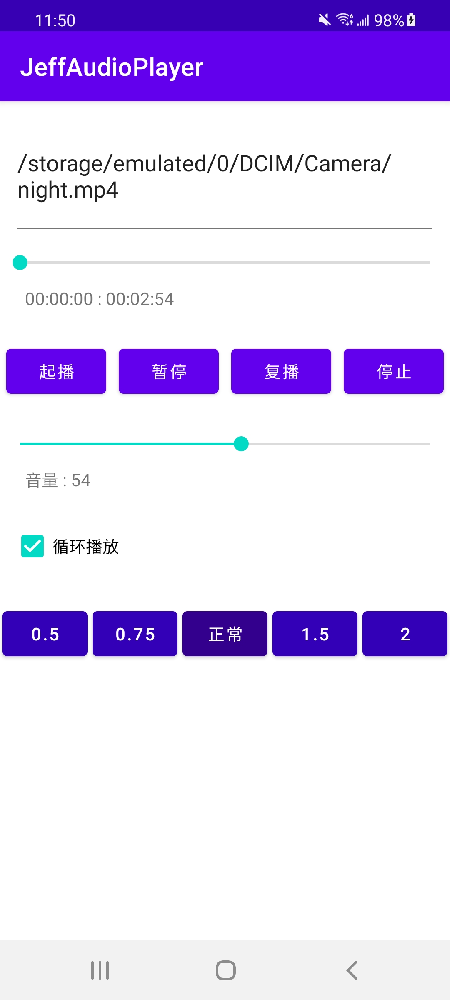

# 从0开始搭建一个音频播放器
## 1.音频播放完整流程
日常生活中，音频无处不在，从电话录音、音乐等都是音频的一种形式，当然视频中的声音也是音频，只不过和视频画面合成在一起，本文不讨论视频的问题，留在下一章讨论。 
音频播放器的完整流程如下： 
 
从上面的流程可以看出完整的播放流程。从中归纳出几个重要的点，本文也是围绕这几个点展开来讲的。
- 解封、解码
- 重采样
- OpenSLES启动
- 音频队列
- 音频后期处理

下面是我写的一个音频播放器的主界面截图（ps : 我不是很擅长写界面，界面不太友好，不过该有的功能都有了，大家将就看吧，笑cry） 
 
音频播放器的几个核心功能： 
- 正常播放、暂停、停止、释放资源
- 拖动进度条
- 倍速
- 控制音量
- 循环播放
- 类播放器的接口

本文会一一介绍音频播放的核心流程，希望大家看完了本文，可以照着开源项目，自己消化理解一下，真正掌握音频播放器的核心原理。 
## 2.播放器用到的库
音频播放器需要解封、解码、重采样，这些都是ffmpeg支持的；如果需要访问网络，甚至支持https，那需要支持支持openssl；还需要倍速的功能，那可供选择的有sonic库和soundtouch库，当然两种库也是各有优劣，sonic对单纯说话的音频支持程度比较好，soundtouch采用WSOLA算法对音乐支持较好，但是大名鼎鼎的ExoPlayer也是采用的sonic算法，再加上soundtouch比sonic要大多了，所以此项目采用sonic支持倍速的功能。
- ffmpeg
- openssl
- sonic

### 2.1 编译库
ffmpeg库是一个很大的多媒体框架，音频播放器中只用到其中的一部分，所以需要裁剪，对于新手而言，编译ffmpeg库还是有一些门槛的，
