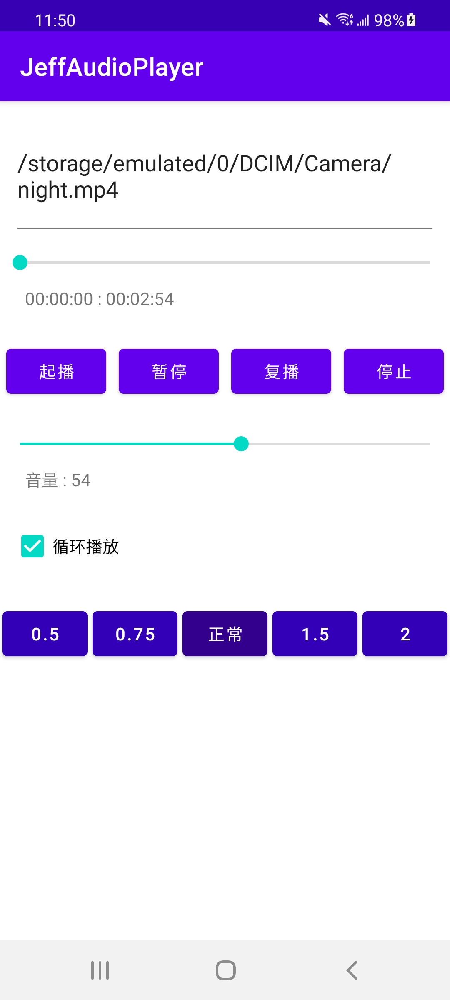
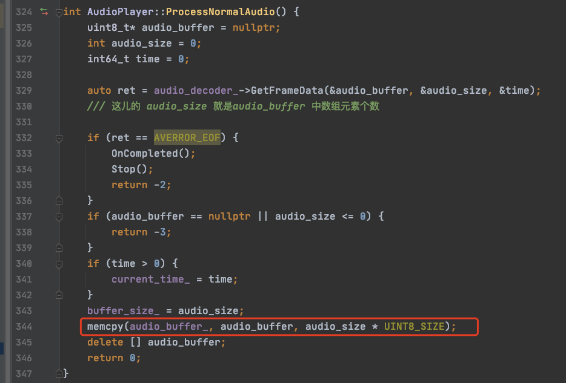
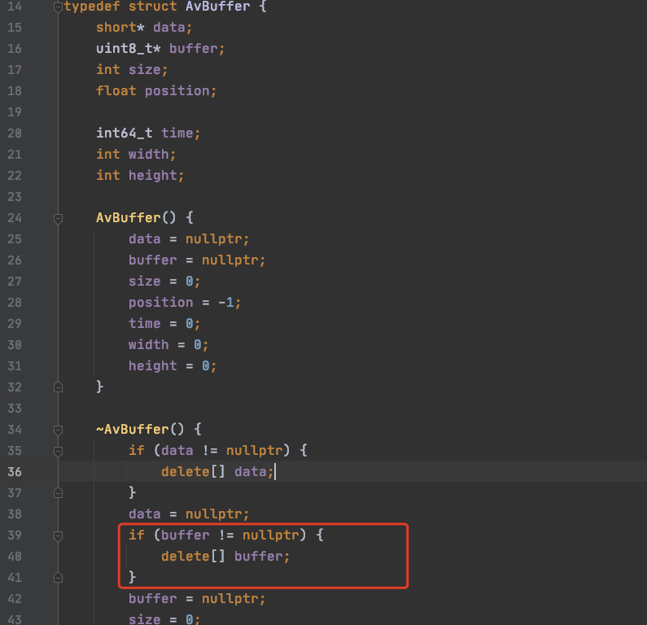
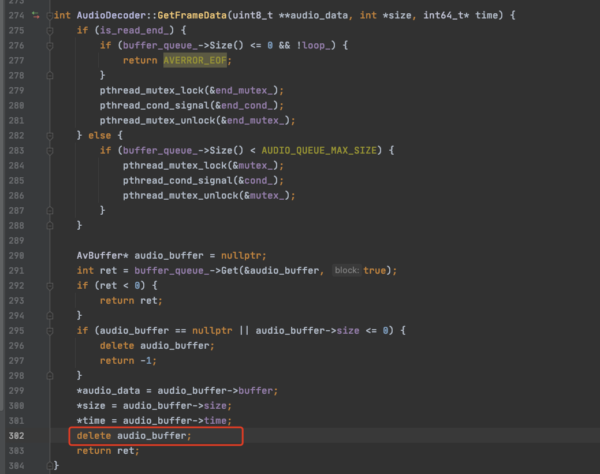

# 如何在工程中引入Asan解决内存问题
## 1.背景
我们做音视频开发的，平时主要写native代码，native crash中比较难缠的是内存问题，内存溢出、野指针、内存拷贝失败等等问题特别难缠，首先当然需要一个优秀的大脑，在写native程序的时候一定要小心加仔细，当然内存问题并不能完全避免，遇到此类问题，特别难查。这时候我们特别需要这个内存检测工具，Asan就是这样一个优秀的工具。

## 2.Asan介绍
Asan全称是AddressSanitizer是一种基于编译器的快速检测的工具，用于检测原生代码中的内存错误问题，Asan可以解决如下四种核心问题：
- 堆栈和堆缓冲区上溢、下溢
- 释放之后堆重新使用问题
- 超过范围的堆栈使用情况
- 重复释放、错误释放问题
Asan可以在32位和64位的arm平台上已经x84和x86-64上运行，但是运行的内存开销比较大，所以还是在调试代码的过程中使用asan，方便排查问题。当然还有一种内存检测工具HWAsan内存开销小一点，性能高一点。大家有空可以尝试下，本文我们主要介绍Asan工具。

## 3.Asan接入
### 3.1 build.gradle文件
首先在native项目的build.gradle中增加如下的配置：
```
android {

    defaultConfig {

        externalNativeBuild {
            cmake {
                arguments "-DANDROID_ARM_MODE=arm", "-DANDROID_STL=c++_shared"
                abiFilters 'armeabi-v7a', 'arm64-v8a'
            }
        }
    }
}

```
加入arguments `"-DANDROID_ARM_MODE=arm", "-DANDROID_STL=c++_shared"`这一行，Asan需要这些配置属性

### 3.2 CMakeLists.txt
现在native代码都通过引入CMakeList.txt来完成编译，需要加上需要检测的native库的名称。
```
target_link_libraries(
        ltpaudio
        android
        OpenSLES
        log
        z
        ltpffmpeg
)

target_compile_options(ltpaudio PUBLIC -fsanitize=address -fno-omit-frame-pointer)
set_target_properties(ltpaudio PROPERTIES LINK_FLAGS -fsanitize=address)

```
添加最后两行，其中第一个参数都是你需要检测的库的名称，例如我本次需要检测是ltpaudio这个库。

### 3.3 导入Asan库
使用Asan的话，需要保证你当前使用的ndk版本不低于21版本，Asan库的具体位置在toolchains/llvm/prebuilt/darwin-x86_64/lib64/clang/9.0.8/lib/linux目录下：
```
jeffli@admindeMacBook-Pro linux % pwd
/Users/jeffli/Library/Android/sdk/ndk/21.1.6352462/toolchains/llvm/prebuilt/darwin-x86_64/lib64/clang/9.0.8/lib/linux
jeffli@admindeMacBook-Pro linux % ls -al *asan*.so
-rw-r--r--  1 jeffli  staff  1904936  7 19 17:32 libclang_rt.asan-aarch64-android.so
-rw-r--r--  1 jeffli  staff  1797956  7 19 17:32 libclang_rt.asan-arm-android.so
-rw-r--r--  1 jeffli  staff  1666512  7 19 17:32 libclang_rt.asan-i686-android.so
-rw-r--r--  1 jeffli  staff  1808008  7 19 17:32 libclang_rt.asan-x86_64-android.so
-rw-r--r--  1 jeffli  staff   855376  7 19 17:32 libclang_rt.hwasan-aarch64-android.so
-rw-r--r--  1 jeffli  staff   796264  7 19 17:32 libclang_rt.hwasan-x86_64-android.so

```
这儿把hwasan列出来了，其实我们只需要asan库就行了，asan库有两个，32位和64位的。x86的库也是类似的，因为我们项目中只用到arm的32位和64位，所以只要这两个库
```
libclang_rt.asan-aarch64-android.so
libclang_rt.asan-arm-android.so

```
分别将这两个库拷贝你工程目录下对应的jniLibs下面，如下：
```
jeffli@admindeMacBook-Pro jniLibs % pwd
/Users/jeffli/sources/JeffAudioPlayer/audiolibrary/src/main/jniLibs
jeffli@admindeMacBook-Pro jniLibs % tree -L 2
.
├── arm64-v8a
│   └── libclang_rt.asan-aarch64-android.so
└── armeabi-v7a
    └── libclang_rt.asan-arm-android.so

```

### 3.4 导入wrap.sh文件
导入了对应的Asan库，需要执行脚本来链接Asan库，这时候需要在对应的目录下添加wrap.sh脚本。wrap.sh如下：
```
#!/system/bin/sh
HERE="$(cd "$(dirname "$0")" && pwd)"
export ASAN_OPTIONS=log_to_syslog=false,allow_user_segv_handler=1
ASAN_LIB=$(ls $HERE/libclang_rt.asan-*-android.so)
if [ -f "$HERE/libc++_shared.so" ]; then
    # Workaround for https://github.com/android-ndk/ndk/issues/988.
    export LD_PRELOAD="$ASAN_LIB $HERE/libc++_shared.so"
else
    export LD_PRELOAD="$ASAN_LIB"
fi
"$@"

```
将wrap.sh拷贝到main/resource/lib下面对应的库文件夹下，目录结构如下：
```
jeffli@admindeMacBook-Pro main % pwd
/Users/jeffli/sources/JeffAudioPlayer/audiolibrary/src/main
jeffli@admindeMacBook-Pro main % ls   
AndroidManifest.xml	cpp			java			jniLibs			resources

```
创建resources文件夹：
```
jeffli@admindeMacBook-Pro resources % tree -L 3 
.
└── lib
    ├── arm64-v8a
    │   └── wrap.sh
    └── armeabi-v7a
        └── wrap.sh

```
目前所有的Asan相关的接入都完成了。

## 4.检测例子
我自己业余时间搞了一个音乐播放器，核心逻辑都在native层，有时候会发生一些native crash问题，指向性不明确，问题不好查，正好可以用一下Asan看看是否有效。<br>
下面是我写的一个音频播放器。
<br>
点击播放的时候发生了crash：
```
2021-09-17 00:32:31.156 20042-20042/? A/DEBUG: *** *** *** *** *** *** *** *** *** *** *** *** *** *** *** ***
2021-09-17 00:32:31.156 20042-20042/? A/DEBUG: Build fingerprint: 'samsung/t2qzcx/t2q:11/RP1A.200720.012/G9960ZCU2AUGE:user/release-keys'
2021-09-17 00:32:31.156 20042-20042/? A/DEBUG: Revision: '13'
2021-09-17 00:32:31.156 20042-20042/? A/DEBUG: ABI: 'arm64'
2021-09-17 00:32:31.156 20042-20042/? A/DEBUG: Timestamp: 2021-09-17 00:32:31+0800
2021-09-17 00:32:31.156 20042-20042/? A/DEBUG: pid: 19946, tid: 20011, name: AudioTrack  >>> com.jeffmony.audioplayer <<<
2021-09-17 00:32:31.157 20042-20042/? A/DEBUG: uid: 10350
2021-09-17 00:32:31.157 20042-20042/? A/DEBUG: signal 6 (SIGABRT), code -1 (SI_QUEUE), fault addr --------
2021-09-17 00:32:31.157 20042-20042/? A/DEBUG: Abort message: '=================================================================
    ==19946==ERROR: AddressSanitizer: heap-use-after-free on address 0x004ac1e41080 at pc 0x007157f69580 bp 0x00705c0bb350 sp 0x00705c0bab08
    READ of size 1792 at 0x004ac1e41080 thread T32 (AudioTrack)
        #0 0x7157f6957c  (/data/app/~~G094WKQQj7KZvdhvGYDLDA==/com.jeffmony.audioplayer-kcu1nmgzpBIQDRJDxCJDOQ==/lib/arm64/libclang_rt.asan-aarch64-android.so+0x9f57c)
        #1 0x706549c228  (/data/app/~~G094WKQQj7KZvdhvGYDLDA==/com.jeffmony.audioplayer-kcu1nmgzpBIQDRJDxCJDOQ==/lib/arm64/libltpaudio.so+0x14228)
        #2 0x706549bcd4  (/data/app/~~G094WKQQj7KZvdhvGYDLDA==/com.jeffmony.audioplayer-kcu1nmgzpBIQDRJDxCJDOQ==/lib/arm64/libltpaudio.so+0x13cd4)
        #3 0x70654994f0  (/data/app/~~G094WKQQj7KZvdhvGYDLDA==/com.jeffmony.audioplayer-kcu1nmgzpBIQDRJDxCJDOQ==/lib/arm64/libltpaudio.so+0x114f0)
        #4 0x70654a9cbc  (/data/app/~~G094WKQQj7KZvdhvGYDLDA==/com.jeffmony.audioplayer-kcu1nmgzpBIQDRJDxCJDOQ==/lib/arm64/libltpaudio.so+0x21cbc)
        #5 0x70654a91d4  (/data/app/~~G094WKQQj7KZvdhvGYDLDA==/com.jeffmony.audioplayer-kcu1nmgzpBIQDRJDxCJDOQ==/lib/arm64/libltpaudio.so+0x211d4)
        #6 0x715af9d188  (/system/lib64/libwilhelm.so+0x1c188)
        #7 0x71570ea290  (/system/lib64/libaudioclient.so+0x8b290)
        #8 0x71570e9480  (/system/lib64/libaudioclient.so+0x8a480)
        #9 0x7156b664d4  (/system/lib64/libutils.so+0x154d4)
        #10 0x71593e9974  (/system/lib64/libandroid_runtime.so+0xa5974)
        #11 0x7156b65db0  (/system/lib64/libutils.so+0x14db0)
        #12 0x7156ace234  (/apex/com.android.runtime/lib64/bionic/libc.so+0xb6234)
        #13 0x7156a68e64  (/apex/com.android.runtime/lib64/bionic/libc.so+0x50e64)
        
        
         0x004ac1e41080 is located 0 bytes inside of 1792-byte region [0x004ac1e41080,0x004ac1e41780)
    freed by thread T32 (AudioTrack) here:
        #0 0x7157f74c64  (/data/app/~~G094WKQQj7KZvdhvGYDLDA==/com.jeffmony.audioplayer-kcu1nmgzpBIQDRJDxCJDOQ==/lib/arm64/libclang_rt.asan-aarch64-android.so+0xaac64)
        #1 0x70654a6d2c  (/data/app/~~G094WKQQj7KZvdhvGYDLDA==/com.jeffmony.audioplayer-kcu1nmgzpBIQDRJDxCJDOQ==/lib/arm64/libltpaudio.so+0x1ed2c)
        #2 0x70654a6af0  (/data/app/~~G094WKQQj7KZvdhvGYDLDA==/com.jeffmony.audioplayer-kcu1nmgzpBIQDRJDxCJDOQ==/lib/arm64/libltpaudio.so+0x1eaf0)
        #3 0x706549bf4c  (/data/app/~~G094WKQQj7KZvdhvGYDLDA==/com.jeffmony.audioplayer-kcu1nmgzpBIQDRJDxCJDOQ==/lib/arm64/libltpaudio.so+0x13f4c)
        #4 0x706549bcd4  (/data/app/~~G094WKQQj7KZvdhvGYDLDA==/com.jeffmony.audioplayer-kcu1nmgzpBIQDRJDxCJDOQ==/lib/arm64/libltpaudio.so+0x13cd4)
        #5 0x70654994f0  (/data/app/~~G094WKQQj7KZvdhvGYDLDA==/com.jeffmony.audioplayer-kcu1nmgzpBIQDRJDxCJDOQ==/lib/arm64/libltpaudio.so+0x114f0)
        #6 0x70654a9cbc  (/data/app/~~G094WKQQj7KZvdhvGYDLDA==/com.jeffmony.audioplayer-kcu1nmgzpBIQDRJDxCJDOQ==/lib/arm64/libltpaudio.so+0x21cbc)
        #7 0x70654a91d4  (/data/app/~~G094WKQQj7KZvdhvGYDLDA==/com.jeffmony.audioplayer-kcu1nmgzpBIQDRJDxCJDOQ==/lib/arm64/libltpaudio.so+0x211d4)
        #8 0x715af9d188  (/system/lib64/libwilhelm.so+0x1c188)
        #9 0x71570ea290  (/system/lib64/libaudioclient.so+0x8b290)

```
显示message是：heap-use-after-free on address 0x004ac1e41080<br>
说明是使用了已经释放掉的内存了，再继续看，这个内存具体在什么地方被释放的？<br>
 0x004ac1e41080 is located 0 bytes inside of 1792-byte region [0x004ac1e41080,0x004ac1e41780)<br>
先解栈看看具体的代码行：<br>
```
        #1 0x706549c228  (/data/app/~~G094WKQQj7KZvdhvGYDLDA==/com.jeffmony.audioplayer-kcu1nmgzpBIQDRJDxCJDOQ==/lib/arm64/libltpaudio.so+0x14228)
        #2 0x706549bcd4  (/data/app/~~G094WKQQj7KZvdhvGYDLDA==/com.jeffmony.audioplayer-kcu1nmgzpBIQDRJDxCJDOQ==/lib/arm64/libltpaudio.so+0x13cd4)
        #3 0x70654994f0  (/data/app/~~G094WKQQj7KZvdhvGYDLDA==/com.jeffmony.audioplayer-kcu1nmgzpBIQDRJDxCJDOQ==/lib/arm64/libltpaudio.so+0x114f0)
        #4 0x70654a9cbc  (/data/app/~~G094WKQQj7KZvdhvGYDLDA==/com.jeffmony.audioplayer-kcu1nmgzpBIQDRJDxCJDOQ==/lib/arm64/libltpaudio.so+0x21cbc)
        #5 0x70654a91d4  (/data/app/~~G094WKQQj7KZvdhvGYDLDA==/com.jeffmony.audioplayer-kcu1nmgzpBIQDRJDxCJDOQ==/lib/arm64/libltpaudio.so+0x211d4)

```
解栈结果是：
```
_ZN5media11AudioPlayer18ProcessNormalAudioEv
/Users/jeffli/sources/JeffAudioPlayer/audiolibrary/src/main/cpp/audio_player.cc:344

_ZN5media11AudioPlayer17GetAudioFrameDataEv
/Users/jeffli/sources/JeffAudioPlayer/audiolibrary/src/main/cpp/audio_player.cc:318

_ZN5media11AudioPlayer17AudioDataCallbackEPPhPiPv
/Users/jeffli/sources/JeffAudioPlayer/audiolibrary/src/main/cpp/audio_player.cc:299

_ZN5media13AudioRenderer13ProducePacketEv
/Users/jeffli/sources/JeffAudioPlayer/audiolibrary/src/main/cpp/opensl/audio_renderer.cc:214

_ZN5media13AudioRenderer19AudioPlayerCallbackEPKPK30SLAndroidSimpleBufferQueueItf_Pv
/Users/jeffli/sources/JeffAudioPlayer/audiolibrary/src/main/cpp/opensl/audio_renderer.cc:207

```
<br>
上图中红框的位置，audio_buffer应该被释放过，但是还想给audio_buffer_赋值，但是我们也不知道在什么地方被释放的，所以先把释放的地方解栈一下：
```
        #1 0x70654a6d2c  (/data/app/~~G094WKQQj7KZvdhvGYDLDA==/com.jeffmony.audioplayer-kcu1nmgzpBIQDRJDxCJDOQ==/lib/arm64/libltpaudio.so+0x1ed2c)
        #2 0x70654a6af0  (/data/app/~~G094WKQQj7KZvdhvGYDLDA==/com.jeffmony.audioplayer-kcu1nmgzpBIQDRJDxCJDOQ==/lib/arm64/libltpaudio.so+0x1eaf0)
        #3 0x706549bf4c  (/data/app/~~G094WKQQj7KZvdhvGYDLDA==/com.jeffmony.audioplayer-kcu1nmgzpBIQDRJDxCJDOQ==/lib/arm64/libltpaudio.so+0x13f4c)
        #4 0x706549bcd4  (/data/app/~~G094WKQQj7KZvdhvGYDLDA==/com.jeffmony.audioplayer-kcu1nmgzpBIQDRJDxCJDOQ==/lib/arm64/libltpaudio.so+0x13cd4)
        #5 0x70654994f0  (/data/app/~~G094WKQQj7KZvdhvGYDLDA==/com.jeffmony.audioplayer-kcu1nmgzpBIQDRJDxCJDOQ==/lib/arm64/libltpaudio.so+0x114f0)
        #6 0x70654a9cbc  (/data/app/~~G094WKQQj7KZvdhvGYDLDA==/com.jeffmony.audioplayer-kcu1nmgzpBIQDRJDxCJDOQ==/lib/arm64/libltpaudio.so+0x21cbc)
        #7 0x70654a91d4  (/data/app/~~G094WKQQj7KZvdhvGYDLDA==/com.jeffmony.audioplayer-kcu1nmgzpBIQDRJDxCJDOQ==/lib/arm64/libltpaudio.so+0x211d4)

```

```
~AvBuffer
/Users/jeffli/sources/JeffAudioPlayer/audiolibrary/src/main/cpp/queue/buffer_queue.h:40

_ZN5media12AudioDecoder12GetFrameDataEPPhPiPl
/Users/jeffli/sources/JeffAudioPlayer/audiolibrary/src/main/cpp/decode/audio_decoder.cc:302

_ZN5media11AudioPlayer18ProcessNormalAudioEv
/Users/jeffli/sources/JeffAudioPlayer/audiolibrary/src/main/cpp/audio_player.cc:329

_ZN5media11AudioPlayer17GetAudioFrameDataEv
/Users/jeffli/sources/JeffAudioPlayer/audiolibrary/src/main/cpp/audio_player.cc:318

_ZN5media11AudioPlayer17AudioDataCallbackEPPhPiPv
/Users/jeffli/sources/JeffAudioPlayer/audiolibrary/src/main/cpp/audio_player.cc:299

_ZN5media13AudioRenderer13ProducePacketEv
/Users/jeffli/sources/JeffAudioPlayer/audiolibrary/src/main/cpp/opensl/audio_renderer.cc:214

_ZN5media13AudioRenderer19AudioPlayerCallbackEPKPK30SLAndroidSimpleBufferQueueItf_Pv
/Users/jeffli/sources/JeffAudioPlayer/audiolibrary/src/main/cpp/opensl/audio_renderer.cc:207

```

<br>

<br>

我们在这个地方释放了这个内存，我们犯了一个错误，就是分配了一块内存地址，即使经过了赋值，如果没有使用完，是不能释放的，有点小心过头了。如果没有Asan帮我们分析这个过程，靠一步步排查，那要付出很大的成本，这个过程耗费的时间太长了。<br>
所以还是工欲善其事必先利其器，希望大家在开发native项目的时候可以多多使用Asan工具，帮助大家节省大量的时间。