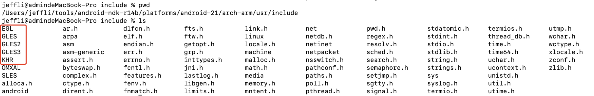
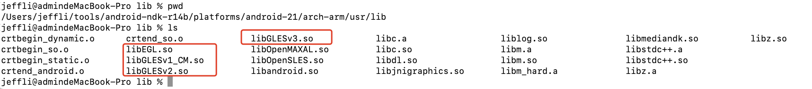
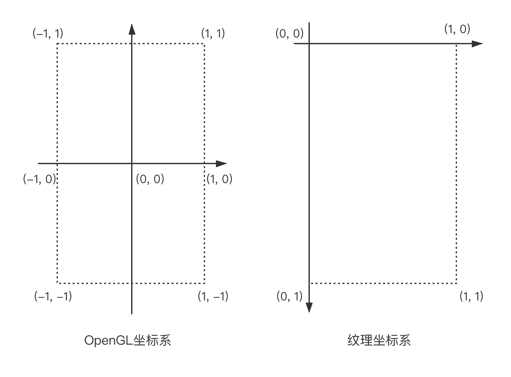
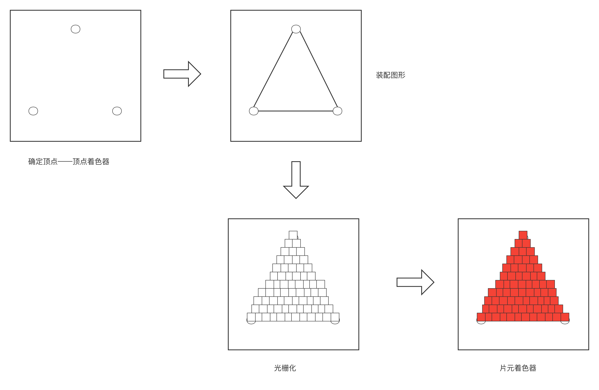

# 深入浅出OpenGL

## 1.概述
OpenGL是一种跨平台的图形API，用于3D图形处理硬件指定标准的软件接口，OpenGL ES是OpenGL规范的一种形式，用于嵌入式设备，目前Android支持的的OpenGL ES版本如下：
- OpenGL ES 1.0 和 1.1 - 此 API 规范受 Android 1.0 及更高版本的支持。
- OpenGL ES 2.0 - 此 API 规范受 Android 2.2（API 级别 8）及更高版本的支持。
- OpenGL ES 3.0 - 此 API 规范受 Android 4.3（API 级别 18）及更高版本的支持。
- OpenGL ES 3.1 - 此 API 规范受 Android 5.0（API 级别 21）及更高版本的支持。

如何选择OpenGL 版本？<br>
OpenGL ES 1.0 API 版本（以及 1.1 扩展）、2.0 版本和 3.0 版本均可提供高性能图形界面，用于创建 3D 游戏、可视化图表和界面。OpenGL ES 2.0 和 3.0 的图形编程基本相似，不同之处在于版本 3.0 表示 2.0 API 与其他功能的超集。OpenGL ES 1.0/1.1 API 的编程明显不同于 OpenGL ES 2.0 和 3.0，因此开发者在开始借助这些 API 进行开发之前应仔细考虑以下因素：<br>
- 性能 : 通常，OpenGL ES 2.0 和 3.0 可提供比 ES 1.0/1.1 API 更快的图形性能。不过，具体的性能差异可能因运行 OpenGL 应用的 Android 设备而异，这是因为硬件制造商对 OpenGL ES 图形管道的实现存在不同。
- 设备兼容性 : 开发者应考虑他们的客户可用的设备类型、Android 版本和 OpenGL ES 版本。如需详细了解各种设备的 OpenGL 兼容性。
- 编码便利性 : OpenGL ES 1.0/1.1 API 提供了一个固定函数管道和多个便捷函数，这些是 OpenGL ES 2.0 或 3.0 API 不具备的。刚接触 OpenGL ES 的开发者可能会发现针对版本 1.0/1.1 进行编码更快且更便捷。
- 图形控制力 : OpenGL ES 2.0 和 3.0 API 通过使用着色程序提供完全可编程的管道，因而能够提供更强的控制力。通过更直接地控制图形处理管道，开发者可以打造使用 1.0/1.1 API 难以生成的效果。
- 纹理支持 : OpenGL ES 3.0 API 能够最好地支持纹理压缩，因为它保证了支持透明度的 ETC2 压缩格式的可用性。1.x 和 2.0 API 实现通常包含对 ETC1 的支持，但这种纹理格式不支持透明度，因此您通常必须采用目标设备支持的其他压缩格式来提供资源。

<br>
<br>
Android版本中OpenGL特性的支持度？<br>
- OpenGL ES 1.0/1.1 : Android 1.0就支持
- OpenGL ES 2.0     : Android 2.2 (API 8) 开始支持
- OpenGL ES 3.0     : Android 4.3 (API 18) 开始支持
- OpenGL ES 3.1     : Android 5.0 (API 21) 开始支持 

在Android平台上，OpenGL ES有两套可供选择的API，java层和native层都有对应的API : 
- Java层的在android.opengl包下面
- native层的在${NDK-ROOT}/platforms/android-API/arch-arm/usr/include下面，如下图:
<br>
<br>
两种API中的用法后面都会有涉及，这人就不做过多讨论了。接下来我们了解一下OpenGL中用到的基本概念。

## 2.基本概念

### 2.1 坐标系
- OpenGL坐标系
- 纹理坐标系

 <br>
上图可以看出两种坐标系之间是有映射关系的，在开发过程中如果想要保证位置的准确，必须要确保对应的坐标位置和顺序是按照正常的位置排序的。
纹理坐标比较奇怪，因为纹理坐标是右上角是原点，就是(0, 0)点，X坐标向右是正方向，Y坐标向下是正方向。这点确实和正常的不一样，但是和Android上Bitmap和Canvas的坐标体系是一样的。<br>
两种坐标系是不同的，所以在绘制纹理的时候，需要做好两个坐标系之间的对应关系。<br>
有几个注意点 :
- 纹理的每个维度必须是2次幂
- 纹理有最大上限，一般是2048 * 2048

### 2.2 着色器
着色器又称为Shader，是运行在GPU上的小程序，这些小程序为图像渲染管线的某个特定部分而运行，基本而言，着色器只是一种将输入转化为输出的程序，着色器之间沟通必须要要通过输入和输出，不能直接调用函数进行沟通。<br>
GLSL是着色器语言，全程是OpenGL Shader Language，GLSL专门为图形计算量身定制的，包含一些针对向量和矩阵操作的特性。<br>
OpenGL中有两种着色器 : 
- 顶点着色器
- 片元着色器

下面给出顶点着色器和片元着色器的例子:<br>
顶点着色器 : 
```
#version 330 core
layout (location = 0) in vec3 aPos; // 位置变量的属性位置值为0

out vec4 vertexColor; // 为片段着色器指定一个颜色输出

void main()
{
    gl_Position = vec4(aPos, 1.0); // 注意我们如何把一个vec3作为vec4的构造器的参数
    vertexColor = vec4(0.5, 0.0, 0.0, 1.0); // 把输出变量设置为暗红色
}
```
片元着色器 : 
```
#version 330 core
out vec4 FragColor;

in vec4 vertexColor; // 从顶点着色器传来的输入变量（名称相同、类型相同）

void main()
{
    FragColor = vertexColor;
}
```
这儿大家先简单了解一下，后续会结合具体的例子分析一下着色器的例子。

### 2.3 渲染流程
一个很简单的例子，我想利用OpenGL生成一个红色的三角形，那我需要3个顶点表示这个三角形的位置，然后连线将三角形的图元转配起来，然后进行光栅化，将三角形分为若干个像素点，最后利用片段着色器开始着色。<br>
<br>
- 确定顶点的位置
- 根据OpenGL中的规则，根据这些顶点绘制特定的图形
- 光栅化图元，将图形分为一个个小的图元片段
- 执行片段着色器
- 将上述图形加载到帧缓冲区FBO（Frame Buffer Object）,再展示到屏幕上

<br>
<br>

其实上面的过程我们只需要关注两点:
- 顶点着色器
- 片元着色器或者片段着色器

<br>
<br>
- 顶点着色器: 每个顶点都会执行一次，例如绘制一个三角形，包含3个顶点，执行3次顶点着色器，而我们传递给顶点着色器的数据包含了顶点的位置、颜色。
- 组装图元: 将顶点连成线，根据需求绘制线段、三角形、顶点等图元
- 光栅化图元: 这个非常关键，在光栅化图元的时候，图形切分为若干个小片元，varying数据或者out数据在这个过程中计算生成，记录在每个片段中。
- 片段着色器: 每个片段都计算一次。
<br>
**顶点位置、顶点颜色--->顶点着色器--->光栅化--->计算每个片段的具体颜色值--->片段着色器**

### 2.4 GLSL数据类型
GLSL包含C和其他语言默认的基础数据类型: int/float/double/uint/bool等。但是GLSL也额外支持两种容器类型 : 向量（Vector）和矩阵（Matrix）<br>
向量可以包含1、2、3、4个分量的容器，分量的类型可以是前面提到的默认基础类型的任意一个，形式如下:
|类型|含义|
|:-|:-|
|vecn|包含n个float分量的默认向量|
|bvecn|包含n个bool分量的向量|
|ivecn|包含n个int分量的向量|
|uvecn|包含n个unsigned int分量的向量|
|dvecn|包含n个double分量的向量|

大多数场景下使用的是vecn，因为float已经可以满足要求，可以使用vec.x、vec.y、vec.z、vec.w来获取vec的1、2、3、4个分量，例如下面的应用:
```
vec2 vect = vec2(0.5, 0.7);
vec4 result = vec4(vect, 0.0, 0.0);
vec4 otherResult = vec4(result.xyz, 1.0);
```
result.xyz表示result的前3个分量。

### 2.5 GLSL输入与输出
着色器程序是独立的小程序，上面介绍，其语法类似C语言，主函数入库也是main函数，那肯定也有对应的输入域输出，这样才能进行数据交换。GLSL中定义了in和out来表示输入与输出，还是例举上面的例子:<br>
顶点着色器:
```
#version 330 core
layout (location = 0) in vec3 aPos; // 位置变量的属性位置值为0

out vec4 vertexColor; // 为片段着色器指定一个颜色输出

void main()
{
    gl_Position = vec4(aPos, 1.0); // 注意我们如何把一个vec3作为vec4的构造器的参数
    vertexColor = vec4(0.5, 0.0, 0.0, 1.0); // 把输出变量设置为暗红色
}

```
片段着色器:
```

#version 330 core
out vec4 FragColor;

in vec4 vertexColor; // 从顶点着色器传来的输入变量（名称相同、类型相同）

void main()
{
    FragColor = vertexColor;
}
```
从上面看出来，顶点着色器中aPos是输入，vertexColor是输出，片段着色器中FragColor是输出，vertexColor是输入；vertexColor在顶点着色器中是输出，在片段着色器中就是输入，输入输出是相对当前的着色器而言的。<br>

这儿我想到了OpenGL ES2.0中的attribute和varying参数，这两个参数已经被废弃了，attribute就是输入，varying就是输出。其实in和out显然比attribute和varying更容易理解。

### 2.6 GLSL中的uniform
uniform也是输入的一种，但是它和一般的顶点输入不同，uniform是全局的，全局意味着uniform变量必须在每个着色器程序对象中都是独一无二的，而且它可以被着色器程序的任意着色器在任意阶段访问，无论你把uniform值设置成什么，uniform会一直保存它们的数据，直到它们被重置或更新。<br>
uniform一般用在光源位置、统一变换矩阵、颜色等变量上。<br>
更新一下上面片段着色器的程序:
```
#version 330 core
out vec4 FragColor;

uniform vec4 ourColor; // 在OpenGL程序代码中设定这个变量

void main()
{
    FragColor = ourColor;
}

```
因为顶点着色器中并没有用到这个color变量，所以没有必要在顶点着色器中定义，然后通过顶点着色器传进来，直接在片段着色器中定义就行了。<br><br>
如何设置uniform的值，OpenGL中提供了几个方法:
|函数|含义|
|:-|:-|
|glUniformf|函数需要一个float作为它的值|
|glUniformi|函数需要一个int作为它的值|
|glUniformui|函数需要一个unsigned int作为它的值|
|glUniform3f|函数需要3个float作为它的值|
|glUniformfv|函数需要一个float向量、数组作为它的值|

这些在我们接下来的实践中都会用到的。

## 3.创建EGL环境
EGL是OpenGL ES和本地窗口系统的接口，不同平台上的EGL配置是不一样的，但是调用OpenGL的方式是一样的，就是说OpenGL能够跨平台就是依赖EGL接口。<br>
在Android中使用OpenGL ES，有相当一部分同学是使用GLSurfaceView结合GLSurfaceView.Render实现类来完成的，不需要我们手动创建EGL环境，因为GLSurfaceView中有一个GLThread线程已经帮我们做好了，使用GLSurfaceView的方式可定制化不是特别好，而且跨平台使用的话肯定不能只调用Android相关的API，我们还需要研究一下如何创建EGL环境。<br>
当我们需要把同一个场景渲染到不同的Surface上时，此时系统的GLSurfaceView就不能满足要求了，所以我们需要自己创建EGL环境来实现渲染的操作。一般较为复杂的OpenGL渲染操作都需要自定义GLSurfaceView来实现渲染功能。<br>
OpenGL整体是一个状态机，通过改变状态就能改变后续的渲染方式，而EGLContext(EGL上下文)就保存所有的状态，因此可以通过共享EGLContext来实现同一场景渲染到不同的Surface上。<br>

- 创建EGL实例
- 得到默认的显示设备，就是显示窗口
- 初始化默认的显示设备
- 设置显示设备的属性
- 从系统中获取对应属性的配置
- 创建EGLContext实例
- 创建渲染的Surface
- 绑定EGLContext和Surface到显示设备中
- 刷新数据，显示渲染场景


下面是native层创建EGL环境的代码:
```
EGLCore::EGLCore() :
egl_display_(EGL_NO_DISPLAY),
egl_config_(nullptr),
egl_context_(EGL_NO_CONTEXT) {

}

EGLCore::~EGLCore() = default;

int EGLCore::Init() {
    if ((egl_display_ = eglGetDisplay(EGL_DEFAULT_DISPLAY)) == EGL_NO_DISPLAY) {
        LOGE("%s %s eglGetDisplay failed, error=%d", FILE_NAME, __func__ , eglGetError());
        return -1;
    }
    if (!eglInitialize(egl_display_, 0, 0)) {
        LOGE("%s %s eglInitialize failedm error=%d", FILE_NAME, __func__ , eglGetError());
        return -2;
    }

    EGLint num_configs;
    const EGLint attributes[] = {
            EGL_BUFFER_SIZE, 32,
            EGL_ALPHA_SIZE, 8, EGL_BLUE_SIZE, 8, EGL_GREEN_SIZE, 8, EGL_RED_SIZE, 8,
            EGL_RENDERABLE_TYPE, EGL_OPENGL_ES2_BIT,
            EGL_SURFACE_TYPE, EGL_WINDOW_BIT,
            EGL_NONE
    };

    if (!eglChooseConfig(egl_display_, attributes, &egl_config_, 1, &num_configs)) {
        LOGE("%s %s eglChooseConfig failed, error=%d", FILE_NAME, __func__ , eglGetError());
        Release();
        return -3;
    }

    EGLint eglContextAttributes[] = { EGL_CONTEXT_CLIENT_VERSION, 2, EGL_NONE };
    egl_context_ = eglCreateContext(egl_display_, egl_config_, EGL_NO_CONTEXT, eglContextAttributes);
    if (egl_context_ == nullptr) {
        LOGE("%s %s eglCreateContext failed, error=%d", FILE_NAME, __func__ , eglGetError());
        Release();
        return -4;
    }
    return 0;
}

EGLSurface EGLCore::CreateWindowSurface(ANativeWindow *window) {
    EGLSurface surface = EGL_NO_SURFACE;
    EGLint format;
    if (window == nullptr) {
        LOGE("%s %s window is null", FILE_NAME, __func__ );
        return surface;
    }

    if (!eglGetConfigAttrib(egl_display_, egl_config_, EGL_NATIVE_VISUAL_ID, &format)) {
        LOGE("%s %s eglGetConfigAttrib failed, error=%d", FILE_NAME, __func__ , eglGetError());
        Release();
        return surface;
    }
    ANativeWindow_setBuffersGeometry(window, 0, 0, format);
    if (!(surface = eglCreateWindowSurface(egl_display_, egl_config_, window, nullptr))) {
        LOGE("%s %s eglCreateWindowSurface failed, error=%d", FILE_NAME, __func__ , eglGetError());
    }
    return surface;
}

int EGLCore::MakeCurrent(EGLSurface surface) {
    return eglMakeCurrent(egl_display_, surface, surface, egl_context_);
}

int EGLCore::SwapBuffers(EGLSurface surface) {
    return eglSwapBuffers(egl_display_, surface);
}

void EGLCore::ReleaseSurface(EGLSurface surface) {
    eglDestroySurface(egl_display_, surface);
}

void EGLCore::Release() {
    if (egl_display_ != EGL_NO_DISPLAY && egl_context_ != EGL_NO_CONTEXT) {
        eglMakeCurrent(egl_display_, EGL_NO_SURFACE, EGL_NO_SURFACE, EGL_NO_CONTEXT);
        eglDestroyContext(egl_display_, egl_context_);
        eglTerminate(egl_display_);
        eglReleaseThread();
    }
    egl_display_ = EGL_NO_DISPLAY;
    egl_context_ = EGL_NO_CONTEXT;
}

```
下面是Java层创建EGL环境的代码:
```
/**
 * EGL环境创建的类
 */
public class EglHelper {
    private EGL10 mEgl10;
    private EGLContext mEglContext;
    private EGLDisplay mEglDisplay;
    private EGLSurface mEglSurface;

    public void initEgl(Surface surface, EGLContext context) {
        //1.
        mEgl10 = (EGL10) EGLContext.getEGL();

        //2.
        mEglDisplay = mEgl10.eglGetDisplay(EGL10.EGL_DEFAULT_DISPLAY);
        if (mEglDisplay == EGL10.EGL_NO_DISPLAY) {
            throw new RuntimeException("eglGetDisplay failed");
        }

        //3.
        int[] version = new int[2];
        if (!mEgl10.eglInitialize(mEglDisplay, version)) {
            throw new RuntimeException("eglInitialize failed");
        }

        //4.设置属性
        int[] attributes = new int[]{
                EGL10.EGL_RED_SIZE, 8,
                EGL10.EGL_GREEN_SIZE, 8,
                EGL10.EGL_BLUE_SIZE, 8,
                EGL10.EGL_ALPHA_SIZE, 8,
                EGL10.EGL_DEPTH_SIZE, 8,
                EGL10.EGL_STENCIL_SIZE, 8,
                EGL10.EGL_RENDERABLE_TYPE, 4,
                EGL10.EGL_NONE
        };

        int[] numConfigs = new int[1];
        if (!mEgl10.eglChooseConfig(mEglDisplay, attributes, null, 1, numConfigs)) {
            throw new RuntimeException("eglChooseConfig failed");
        }

        int numConfig = numConfigs[0];
        if (numConfig <= 0) {
            throw new RuntimeException("No match configs");
        }

        //5.
        EGLConfig[] configs = new EGLConfig[numConfig];
        if (!mEgl10.eglChooseConfig(mEglDisplay, attributes, configs, numConfig, numConfigs)) {
            throw new RuntimeException("eglChooseConfig failed final");
        }

        //6.
        //这句代码很重要，因为没有这个支持，并不能加载shader
        int[] attrib_list = {
                EGL14.EGL_CONTEXT_CLIENT_VERSION, 2,
                EGL10.EGL_NONE
        };
        if (context != null) {
            mEglContext = mEgl10.eglCreateContext(mEglDisplay, configs[0], context, attrib_list);
        } else {
            mEglContext = mEgl10.eglCreateContext(mEglDisplay, configs[0], EGL10.EGL_NO_CONTEXT, attrib_list);
        }

        //7.
        mEglSurface = mEgl10.eglCreateWindowSurface(mEglDisplay, configs[0], surface, null);

        //8.
        if (!mEgl10.eglMakeCurrent(mEglDisplay, mEglSurface, mEglSurface, mEglContext)) {
            throw new RuntimeException("eglMakeCurrent failed");
        }
    }

    //刷新数据
    public boolean swapBuffers() {
        if (mEgl10 != null) {
            return mEgl10.eglSwapBuffers(mEglDisplay, mEglSurface);
        } else {
            throw new RuntimeException("EGL is empty");
        }
    }

    public EGLContext getEglContext() {
        return mEglContext;
    }

    public void destoryEgl() {
        if (mEgl10 != null) {
            mEgl10.eglMakeCurrent(mEglDisplay, EGL10.EGL_NO_SURFACE, EGL10.EGL_NO_SURFACE, EGL10.EGL_NO_CONTEXT);
            mEgl10.eglDestroySurface(mEglDisplay, mEglSurface);
            mEglSurface = null;

            mEgl10.eglDestroyContext(mEglDisplay, mEglContext);
            mEglContext = null;

            mEgl10.eglTerminate(mEglDisplay);
            mEglDisplay = null;
            mEgl10 = null;
        }
    }
}

```
## 4.shader加载流程
创建EGL环境之后，需要加载shader，获取对应的变量，进行相应的设置，实现绘制的需求。<br>
shader加载流程:
- 创建shader着色器，顶点和片元着色器
```
int shader = GLES20.glCreateShader(shaderType);

```
- 加载shader源码并编译shader
```
GLES20.glShaderSource(shader, source);
GLES20.glCompileShader(shader);

```
- 检查是否编译成功
```
GLES20.glGetShaderiv(shader, GLES20.GL_COMPILE_STATUS, compiled, 0);

```
- 创建一个渲染程序
```
int program = GLES20.glCreateProgram();

```
- 将着色器程序添加到渲染程序中
```
GLES20.glAttachShader(program, vertexShader);

```
- 链接源程序
```
GLES20.glLinkProgram(program);

```
- 检查链接源程序是否成功
```
GLES20.glGetProgramiv(program, GLES20.GL_LINK_STATUS, linkStatus, 0);

```
- 得到着色器中的属性
```
int vPosition = GLES20.glGetAttribLocation(program, "v_Postion");

```
- 使用源程序
```
GLES20.glUseProgram(program);

```
- 使顶点属性数组有效
```
GLES20.glEnableVertexAttribArray(vPosition);

```
- 为顶点属性赋值
```
GLES20.glVertexAttribPointer(vPosition, 2, GLES20.GL_FLOAT, false, 8, vertexBuffer);

```
- 绘制图形
```
GLES20.glDrawArrays(GLES20.GL_TRIANGLE_STRIP, 0, 4);

```
<br>
OpenGL ES加载shader的代码流程: 加载shader和链接program的完整代码流程
```
    private static int loadShader(int shaderType, String source) {
        int shader = GLES20.glCreateShader(shaderType);
        if(shader != 0) {
            GLES20.glShaderSource(shader, source);
            GLES20.glCompileShader(shader);

            int[] compile = new int[1];
            GLES20.glGetShaderiv(shader, GLES20.GL_COMPILE_STATUS, compile, 0);
            if(compile[0] != GLES20.GL_TRUE) {
                Log.d(TAG, "shader compile error");
                GLES20.glDeleteShader(shader);
                shader = 0;
            }
            return shader;
        }
        else {
            return 0;
        }
    }

    public static int createProgram(String vertexSource, String fragmentSoruce) {
        int vertexShader = loadShader(GLES20.GL_VERTEX_SHADER, vertexSource);
        int fragmentShader = loadShader(GLES20.GL_FRAGMENT_SHADER, fragmentSoruce);

        if(vertexShader != 0 && fragmentShader != 0) {
            int program = GLES20.glCreateProgram();

            GLES20.glAttachShader(program, vertexShader);
            GLES20.glAttachShader(program, fragmentShader);

            GLES20.glLinkProgram(program);
            return program;
        }
        return 0;
    }
```


